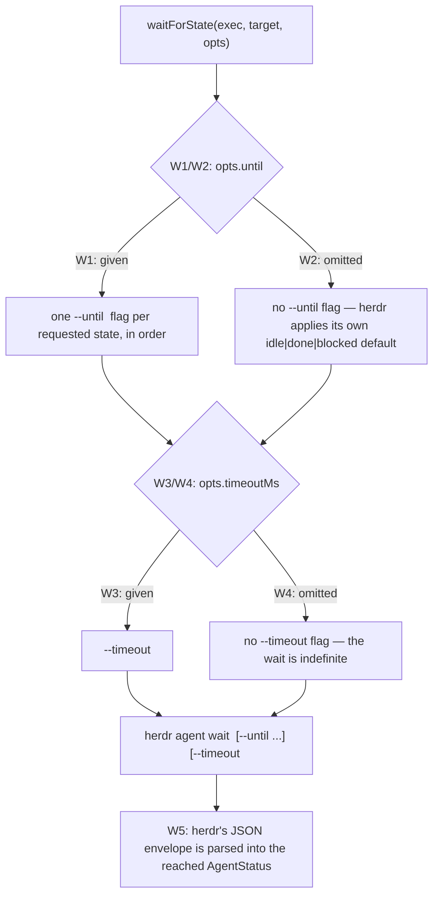
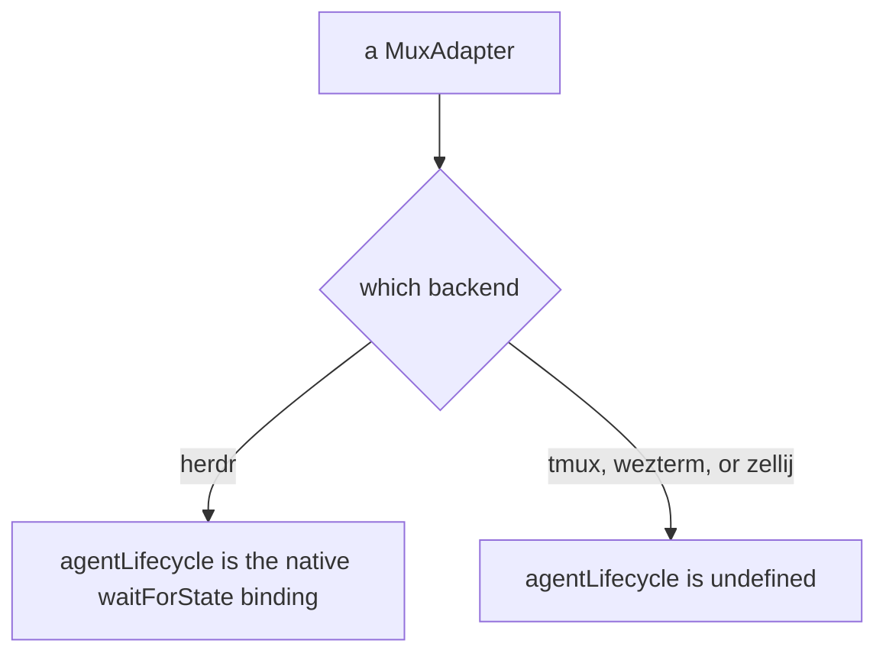
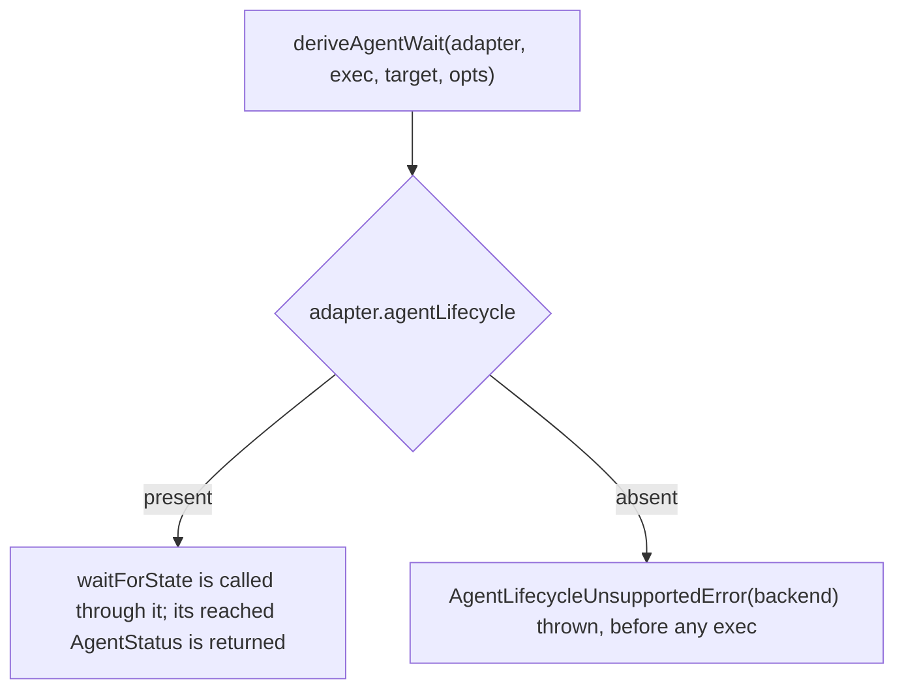

# agent — the herdr agent-lifecycle capability

> The **CLI surface** over this seam — the `cyber-mux agent status` / `agent wait` verbs, their
> stdout and exit codes, and the `backend-unsupported` refusal every non-herdr backend surfaces —
> lives in [`cli/agent/`](../cli/agent/README.md). This node owns the **surface-independent library
> contract**: the `AgentLifecycle` capability itself, herdr's binding of it, and the refusal
> orchestrator that keeps every other backend from emulating what it cannot honestly report.

## What

herdr 0.7.5 reports a per-pane agent state feed (`AgentStatus = idle | working | blocked | done |
unknown`) and owns a server-side blocking primitive, `herdr agent wait <target> --until <status>…
--timeout <ms>`, that waits until a pane's agent reaches one of the named states (or times out).
`cyber-mux` drives that primitive, normalized across the seam, as its own optional capability:

```ts
type AgentStatus = 'idle' | 'working' | 'blocked' | 'done' | 'unknown' // lives in mux.ts (LivePane.agentStatus uses it too)

interface AgentLifecycle {
  waitForState(exec: Exec, target: MuxTarget, opts: { until?: AgentStatus[]; timeoutMs?: number }): AgentStatus
}
```

`MuxAdapter` gains `readonly agentLifecycle?: AgentLifecycle | undefined`. This capability lives on
its own library subpath, `cyber-mux/agent` (`src/agent.ts`), rather than the core barrel — the same
distinct-domain-gets-its-own-subpath precedent `cyber-mux/worktree` and `cyber-mux/template` already
set, keeping `mux.ts` as pane control and giving the agent domain room to grow. `AgentStatus` itself
stays in `mux.ts`, because `LivePane.agentStatus` (the snapshot field, specified in
[`mux/lookup/`](../mux/lookup/README.md)) needs it too; `agent.ts` imports the type rather than
redeclaring it.

`agentLifecycle` is present **only on herdr** — the native binding calls `herdr agent wait` directly.
tmux, wezterm, and zellij have no equivalent primitive and no equivalent detection signal, so they
report `agentLifecycle` **absent**, exactly the way `worktree` and `regions` are absent on a backend
that lacks their concept.

### Non-goals

- **Emulating the wait on a backend without the primitive.** A polling loop against `read()` output
  would be a guess dressed up as a fact — herdr's own state derivation reads lifecycle-authority hooks
  and per-agent screen-manifest matchers cyber-mux has no access to, so any lookalike on another
  backend would silently disagree with herdr's answer to the same question. The contract chooses a
  **truthful refusal** over a confident lie: see the refusal orchestrator below.
- **The snapshot field `LivePane.agentStatus`** — that `listPanes` reports (or omits) a pane's current
  `agentStatus` as part of the bulk pane listing is [`mux/lookup/`](../mux/lookup/README.md)'s, not
  this node's. This node owns the **blocking wait**, not the snapshot read; the two share a type
  (`AgentStatus`) and nothing else.
- **The CLI's `agent status` / `agent wait` verbs, their exit codes, and stdout shape** — those are
  [`cli/agent/`](../cli/agent/README.md).
- **A portable, cross-mux `waitForOutput`.** herdr's own `pane wait-output` is a different, more
  primitive capability — waiting on a pane's raw output rather than its derived agent state — and,
  unlike agent-state detection, it is genuinely normalizable on every backend: herdr natively, the
  others by polling `read()`. That portability is exactly why it does **not** belong here: this node's
  whole shape is "one backend has the fact, the rest must refuse," and a capability every backend can
  honor does not fit it. Deliberately deferred to its own, separate CR.

## Use Cases

- **`AgentLifecycle.waitForState`, herdr's binding** — calls `herdr agent wait <id>`, translating
  `opts.until` into one repeated `--until <status>` flag per requested state (in the order given) and
  `opts.timeoutMs` into `--timeout <ms>`. Either option is optional and each is omitted from the
  command independently when not given: no `until` means no `--until` flag at all, so herdr applies
  its own default (`idle|done|blocked`) rather than cyber-mux restating it; no `timeoutMs` means no
  `--timeout` flag, so the wait is genuinely indefinite rather than bounded by a value cyber-mux
  invented. herdr's response is a JSON envelope naming the `AgentStatus` the wait actually reached,
  which `waitForState` parses and returns — the caller learns *which* of the requested states (or the
  timeout) ended the wait, not just that it ended.

- **`agentLifecycle` is present only on herdr** — every other adapter (tmux, wezterm, zellij) leaves
  the member `undefined`. Absent-rather-than-false is the same convention `worktree` and `regions`
  already follow: a capability a backend genuinely lacks is not present with degraded behavior, it is
  not present at all, so a caller can `if (adapter.agentLifecycle)` and know exactly what it is
  asking.

- **`deriveAgentWait` refuses rather than emulates on tmux, wezterm, and zellij** — the library
  orchestrator `deriveAgentWait(adapter, exec, target, opts)` mirrors `deriveRegionCapture` in
  `template-capture.ts` exactly: it is the one place that sees the adapter (`waitForState` itself
  never does), so it is the one place the emulate-or-refuse decision can be made. When
  `adapter.agentLifecycle` is absent it throws a named, portable `AgentLifecycleUnsupportedError`
  carrying the backend's name — **before any exec runs**, so a refusal costs nothing and never risks
  a partial or misleading wait. When present, it calls `waitForState` through the capability and
  returns what it returns. The CLI catches `AgentLifecycleUnsupportedError` and re-raises its own
  `backend-unsupported` coded error (exit 1, help naming the herdr-only constraint) — the same
  decision-in-the-library, presentation-in-the-CLI split `CaptureUnsupportedError` /
  `backend-unsupported` already established for `template save`.

## Control Flow

### `waitForState` — herdr's binding



### `agentLifecycle` — present only on herdr



### `deriveAgentWait` — the refusal orchestrator



## Scenario map

Every scenario in [`agent.feature`](./agent.feature), one row each, grouped by use case. The CLI
rendering of the refusal — exit code, `code`, help — is in [`cli/agent/`](../cli/agent/README.md).

### Driving herdr's native `agent wait`

| Edge | Path (Given) | Scenario |
|---|---|---|
| W1 `until` given → one `--until` flag per state, in order; W3 `timeoutMs` given → `--timeout <ms>` | `until: ['idle', 'done']`, `timeoutMs: 5000`, reaching `done` | `herdr waitForState builds agent wait with a repeated --until flag and --timeout for the requested states` |
| W2 `until` omitted → no `--until` flag | `opts` with no `until` | `herdr waitForState with no until sends no --until flag, so herdr applies its own default` |
| W4 `timeoutMs` omitted → no `--timeout` flag | `opts` with no `timeoutMs` | `herdr waitForState with no timeoutMs sends no --timeout flag, so the wait is indefinite` |
| W5 herdr's JSON envelope → the reached `AgentStatus` | herdr reports it reached `idle` | `herdr waitForState parses herdr's JSON envelope into the reached AgentStatus` |

### `agentLifecycle` is present only on herdr

| Edge | Path (Given) | Scenario |
|---|---|---|
| absent on every non-herdr backend | tmux, wezterm, and zellij adapters | `agentLifecycle is undefined on every backend except herdr` |

### `deriveAgentWait` — refuse, never emulate

| Edge | Path (Given) | Scenario |
|---|---|---|
| `agentLifecycle` absent → refused before any exec | tmux, wezterm, and zellij adapters | `deriveAgentWait refuses before any exec when agentLifecycle is absent` |
