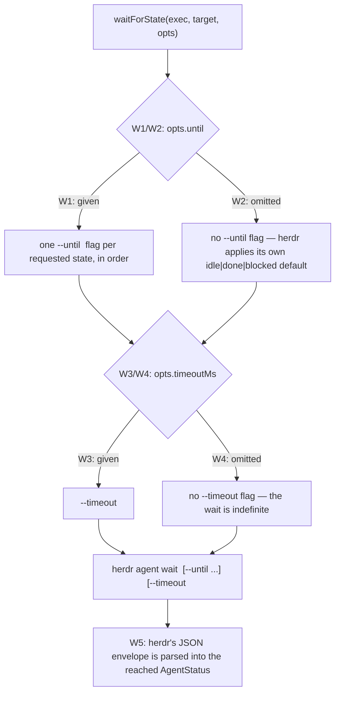
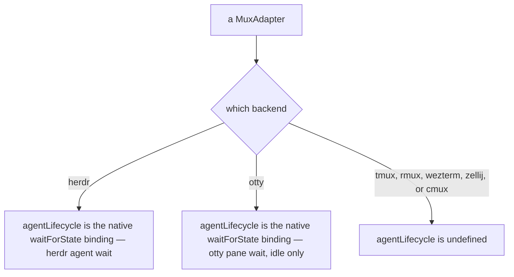
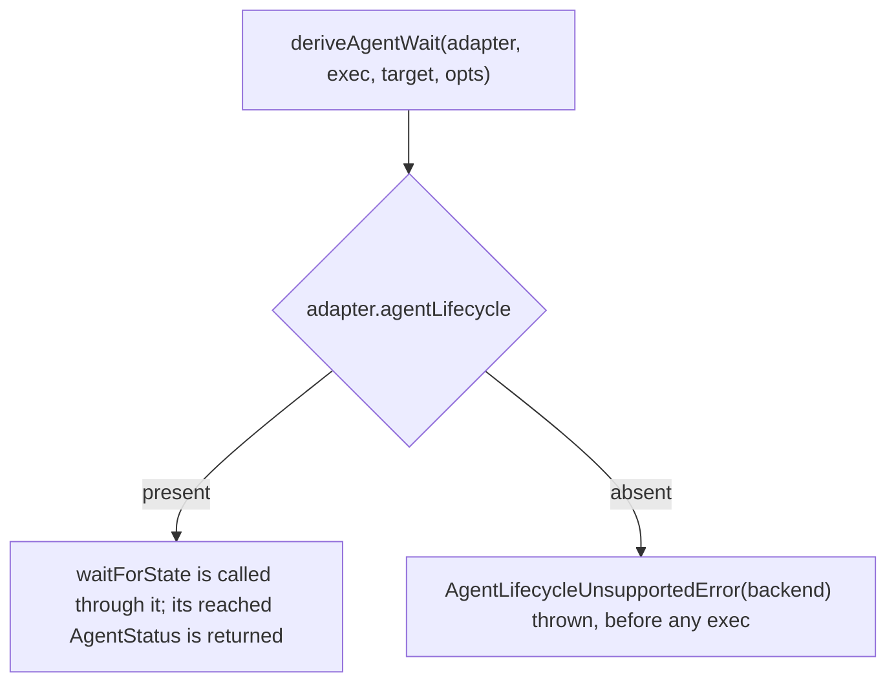
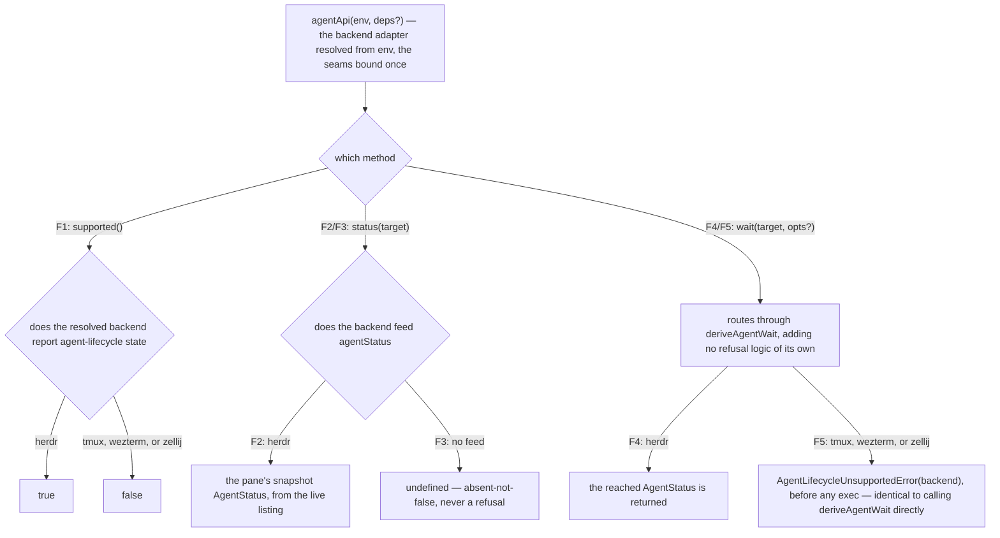

# agent — the agent-lifecycle capability

> The **CLI surface** over this seam — the `cyber-mux agent status` / `agent wait` verbs, their
> stdout and exit codes, and the `backend-unsupported` refusal a backend without the capability
> surfaces — lives in [`cli/agent/`](../cli/agent/README.md). This node owns the
> **surface-independent library contract**: the `AgentLifecycle` capability itself, the backend
> bindings of it, and the refusal orchestrator that keeps every other backend from emulating what it
> cannot honestly report.

## What

herdr 0.7.5 reports a per-pane agent state feed (`AgentStatus = idle | working | blocked | done |
unknown`) and owns a server-side blocking primitive, `herdr agent wait <target> --until <status>…
--timeout <ms>`, that waits until a pane's agent reaches one of the named states (or times out).
`cyber-mux` drives that primitive, normalized across the seam, as its own optional capability:

```ts
type AgentStatus = 'idle' | 'working' | 'blocked' | 'done' | 'unknown' // lives in mux.ts (LivePane.agentStatus uses it too)

interface AgentLifecycle {
  waitForState(exec: Exec, target: MuxTarget, opts: { until?: AgentStatus[]; timeoutMs?: number }): AgentStatus
}
```

`MuxAdapter` gains `readonly agentLifecycle?: AgentLifecycle | undefined`. This capability lives on
its own library subpath, `cyber-mux/agent` (`src/agent.ts`), rather than the core barrel — the same
distinct-domain-gets-its-own-subpath precedent `cyber-mux/worktree` and `cyber-mux/template` already
set, keeping `mux.ts` as pane control and giving the agent domain room to grow. `AgentStatus` itself
stays in `mux.ts`, because `LivePane.agentStatus` (the snapshot field, specified in
[`mux/lookup/`](../mux/lookup/README.md)) needs it too; `agent.ts` imports the type rather than
redeclaring it.

`agentLifecycle` is present on the backends that have a native blocking per-pane agent-state wait,
and **the two that do are not equally capable**:

| backend | primitive | states it can end a wait on | timeout unit |
|---|---|---|---|
| herdr | `herdr agent wait <pane> [--until <status>]… [--timeout <ms>]` | the whole `AgentStatus` vocabulary | milliseconds |
| otty | `otty pane wait --pane <id> [--timeout-secs <n>]` | `idle` only | whole seconds |

tmux, rmux, wezterm, zellij and cmux have no equivalent primitive, so they report `agentLifecycle`
**absent**, exactly the way `worktree` and `regions` are absent on a backend that lacks their concept.

Because the two bindings differ, `until` is a **request, not a guarantee**. A backend whose native
wait cannot name every requested state refuses BY NAME —
`AgentWaitStatesUnsupportedError(backend, requested, supported)`, `src/agent-states.ts` — rather than
narrowing the set to what it can do. Narrowing would end the wait on a state the caller never asked
for, which is a wrong answer wearing the shape of a right one; the refusal names both sets so the
caller can fix it without re-deriving either. It is a **different** refusal from
`AgentLifecycleUnsupportedError`: that one says *no wait here at all*, this one says *this wait, and
not those states*.

**otty's wait is a different primitive from the one issue #134 proposed, and that matters to anyone
re-reading the docs.** #134 named `otty watch:<agent>`; its positional argument is an **agent session
id** ("the one from Agent History"), not a pane id, its flag table carries no pane selector, and the
agent KIND is spelled into the verb (`watch:claude` / `watch:codex` / `watch:opencode`) — with no
documented CLI read mapping a pane id to either fact. So `watch:` genuinely cannot serve
`waitForState`, and is not what this binds. `otty pane wait` is: pane-selected with the same
`--pane <id|index>` every other pane verb takes, blocking, and *"for a pane running a coding agent,
idle is what the agent reports"* (`docs.otty.sh/workflows/cli-usage`; `/agents/orchestration` and
`/agents/skills` say the same). Both facts are **read off otty's docs, not measured** — otty is a
GUI-only app with no binary in this environment and no real-boundary suite (#128).

### Non-goals

- **Emulating the wait on a backend without the primitive.** A polling loop against `read()` output
  would be a guess dressed up as a fact — herdr's own state derivation reads lifecycle-authority hooks
  and per-agent screen-manifest matchers cyber-mux has no access to, so any lookalike on another
  backend would silently disagree with herdr's answer to the same question. The contract chooses a
  **truthful refusal** over a confident lie: see the refusal orchestrator below.
- **The snapshot field `LivePane.agentStatus`** — that `listPanes` reports (or omits) a pane's current
  `agentStatus` as part of the bulk pane listing is [`mux/lookup/`](../mux/lookup/README.md)'s, not
  this node's. This node owns the **blocking wait**, not the snapshot read; the two share a type
  (`AgentStatus`) and nothing else.
- **The CLI's `agent status` / `agent wait` verbs, their exit codes, and stdout shape** — those are
  [`cli/agent/`](../cli/agent/README.md).
- **A portable, cross-mux `waitForOutput`.** herdr's own `pane wait-output` is a different, more
  primitive capability — waiting on a pane's raw output rather than its derived agent state — and,
  unlike agent-state detection, it is genuinely normalizable on every backend: herdr natively, the
  others by polling `read()`. That portability is exactly why it does **not** belong here: this node's
  whole shape is "one backend has the fact, the rest must refuse," and a capability every backend can
  honor does not fit it. Deliberately deferred to its own, separate CR.

## Use Cases

- **`AgentLifecycle.waitForState`, herdr's binding** — calls `herdr agent wait <id>`, translating
  `opts.until` into one repeated `--until <status>` flag per requested state (in the order given) and
  `opts.timeoutMs` into `--timeout <ms>`. Either option is optional and each is omitted from the
  command independently when not given: no `until` means no `--until` flag at all, so herdr applies
  its own default (`idle|done|blocked`) rather than cyber-mux restating it; no `timeoutMs` means no
  `--timeout` flag, so the wait is genuinely indefinite rather than bounded by a value cyber-mux
  invented. herdr's response is a JSON envelope naming the `AgentStatus` the wait actually reached,
  which `waitForState` parses and returns — the caller learns *which* of the requested states (or the
  timeout) ended the wait, not just that it ended.

- **`AgentLifecycle.waitForState`, otty's binding** — calls `otty pane wait --pane <id>`, the
  pane-selected native wait. Three things it does that herdr's does not have to:
  - **`until` is checked before any exec.** otty's wait takes no `--until` and ends on `idle` alone,
    so an omitted (or empty) set sends no flag — otty's own default, which is the only state it has —
    an explicit `['idle']` also sends no flag, and anything else is refused with
    `AgentWaitStatesUnsupportedError` naming both sets. Nothing is run for a refused set.
  - **`timeoutMs` rounds UP to whole seconds and never to zero.** otty's flag is `--timeout-secs`, and
    `--timeout-secs 0` is otty's spelling for *wait forever* — which is what omitting `timeoutMs`
    already means at the seam. So a bound the caller passed must never become 0: rounding up costs at
    most 999ms of extra patience, rounding down costs the timeout entirely. An omitted `timeoutMs`
    still sends no flag at all.
  - **Success is an EMPTY string, and the failures collapse.** A satisfied `otty pane wait` prints
    nothing documented, so the binding tests `out === null` rather than `!out` — `!out` would turn
    every successful wait into a throw. otty distinguishes satisfied (exit 0) from
    no-reportable-state (6), no-such-pane (4) and timeout (9) by **exit code**, which the `Exec` seam
    does not carry (`string | null`), so those three fold into one throw naming the pane, with otty's
    own words appended by `withReason`. Satisfied-vs-not — the distinction the seam needs — survives;
    which failure it was does not. Nothing branches on `exec.lastError`: that is documented
    diagnostic-only and a runner is free never to set it.

  **The limit this binding cannot guard**, stated because it is a real divergence from herdr: a pane
  with **no agent** answers `idle` when its shell is at a prompt, where herdr's `agent wait` reports
  `agent_not_found` and throws. Guarding it would need a per-pane agent read, and the *"which agent
  sits in which"* that `/agents/orchestration` credits to `otty pane list` has no documented output
  schema on any of otty's 141 doc pages — there is no field to check.

- **`agentLifecycle` is present only where the primitive is** — herdr and otty carry it; tmux, rmux,
  wezterm, zellij and cmux leave the member `undefined`. Absent-rather-than-false is the same
  convention `worktree` and `regions` already follow: a capability a backend genuinely lacks is not
  present with degraded behavior, it is not present at all, so a caller can
  `if (adapter.agentLifecycle)` and know exactly what it is asking.

- **`supported()` and `status()` answer different questions, and otty is where they part** — otty can
  BLOCK on its own agent state and exposes no documented CLI read of it, so `agentApi.supported()` is
  `true` there while `agentApi.status()` (and `LivePane.agentStatus`) stays `undefined`. The two
  members were always independent; until otty, every backend happened to answer both the same way.

- **`deriveAgentWait` refuses rather than emulates on a backend with no primitive** — the library
  orchestrator `deriveAgentWait(adapter, exec, target, opts)` mirrors `deriveRegionCapture` in
  `template-capture.ts` exactly: it is the one place that sees the adapter (`waitForState` itself
  never does), so it is the one place the emulate-or-refuse decision can be made. When
  `adapter.agentLifecycle` is absent it throws a named, portable `AgentLifecycleUnsupportedError`
  carrying the backend's name — **before any exec runs**, so a refusal costs nothing and never risks
  a partial or misleading wait. When present, it calls `waitForState` through the capability and
  returns what it returns. The CLI catches `AgentLifecycleUnsupportedError` and re-raises its own
  `backend-unsupported` coded error (exit 1, help naming the backends that have the wait) — the same
  decision-in-the-library, presentation-in-the-CLI split `CaptureUnsupportedError` /
  `backend-unsupported` already established for `template save`.

- **`agentApi(env, deps?)` — the exec-bound subpath facade** — the same ergonomic tier `worktreeApi`
  and `templateApi` give their subpaths: bind the seams once (the backend adapter resolved from
  `env`, the `Exec` defaulted), and every method drops them. It exposes exactly three methods and
  **adds no logic of its own** — each one is an existing contract of this node or its sibling, bound:
  - **`supported(): boolean`** — whether the resolved backend can WAIT on agent-lifecycle state:
    `true` on herdr and otty, `false` on tmux, wezterm, and zellij. The same capability presence
    `deriveAgentWait` gates on, read as a predicate so a caller can branch without try/catch. Not the
    same question `status()` answers — see the otty row above.
  - **`status(target): AgentStatus | undefined`** — the pane's snapshot, read from the live listing
    (`LivePane.agentStatus`, [`mux/lookup/`](../mux/lookup/README.md)); `undefined` on a no-feed
    backend — absent-not-false, never a guessed `unknown`, and never a refusal (the same degrade the
    CLI's `agent status` surfaces).
  - **`wait(target, opts?): AgentStatus`** — blocks until the agent reaches a requested state,
    routing **through `deriveAgentWait` itself**: on tmux, wezterm, and zellij it throws the same
    `AgentLifecycleUnsupportedError`, identical to calling the orchestrator directly, so the refusal
    stays specified once and enforced once with no second path to drift.

## Control Flow

### `waitForState` — herdr's binding



### `agentLifecycle` — present only on herdr



### `deriveAgentWait` — the refusal orchestrator



### `agentApi` — the exec-bound facade



## Scenario map

Every scenario in [`agent.feature`](./agent.feature), one row each, grouped by use case. The CLI
rendering of the refusal — exit code, `code`, help — is in [`cli/agent/`](../cli/agent/README.md).

### Driving herdr's native `agent wait`

| Edge | Path (Given) | Scenario |
|---|---|---|
| W1 `until` given → one `--until` flag per state, in order; W3 `timeoutMs` given → `--timeout <ms>` | `until: ['idle', 'done']`, `timeoutMs: 5000`, reaching `done` | `herdr waitForState builds agent wait with a repeated --until flag and --timeout for the requested states` |
| W2 `until` omitted → no `--until` flag | `opts` with no `until` | `herdr waitForState with no until sends no --until flag, so herdr applies its own default` |
| W4 `timeoutMs` omitted → no `--timeout` flag | `opts` with no `timeoutMs` | `herdr waitForState with no timeoutMs sends no --timeout flag, so the wait is indefinite` |
| W5 herdr's JSON envelope → the reached `AgentStatus` | herdr reports it reached `idle` | `herdr waitForState parses herdr's JSON envelope into the reached AgentStatus` |

### Driving otty's native `pane wait`

| Edge | Path (Given) | Scenario |
|---|---|---|
| O1 pane-selected argv | an otty pane and no options | `otty waitForState builds pane wait against the pane id and returns idle` |
| O2 a satisfied wait prints nothing → still a success | otty's wait exits 0 with empty stdout | `otty waitForState treats empty stdout as a satisfied wait, not a failure` |
| O3 `timeoutMs` → `--timeout-secs`, rounded up | `timeoutMs: 1500` | `otty waitForState rounds a timeout up to whole seconds` |
| O4 a bound never rounds to 0 (otty's forever) | `timeoutMs: 0` and `timeoutMs: 200` | `otty waitForState never sends --timeout-secs 0 for a bounded wait` |
| O5 `timeoutMs` omitted → no flag | `opts` with no `timeoutMs` | `otty waitForState with no timeoutMs sends no --timeout-secs flag` |
| O6 `until` omitted, empty, or exactly `['idle']` → no flag | each of the three | `otty waitForState sends no state flag for an until it can honor` |
| O7 an `until` otty cannot end on → refused by name, before any exec | `until: ['blocked']` and `until: ['idle','done']` | `otty waitForState refuses an until it cannot end on` |
| O8 a wait that does not land → one throw naming the pane | otty's runner answers null | `otty waitForState throws naming the pane when the wait does not land` |
| O9 the snapshot stays absent | an otty pane listing | `otty reports no agentStatus even though it can wait` |

### `agentLifecycle` is present only where the primitive is

| Edge | Path (Given) | Scenario |
|---|---|---|
| absent on every backend with no native wait | tmux, wezterm, and zellij adapters | `agentLifecycle is undefined on every backend without a native agent wait` |
| present on every backend that has one | the herdr and otty adapters | `agentLifecycle is present on every backend with a native agent wait` |

### `deriveAgentWait` — refuse, never emulate

| Edge | Path (Given) | Scenario |
|---|---|---|
| `agentLifecycle` absent → refused before any exec | tmux, wezterm, and zellij adapters | `deriveAgentWait refuses before any exec when agentLifecycle is absent` |

### `agentApi` — the exec-bound facade

| Edge | Path (Given) | Scenario |
|---|---|---|
| F1 `supported()` → true on herdr and otty, false elsewhere | an env resolving to each backend | `agentApi's supported reflects whether the backend reports agent-lifecycle state` |
| `supported()` and `status()` part on otty | an env resolving to otty | `agentApi's supported is true on otty while its status stays undefined` |
| F2 `status()` on herdr → the pane's snapshot | a herdr pane whose feed reports `working` | `agentApi's status returns the pane's agentStatus snapshot on herdr` |
| F3 `status()` on a no-feed backend → `undefined` | a live pane on each of tmux, wezterm, and zellij | `agentApi's status returns undefined on a backend with no agent-state feed` |
| F4 `wait()` on herdr → the reached status | a herdr pane whose agent reaches `idle` | `agentApi's wait drives the capability on herdr and returns the reached status` |
| F5 `wait()` without the capability → the orchestrator's refusal | an env resolving to each non-herdr backend | `agentApi's wait routes through deriveAgentWait's refusal on a backend without the capability` |
