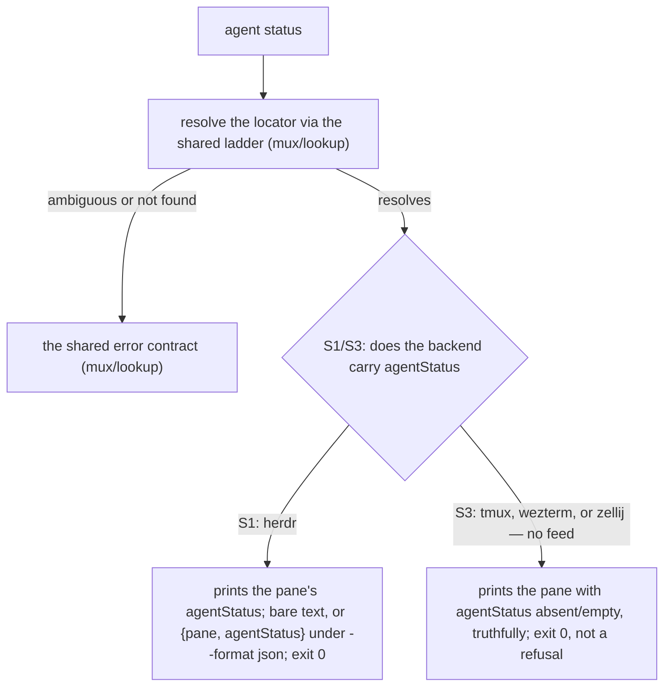
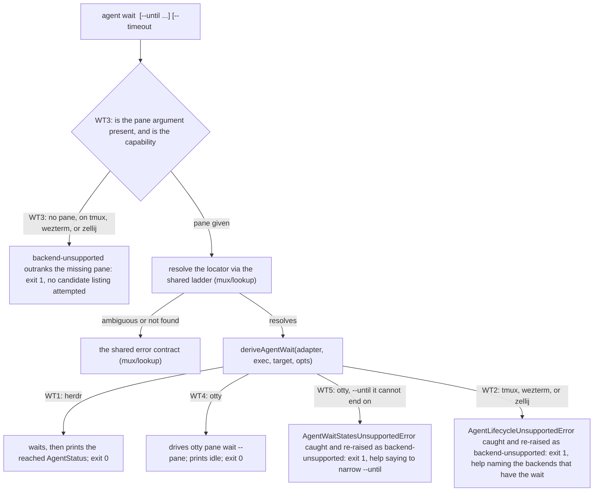

# cli/agent — the CLI agent-lifecycle surface

> The **library contract** these verbs drive — the `AgentLifecycle` capability, the herdr and otty
> bindings of it, and the `deriveAgentWait` refusal orchestrator — lives in
> [`agent/`](../../agent/README.md).
> This node owns the **CLI surface**: the `cyber-mux agent status` / `agent wait` verbs, agent-first
> (no interactive prompt, every option a flag), their stdout shape and exit codes, and how the
> `backend-unsupported` refusal renders.

## What

The `cyber-mux agent` command group, mirroring `send` / `worktree` / `template` as its own top-level
group: `agent status <pane>` (a snapshot read, never a refusal) and `agent wait <pane>` (a blocking
drive of the backend's native wait — herdr's `agent wait`, otty's `pane wait` — refused cleanly on
every backend without the primitive). **The two verbs do not cover the same backends**: only herdr
feeds the snapshot, while herdr and otty both have the wait. Both verbs
address their pane through the shared id/label resolution ladder
([`mux/lookup/`](../../mux/lookup/README.md)) like every other pane-taking verb.

### Non-goals

- **The `AgentLifecycle` capability itself, herdr's `waitForState` binding, and the refusal
  decision** — those are surface-independent and live in [`agent/`](../../agent/README.md). This node
  owns only the verb's observable: what `agent wait` prints and exits when the capability is absent,
  never the decision that it must refuse.
- **The `agentStatus` snapshot field on `LivePane`, and what `list` renders for it** — that is
  [`mux/lookup/`](../../mux/lookup/README.md) and [`cli/lookup/`](../lookup/README.md)'s.
  `agent status` reads the same field for **one** resolved pane rather than the whole listing, and
  shares its degrade-truthfully behavior on a no-feed backend, but the field's presence/absence rule
  is specified once, there.
- **The AXI error contract** — the exit-code discipline (`0` ok, `1` operation failed, `2` usage
  error), the structured-error shape, and `--format json` — is pinned once for the whole CLI in
  [`cli/lookup/`](../lookup/README.md). `agent wait`'s refusal below is an **application** of it,
  cross-referenced rather than restated.

## Use Cases

- **`agent status <pane>`** (`agentStatusCommand`) — resolve the pane through the shared ladder and
  print its current `agentStatus` (the same field `list` carries per pane). The bare form prints the
  state as text; `--format json` emits `{ pane, agentStatus }`. This is a **snapshot read, never a
  refusal**: on a backend with no agent-state feed (tmux, wezterm, zellij), it still resolves and
  prints the pane, with `agentStatus` absent (empty in the bare form, the key omitted or `null` under
  `--format json`) — exit **0**. Degrading truthfully, not refusing, is deliberate: a caller asking
  "what pane is this" should never be turned away because the backend cannot also say "and what is
  its agent doing" — the two are independent facts. The snapshot is herdr-only; the wait is not.

- **`agent wait <pane> [--until <status>…] [--timeout <ms>]`** (`agentWaitCommand`) — resolve the
  pane through the shared ladder, then **drive** herdr's blocking wait through `deriveAgentWait`
  ([`agent/`](../../agent/README.md)) and print the `AgentStatus` it reached. `--until` repeats to
  build the requested status set (herdr's own `idle|done|blocked` default applies when omitted);
  `--timeout <ms>` bounds the wait (indefinite when omitted). Unlike `agent status`, this **is** a
  refusal surface: `deriveAgentWait` throws `AgentLifecycleUnsupportedError` on tmux, wezterm, and
  zellij, and this verb catches it and re-raises the CLI's own `backend-unsupported` coded error —
  exit **1**, `help` naming the backends that have the wait — the exact mirror of how `template save`
  surfaces `CaptureUnsupportedError` as its own `backend-unsupported`.

  **On otty the same verb drives `otty pane wait`**, so the millisecond `--timeout` the CLI takes
  becomes otty's whole `--timeout-secs`, and the reached state is always `idle`.

- **A second, separate refusal: an `--until` the backend's native wait cannot end on.** otty's wait
  ends on `idle` alone, so `agent wait --until blocked` there raises
  `AgentWaitStatesUnsupportedError` and this verb re-raises it as `backend-unsupported` (exit **1**)
  too — with a **different fix hint**: narrow `--until`, not "go run it on herdr". Kept as its own
  arm rather than folded into the capability refusal precisely so the hint stays actionable. It is
  exit 1 rather than 2 because the invocation is well-formed and every `--until` value is a legal
  `AgentStatus`; what is missing is the backend's ability to end a wait there.

  **The refusal outranks a missing pane argument (CR 95).** The shared error contract now answers a
  missing `<pane>` by listing the live panes as candidates
  ([`cli/lookup/`](../lookup/README.md)) — but on a non-herdr backend, `agent wait` with no pane is
  refused `backend-unsupported` (exit 1) **before** any candidate listing, because the capability
  refusal is unconditional: no pane on that backend can be waited on, so handing the caller panes to
  pick from would send them down a dead end — pick one, rerun, get exit 1 anyway. The same
  deeper-error-first ordering `template save` pins for its geometry refusal. This is also why
  `agent wait` sits outside the shared missing-pane candidate-listing Examples in
  [`cli/lookup/`](../lookup/README.md); on herdr, where the capability is present, the shared rule
  applies unchanged.

## Control Flow

### `agent status` — a snapshot that never refuses

### `agent wait` — drives the capability, or refuses naming the backend

## Scenario map

Every scenario in [`agent.feature`](./agent.feature), one row each, grouped by use case. The
capability and refusal decision these verbs drive is in [`agent/`](../../agent/README.md).

### `agent status` — a snapshot that degrades, never refuses

| Edge | Path (Given) | Scenario |
|---|---|---|
| S1 herdr → the pane's `agentStatus` printed | a herdr pane whose feed reports `working` | `agent status prints the resolved pane's agentStatus on herdr` |
| S1 `--format json` → `{ pane, agentStatus }` | the same herdr pane, `--format json` | `agent status --format json emits pane and agentStatus as a structured payload` |
| S3 no-feed backend → the pane printed, status absent, exit 0 | a tmux pane | `agent status on a backend with no agent-state feed prints the pane with no status, and exits 0` |

### `agent wait` — drives the backend's capability, or refuses naming the backend

| Edge | Path (Given) | Scenario |
|---|---|---|
| WT1 herdr → drives the wait, prints the reached state | `agent wait <pane> --until idle --timeout 5000` on herdr | `agent wait drives the capability on herdr and reports the reached state` |
| WT4 otty → drives `otty pane wait`, prints `idle` | `agent wait <pane> --timeout 5000` on otty | `agent wait drives the capability on otty and reports idle` |
| WT5 an `--until` the backend cannot end on → `backend-unsupported`, exit 1, a narrow-`--until` hint | `agent wait <pane> --until blocked` on otty | `agent wait refuses an --until the backend's native wait cannot end on` |
| WT2 tmux, wezterm, or zellij → `backend-unsupported`, exit 1 | `agent wait <pane>` on each non-herdr backend | `agent wait refuses with backend-unsupported on a backend with no agent-lifecycle capability` |
| WT3 no pane on a non-herdr backend → the refusal outranks the missing pane | `agent wait` with no pane argument, on each non-herdr backend | `an agent-lifecycle-incapable backend is refused for the backend, not for a missing pane` |
