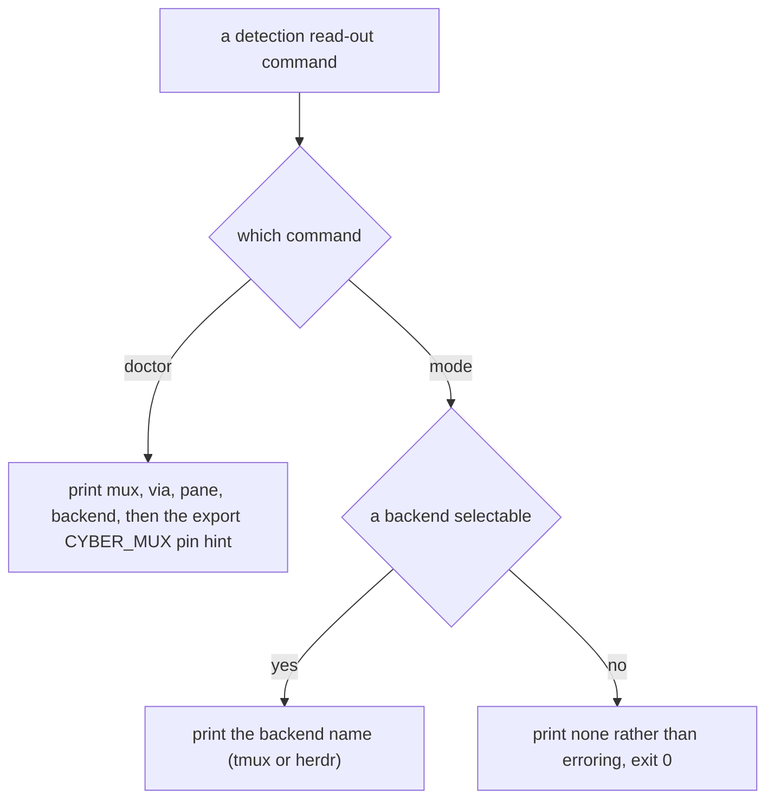

# cli/detection — the CLI detection read-out

> The **library seam** these commands read — `probeMultiplexer` and `selectSessionAdapter`, the
> env fast-path, the ancestry walk, and the screen rejection — is the surface-independent contract in
> [`mux/detection/`](../../mux/detection/README.md). This node owns only the **read-out surface**.

## What

The two `cyber-mux` commands that report what detection found — **`doctor`** and **`mode`**. `doctor`
runs discovery and prints the full probe read-out (mux, via, pane, backend) plus an `export
CYBER_MUX=<m> CYBER_MUX_PANE=
` hint a caller can paste to pin the fast-path. `mode` prints the one
thing a script usually wants — the selected session-backend name — or `none` when nothing is
selectable, without erroring. This node owns **invocation and presentation**: which command prints
what, and that `mode` degrades to `none` rather than the throw the underlying selection would raise.

### Non-goals

- **The probe and selection contract itself** — the `$CYBER_MUX` fast-path, the process-ancestry
  walk, the `$TMUX`/`$HERDR_ENV` hint fallback, and the named `screen` rejection. Those are
  surface-independent and live in [`mux/detection/`](../../mux/detection/README.md); this node reads
  their result, it does not decide it.
- **What a backend does with a pane** — placement, driving, lookup, and the worktree surface are the
  sibling units.

## Use Cases

- **`doctor`** — run detection and print the whole read-out for a human debugging why a backend was
  or was not selected: `mux`, `via`, `pane`, and `backend`, followed by an `export CYBER_MUX=…
  CYBER_MUX_PANE=…` line so the caller can pin the fast-path the probe just resolved.

- **`mode`** — print only the selected session-backend name (`tmux` or `herdr`) for a script that
  needs to branch on it. Where the underlying selection would throw for no drivable backend, `mode`
  answers `none` and exits 0 — a read-out never fails a caller who only asked what is there.

## Logic

### The two read-out commands

## Scenario map

Every scenario in [`detection.feature`](./detection.feature), one row each, grouped by use case.

### doctor — the full detection read-out

| Edge | Path (Given) | Scenario |
|---|---|---|
| `doctor` → reports mux/via/pane/backend, then the pin hint | running behind a detected multiplexer | `doctor reports the detected mux and prints a pin hint` |

### mode — the selected backend name

| Edge | Path (Given) | Scenario |
|---|---|---|
| a backend is selectable → print its name | inside a detected multiplexer | `mode reports the detected session backend` |
| no backend selectable → print `none`, exit 0 | in no detectable multiplexer | `mode reports none when no backend is selectable` |
