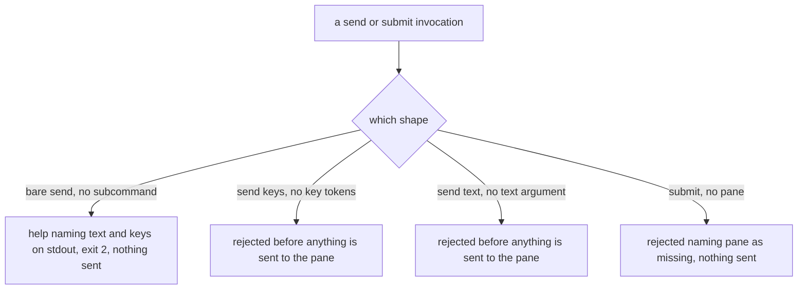

# cli/driving — the send/submit invocation surface

> The **drive contract** these verbs invoke — what `send text`, `send keys`, and `submit` actually
> send once the pane is known and the input is complete (the Enter-implied distinction, the key
> vocabulary, wezterm's raw bytes) — is the surface-independent library seam in
> [`mux/driving/`](../../mux/driving/README.md). This node owns only how the CLI **rejects
> incomplete invocation** before anything reaches a pane.

## What

The usage contract of the `cyber-mux send` and `cyber-mux submit` verbs — how each fails an
incomplete invocation loudly, before a single keystroke reaches a pane: `send keys` with no key
tokens, `send text` with no text argument, a bare `send` with no subcommand, and `submit` with no
pane. This node owns **invocation**: which shapes are rejected and how the rejection reads (the exit
code, the help routed to stdout). The **structured error/usage envelope** these rejections ride —
the shared `fail()` contract, exit-code conventions, and the help block's shape — is owned once for
every verb by [`../lookup/`](../lookup/README.md); this node names the send/submit usage errors, it
does not restate that contract.

### Non-goals

- **The drive primitives** — typing literal text, pressing named keys, the portable key vocabulary,
  `submit`'s always-Enter guarantee, wezterm's byte-sequence encoding. Those are surface-independent
  and live in [`mux/driving/`](../../mux/driving/README.md); this node is what happens *before* a
  complete invocation reaches them.
- **The shared error/exit-code/help envelope** — the `fail()` contract every verb's failure carries
  is [`../lookup/`](../lookup/README.md)'s, pinned once at the surface for all verbs.

## Use Cases

- **`send text <pane> <text>`** — rejects when no text argument is given: nothing is sent to the
  pane, the invocation is bad input.

- **`send keys <pane> <keys...>`** — rejects when no key tokens are given: same, nothing is sent.

- **`send` (the bare group)** — invoked with neither `text` nor `keys`, it is **incomplete input**:
  help naming its subcommands is written to **stdout** and it exits **2**, sending nothing. Every
  live view a bare `send` could derive already belongs to a verb — the pane enumeration to `list`,
  the current pane to `doctor` — so rather than ship a second name for an existing verb, a bare
  `send` is treated as incomplete input rather than a default action.

  **That is [`axi.md`](../../axi.md)'s #6 deciding it, not #8, and the difference is not
  bookkeeping.** Bare `send` is a missing required parameter, which #6 already puts at exit `2` — the
  decision needs no content-first reasoning at all. AXI's #8 governs the bare **binary** ("running
  your CLI with no arguments", its example being `$ tasks`) and says nothing about a command **group**
  invoked without a subcommand, so #8 was never addressed to this case and nothing here diverges from
  it. Whether the contract *should* extend #8 to groups belongs to the contract, not this node; the
  shared exit-code/help mechanism itself is [`../lookup/`](../lookup/README.md)'s.

- **`submit <pane> [text]`** — rejects when no pane is named, reporting `pane` as the missing
  argument and sending nothing to any pane. (The text argument is optional — a bare-Enter flush is a
  complete invocation; that behavior is [`mux/driving/`](../../mux/driving/README.md)'s.)

## Control Flow

### Rejecting an incomplete send/submit invocation

## Scenario map

Every scenario in [`driving.feature`](./driving.feature), one row each, grouped by use case.

### send text / send keys reject incomplete input before touching a pane

| Edge | Path (Given) | Scenario |
|---|---|---|
| `send keys` with no tokens → rejected before sending | a pane named, no key tokens | `send keys with no key tokens is rejected` |
| `send text` with no text → rejected before sending | a pane named, no text | `send text with no text argument is rejected` |

### the bare send group — invoked without a subcommand

| Edge | Path (Given) | Scenario |
|---|---|---|
| bare `send` → help on stdout, exit 2, nothing sent | `send` naming neither `text` nor `keys` | `bare send is incomplete input, so it fails loud with help rather than acting` |

### submit rejects a missing pane

| Edge | Path (Given) | Scenario |
|---|---|---|
| `submit` with no pane → rejected naming `pane`, nothing sent | `submit` naming no pane | `submit with no pane is rejected` |
