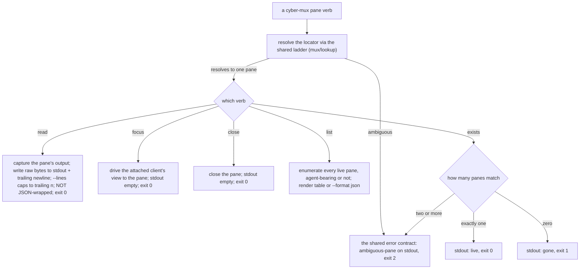
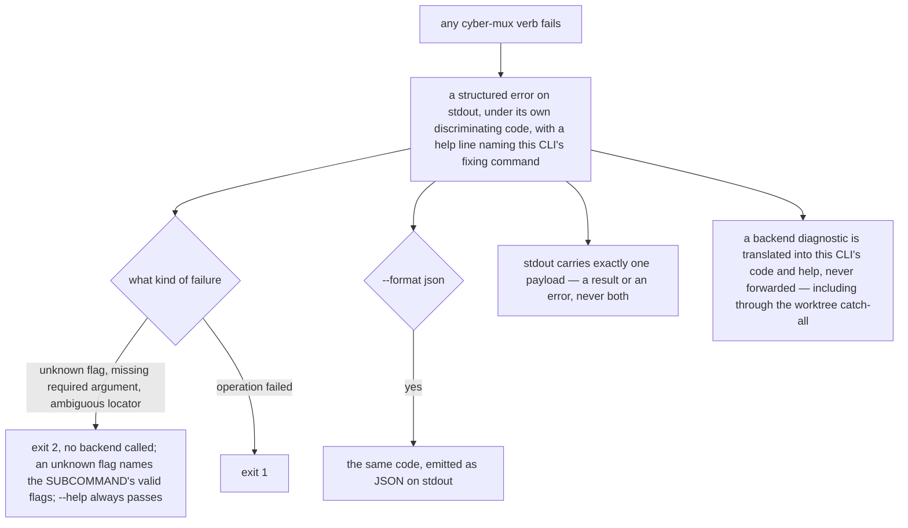

# cli/lookup — the CLI pane-addressing surface and the shared error contract

> The **library contract** these verbs rest on — the id/label resolution ladder, the read-only focus
> probe, and what the live pane listing carries — lives in [`mux/lookup/`](../../mux/lookup/README.md).
> This node owns the **CLI surface**: the `cyber-mux` verbs that address a pane, and the one
> structured-error contract every verb in the whole CLI routes through.

## What

The `cyber-mux` verbs that take a pane — **read, focus, close, list, exists** — and the shared **AXI
error/usage contract** every `cyber-mux` verb (pane, worktree, template, detection, driving) fails
through. This node owns **invocation and presentation**: what each verb writes to stdout, what it
exits, and — once — the shape of every failure: a structured error on stdout, under a stable
discriminating `code`, with a `help:` line naming this CLI's own fixing command, honoring
`--format json`, translating a backend's raw diagnostic rather than leaking it.

The surface-independent contract those verbs drive — how a locator resolves to one pane (an id
outranks a name; exactly one match resolves; two or more is ambiguous), whether a pane is currently
focused (the read-only probe), and what the live pane listing carries (labels that feed resolution) —
is the **library seam** in [`mux/lookup/`](../../mux/lookup/README.md); this node does not restate it,
it drives it and renders its outcomes.

### Non-goals

- **The resolution ladder and the focus probe themselves** — how a string is taken as an id versus a
  name, why ambiguity is a fuzzy-tier-only condition, how each backend answers focused / not-focused /
  unknown, and which labels the listing carries. Those are surface-independent and live in
  [`mux/lookup/`](../../mux/lookup/README.md).
- **What is *sent* to a resolved pane** — that is [`driving/`](../../mux/driving/README.md)'s business
  (`send`, `submit`). This node addresses a pane; `driving/` drives it.
- **Moving focus as an effect of another verb, or where a pane opens** — placement is
  [`placement/`](../../mux/placement/README.md)'s. The `focus` VERB here beams the attached client's
  view to an already-resolved pane; it opens nothing.

### Key terms

- **locator** — the string a caller passes to name a pane: either the backend's pane id or a
  human-set label. Resolution (the ladder) belongs to [`mux/lookup/`](../../mux/lookup/README.md).
- **structured error** — a machine-readable failure payload carrying a stable `code` and a `help`
  line, written to **stdout** (AXI's stream for what an agent consumes), never stderr.
- **usage error** — an invocation that is wrong before any operation is attempted (a missing required
  argument, an unknown flag, an ambiguous locator). It exits **2**; a failed *operation* exits **1**.

## Use Cases

- **`read <pane>`** (`readCommand`) — capture the addressed pane's output and write it **straight to
  stdout as raw bytes**, followed by a trailing newline. It addresses its pane through the shared
  id/label ladder. Unlike every other verb, `read` does **not** wrap its result in the structured
  (`--format json`) envelope — its stdout is the pane's own byte stream, because that is what a caller
  asked to capture. `--lines <n>` caps the capture to the trailing *n* lines. A failed read captures
  nothing, so on failure stdout is the structured error alone (the shared contract below).

- **`focus <pane>`** (`focusCommand`) — beam the attached client's view to the addressed pane. This is
  the focus **verb**, distinct from the read-only focus **probe** in
  [`mux/lookup/`](../../mux/lookup/README.md): the probe reports whether a pane is on screen and moves
  nothing; the verb drives the client's view. It reports **nothing on success** — its effect is the
  moved view — and exits 0. It addresses its pane through the shared ladder.

- **`close <pane>`** (`closeCommand`) — close (tear down) the addressed pane. It reports **nothing on
  success** and exits 0, addressing its pane through the shared ladder.

- **`list`** (`listCommand`) — enumerate every live pane the current backend can see and render them
  as a human table (with a `label` column that carries what a name resolves from) or as a structured
  payload under `--format json`. The **content** of the enumeration — that every live pane is reported
  (agent-bearing or not) and which labels a listing carries, per backend — is adapter listing
  behavior, specified as the library contract in [`mux/lookup/`](../../mux/lookup/README.md); this verb
  presents it and adds no rendering rule of its own beyond the shared table, save that a value
  containing a space is rendered whole (below).

- **`exists <pane>`** (`existsCommand`) — probe whether a single pane is still live, distinguishing its
  three outcomes **by exit code, not by prose**: `0` live, `1` gone, `2` an ambiguous locator (which
  is not an answer to "is it live?" and reports its candidates instead).

- **The shared AXI error/usage contract** — this node owns the one `fail()` / `reportError` /
  `paneVerb` / `reportWorktreeFailure` surface **every** `cyber-mux` verb routes through, so the error
  contract is pinned **once** rather than per verb. Every failure is a **structured error on stdout**,
  under a **stable, discriminating `code`** (two failures never share one), with a **`help:`** line
  naming this CLI's own fixing command (never `see --help`, never the wrapped multiplexer's raw
  diagnostic). A **usage error exits 2** (unknown flag, missing required argument, ambiguous locator),
  a **failed operation exits 1**; an unknown flag is validated against the **subcommand's** flag set
  and names them; `--help` always passes; the error honors `--format json`; stdout carries **exactly
  one** payload (a result or an error, never both); a backend diagnostic is **translated**, never
  forwarded — including through the `worktree` verbs' shared catch-all.

## Control Flow

### The pane-taking verbs

### The shared error and usage contract

## Scenario map

Every scenario in [`lookup.feature`](./lookup.feature), one row each, grouped by use case. The
resolution/probe/listing contract these verbs drive is in
[`mux/lookup/`](../../mux/lookup/README.md).

### read, focus, close — the pane-taking verbs

| Edge | Path (Given) | Scenario |
|---|---|---|
| `read` → the pane's raw captured bytes on stdout, not a JSON envelope | a live pane with captured output | `read writes the addressed pane's captured output straight to stdout, as raw bytes` |
| `read --lines n` → only the trailing n lines | a pane with more scrollback than the cap | `read --lines caps the capture to the trailing n lines` |
| `focus` → the attached client's view is driven to the pane, stdout empty | a live pane on a backend with an attached client | `focus beams the attached client's view to the addressed pane` |
| `close` → the pane is closed, stdout empty | a live pane | `close terminates the addressed pane` |

### exists — probe whether a single pane is live

| Edge | Path (Given) | Scenario |
|---|---|---|
| `exists` → live, gone, or ambiguous by exit code | one, zero, and two-or-more matches | `exists distinguishes its three outcomes by exit code, not by prose` |
| two or more matches → the report replaces the answer | `exists` against two panes labeled worker | `an ambiguous exists reports its candidates rather than answering the question` |

### The shared AXI error and usage contract

| Edge | Path (Given) | Scenario |
|---|---|---|
| ambiguous locator → ambiguous-pane on stdout, exit 2, on every pane verb | three panes all labeled worker, per pane verb | `an ambiguous locator is reported under ambiguous-pane on every pane verb` |
| ambiguity report → candidates carry id, label, cwd, each id a retry | three worker panes in different working directories | `the ambiguity report carries what tells the candidates apart, and what retries them` |
| ambiguity report → structured error on stdout, exit 2 | two panes labeled worker | `the ambiguity report is a structured error on stdout, where the agent reads` |
| ambiguity report → honors `--format json` | two panes labeled worker, `--format json` | `--format json emits the ambiguity as a structured error carrying its candidates` |
| any verb fails → structured error on stdout under its own code | no-mux, pane-not-found, and ambiguous-pane failures | `a failure is a structured error on stdout, under the code for THAT failure` |
| codes discriminate → no shared catch-all | an ambiguous locator and a missing multiplexer | `two different failures never share one code` |
| missing required argument → exit 2, no backend called | `read`, `focus`, `send text` without the pane argument | `a missing required argument is a usage error, not a failed operation` |
| unknown flag → exit 2 with the command's valid flags | `list` with a flag it does not define | `an unknown flag is a usage error, and says what the valid flags are` |
| unknown flag → validated against the subcommand's set | `template list` with `--force`, a `template save` flag | `an unknown flag is rejected against the SUBCOMMAND's flags, not the group's` |
| `--help` → passes on every command, exit 0 | any command with `--help` | `--help is never an unknown flag` |
| error → honors `--format json` under the same code | a failing command with `--format json` | `a structured error honors --format json` |
| error → the whole of stdout, never a result before it | `read` against a pane whose capture fails | `a failed verb's stdout is its structured error alone, with no result before it` |
| partial outcome → one result payload, not result plus error | a tabs template whose second tab fails | `a partially-applied template is one result payload, not a result plus an error` |
| backend diagnostic → translated into this CLI's code and help | a verb whose backend command fails with its own diagnostic | `an error never leaks the multiplexer's own output` |
| backend diagnostic → translated into this CLI's code and help | `worktree add` whose backend fails opening the pane | `the worktree catch-all never forwards the multiplexer's raw diagnostic either` |

### The list rendering keeps each field whole

| Edge | Path (Given) | Scenario |
|---|---|---|
| a listed value containing a space → rendered whole, not split across columns | a tmux pane labeled `my worker`, cwd containing a space | `a listed label or working directory containing a space is rendered whole, never split across columns` |
