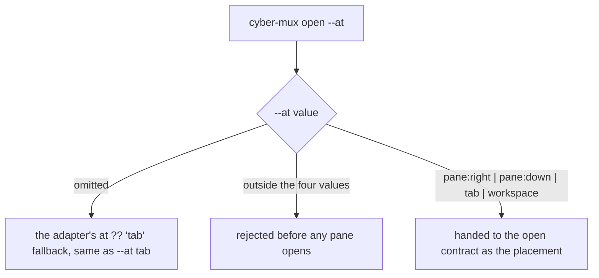
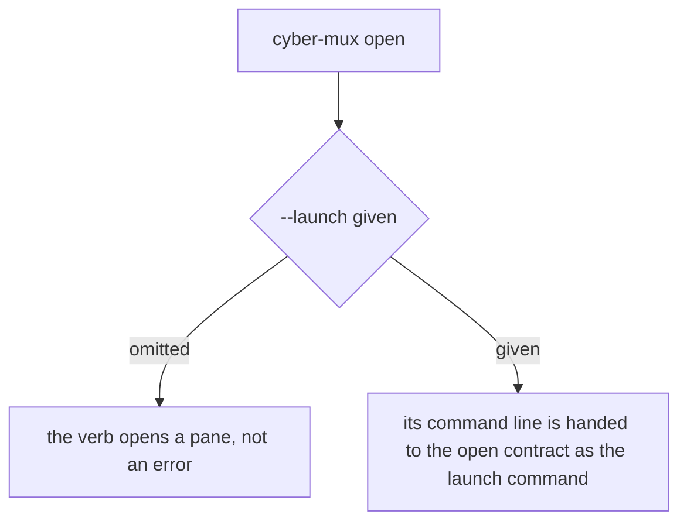
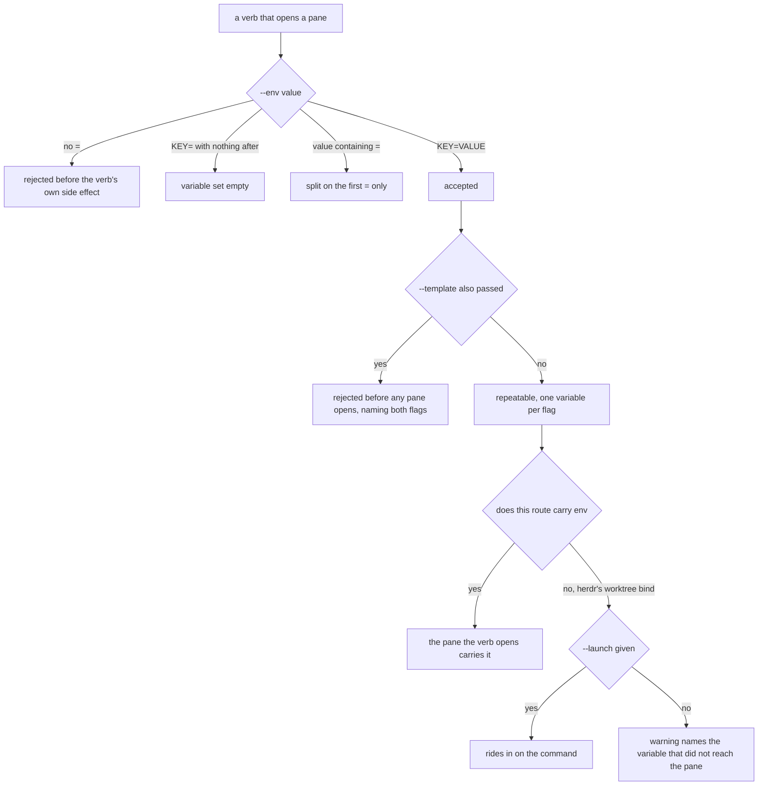

# cli/placement — the CLI placement surface

## What

The `cyber-mux open` verb's own **flags** — `--at`, `--launch`, and `--env` — the public CLI over the
library open contract. This node owns **flag parsing, defaulting, validation, conflict, and handoff**:
which flags the verb accepts, how `--at` defaults and is refused out of set, how `--launch` is optional
and hands its command line onward, and how `--env` parses a `KEY=VALUE` pair, repeats, is refused
alongside `--template`, and degrades on the one route that cannot carry it.

What each flag's value **does** once handed to the seam — where a placement lands on each backend, how a
launch command is submitted, what env means natively at each tier and how it falls back — is the
surface-independent **library contract** in [`mux/placement/`](../../mux/placement/README.md); this node
does not restate it, it drives it.

The surface split exists because the CLI and the library **diverge in what they expose** (cyberuni/cyberplace#360):
a verb only ever reads flags a human typed and can refuse a malformed one before any side effect, while
the library `open(options)` seam takes a typed options object with no flag layer at all. That divergence
cannot live in a single capability-first node, so the CLI surface earns its own — the counterpart to
[`mux/placement/`](../../mux/placement/README.md).

### Non-goals

- **What the flags' values mean.** Where `--at workspace` opens each backend's own visible space,
  whether a route carries env natively, how the env fallback prefixes a command or warns, what `open`
  returns — all surface-independent, all in [`mux/placement/`](../../mux/placement/README.md).
- **The usage-error contract** — how a rejected flag is rendered and what it exits — is shared by every
  verb and lives in [`../lookup/`](../lookup/README.md). This node asserts only that a malformed flag is
  refused **before any side effect**, never the shape of the message it is refused with.
- **`from` and `ratio`** — the two split options with **no** CLI flag at all. They are reached only
  through the adapter and are [`mux/placement/`](../../mux/placement/README.md)'s alone.

## Use Cases

- **`--at <placement>`** — selects where the new pane opens. The value maps onto each backend's own
  primitive (that mapping is the library's); this surface owns that the flag is **read**, **defaulted**
  when omitted (the adapter's own `at ?? 'tab'` fallback is reachable and observable exactly because
  `--at` is optional at the CLI), and **refused before any pane opens** when given a value outside
  `pane:right|pane:down|tab|workspace`.

- **`--launch <command>`** — optional at the CLI. Omitted, the verb still opens a pane rather than
  treating the absent flag as an error; given, it **hands its command line to the open contract** as the
  launch command for the pane the verb opens. What the contract does with it — submit-and-run versus a
  blank pane — is [`mux/placement/`](../../mux/placement/README.md)'s.

- **`--env KEY=VALUE`, repeatable, on every verb that opens a pane** (`open`, `worktree add`,
  `worktree open`) — env is the one split option with a CLI flag, because a variable a caller cannot set
  at birth is one they cannot set at all: nothing else in the CLI reaches the pane before its shell
  starts. Exactly one pane opens on each of those routes, so "which pane" needs no rule: it is the one
  the verb opened — **except on herdr's worktree bind route**, the one route that cannot carry env,
  where the flag degrades to riding in on `--launch` or, with no command to ride, a warning naming the
  variable that did not land. That exception is stated wherever the flag is, because a CLI property
  silently false on one backend's one route is this project's recurring defect. Refused alongside
  `--template` for `--launch`'s reason — the template owns what is in the panes it declares. A missing
  `=` is malformed and rejected before the verb's own side effect (which **differs by verb** — a pane
  opening, a checkout created, a workspace opened — so each is named); a present `=` with nothing after
  it sets the variable empty, and a value's own `=` is kept by splitting on the **first** one only.

## Logic

### `--at` — selecting and validating the placement

### `--launch` — optional, handed to the open contract

### `--env` — the CLI surface for the seam's env option

## Scenario map

Every scenario in [`placement.feature`](./placement.feature), one row each, grouped by use case.

### --at — choosing where the pane opens

| Edge | Path (Given) | Scenario |
|---|---|---|
| `--at` given → open at that placement | `open --at pane:down` | `--at chooses where the new pane opens` |
| `--at` outside the four values → rejected before any pane opens | `open` with an unlisted `--at` value | `--at accepts only pane:right, pane:down, tab, and workspace` |

### --launch — optional, carrying a command to the opened pane

| Edge | Path (Given) | Scenario |
|---|---|---|
| `--launch` omitted → the verb still opens a pane | `open` with no `--launch` | `open with no --launch still opens a pane — the flag is optional` |
| `--launch` given → its command line is handed to the open contract | `open --launch` with a command line | `open --launch hands its command line to the pane the verb opens` |

### --env, the CLI surface for the seam's env option

| Edge | Path (Given) | Scenario |
|---|---|---|
| `KEY=VALUE` on a carrying route → the opened pane carries it | `open`, `worktree add`, `worktree open` | `--env sets the variable in the pane the verb opens, on every route that carries env` |
| bind route with `--launch` → rides in on the command | herdr worktree verbs at workspace | `--env on the one route that cannot carry it rides in on --launch` |
| bind route with no `--launch` → warn | herdr worktree verbs at workspace | `--env on the one route that cannot carry it, with no command to ride, warns` |
| accepted → repeatable, one variable per flag | `open`, `worktree add`, `worktree open` | `--env is repeatable, one variable per flag, on every verb that has it` |
| `--template` also passed → rejected before any pane opens | `open` and `worktree add`, the two verbs with `--template` | `--env is refused alongside --template, which owns its own panes' env` |
| no `=` → rejected before the verb's own side effect | each verb, `ROLE` and `=worker` | `--env without a KEY=VALUE pair is rejected before any side effect` |
| `KEY=` with nothing after → variable set empty | each verb, carrying route | `--env with an empty value sets the variable empty, rather than rejecting` |
| value containing `=` → split on the first `=` only | each verb, carrying route | `an env value containing = splits on the first = only` |
