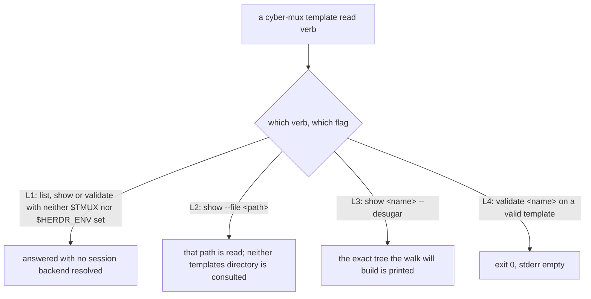
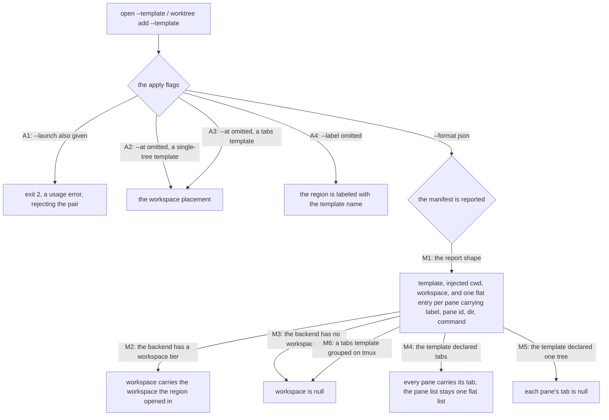

# cli/template/apply — the CLI apply surface

## What

How the `cyber-mux` command line reaches the template **read direction**: the read verbs
(`template list`, `template show`, `template validate`), the `--template` flag that applies a
template through `open` and `worktree add`, and the shape of the manifest `--format json` hands
back. This node owns **invocation and presentation** — which verbs exist, how `--file`, `--desugar`,
`--at`, `--label` and `--launch` behave at the command line, which exit code a usage error takes,
and what fields the manifest carries. The surface-independent engine those verbs drive — resolving a
template by name, validating it, desugaring the flat form, and walking the tree into live panes and
tabs — is the **library contract** in [`template/apply/`](../../../template/apply/README.md); this
node does not restate it, it drives it.

The surface split exists because one capability ships through **two divergent surfaces** — the CLI
and the library API — that expose different things (cyberuni/cyberplace#360). The engine's guarantees
(resolution precedence, the validation rules, the desugar comb, the walk's ordering and atomicity)
are surface-independent and are specified once at the library node. What is genuinely the command
line's — the verb set, the flag defaults, the usage-error exit code, the `--format json` payload
shape — earns its own node here.

### Non-goals

- **The engine itself** — how a name resolves (repo before user, through the primary checkout), what
  the validator rejects, how the flat form desugars, and the walk's build-blank-then-submit ordering
  and no-rollback atomicity. Those are surface-independent and live in
  [`template/apply/`](../../../template/apply/README.md). In particular the **atomicity** guarantee —
  that an unresolvable or invalid template leaves no worktree behind and opens nothing — is the
  engine's, verified there against both `open --template` and `worktree add --template`.
- **The AXI error contract** — the exit-code discipline (`0` ok, `1` operation failed, `2` usage
  error), the structured-error-on-stdout shape, and the `fail()` helper — is pinned once for the whole
  CLI in [`cli/lookup/`](../../lookup/README.md). The usage-error exits below (`--template` with
  `--launch`) are an **application** of it, cross-referenced rather than restated.

## Use Cases

- **`template list` / `template show` / `template validate`** — the read verbs. They take a file as
  their subject, so they answer with **no multiplexer present at all**, the same way `worktree list`
  does. `show --file <path>` is the escape hatch that skips resolution and reads a path directly;
  `show <name> --desugar` prints the exact tree the walk will build (a pure function of the flat
  form, so the print and the build cannot diverge); `validate <name>` is the CI hook — exit 0 on a
  valid template.

- **`open --template` / `worktree add --template`** — applying is `--template`, the exact sibling of
  `--launch`. There is **no `template apply` verb**: both flags answer *"what runs in the space you
  are opening"*, one for a single pane and one for a pool, so applying belongs to the verbs that
  already open a space, and `--template` and `--launch` are **mutually exclusive** (giving both is a
  usage error, exit 2). `--at` defaults to `workspace` when `--template` is given — a fresh space is
  empty by construction — for a single-tree template and a tabs template alike. `--label` defaults to
  the template name.

- **The manifest — `--format json`** — the whole handoff. It reports every pane apply created as
  `(label, pane, dir, command, tab)`, plus the `template`, the injected `cwd`, and the `workspace`.
  The `workspace` field carries the real workspace the region opened in **where the backend has a
  workspace tier**, and is `null` where it does not (`null` on tmux, and still `null` on tmux even
  when a tabs template's tabs are grouped — the group tag is cyber-mux's own bookkeeping, not a
  tier). `tab` is the same argument one level down: the tab each pane landed in, `null` from a
  single-tab template. The pane list stays **one flat list**; the tab is a field on each pane, not a
  second nesting.

## Control Flow

Two sub-graphs. The read verbs enter the first; `open --template` / `worktree add --template` and
the manifest enter the second.

### The read verbs, and the flags that shape a read

### Applying through --template, and the manifest it reports

## Scenario map

Every scenario in [`apply.feature`](./apply.feature), one row each, grouped by use case.

### The read verbs — list, show, validate

| Edge | Path (Given) | Scenario |
|---|---|---|
| L1 no multiplexer | neither `$TMUX` nor `$HERDR_ENV` set | `list, show and validate answer with no multiplexer at all` |
| L2 `show --file` | `template show --file` | `--file skips resolution entirely` |
| L3 `show --desugar` | a flat template | `show --desugar prints exactly the tree apply will build` |
| L4 `validate` on a valid template | a well-formed template | `validate exits 0 on a valid template` |

### Applying is --template, --launch's sibling

| Edge | Path (Given) | Scenario |
|---|---|---|
| A1 `--launch` also given | `open --template … --launch …` | `--template and --launch are mutually exclusive` |
| A2 `--at` omitted, single-tree | `open --template` with a single-tree template | `--at defaults to workspace when --template is given` |
| A3 `--at` omitted, tabs | `open --template` with a tabs template | `a tabs template still defaults --at to workspace` |
| A4 `--label` omitted | `open --template` | `--label defaults to the template name` |

### The manifest is the handoff (--format json)

| Edge | Path (Given) | Scenario |
|---|---|---|
| M1 the report shape | `open --template --format json` | `--format json reports every pane apply created` |
| M2 the backend has a workspace tier | `$HERDR_ENV` set and no `$TMUX` | `the manifest carries the workspace the region opened in` |
| M3 the backend has no workspace tier | a single-tree apply with `$TMUX` set | `the manifest's workspace is null on tmux` |
| M4 the template declared tabs | 2 tabs with `--format json` | `the manifest reports which tab each pane landed in` |
| M5 the template declared one tree | a template declaring `root` | `a pane from a single-tab template reports no tab` |
| M6 a tabs template grouped on tmux | a tabs template applied on tmux | `the manifest's workspace is still null on tmux even when tabs are grouped` |
