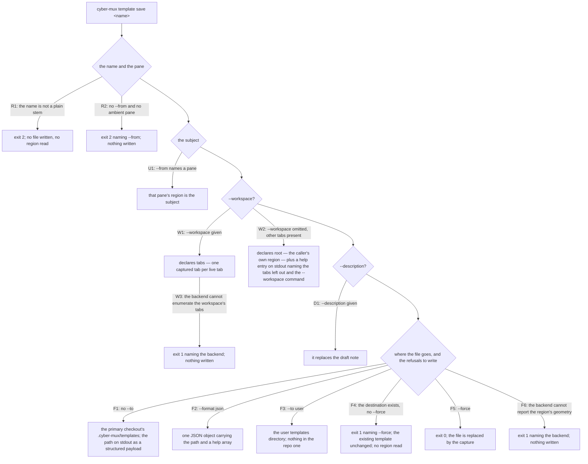

# cli/template/capture — the CLI save surface

## What

How the `cyber-mux` command line reaches the template **write direction**: `cyber-mux template save
<name>` and its flags. This node owns **invocation and presentation** — which region `--from` names,
how `--workspace` widens the subject and what a bare `save` reveals on stdout, the `--description`
draft note, where the file goes (`--to`, `--force`), the `--format json` payload, and the exit code
each refusal takes. The surface-independent engine `save` drives — deriving the split tree from the
rectangles the geometry seam reports, subtracting the target directory back out into `dir`, the
draft-note content, and the roundtrip that makes capture the exact inverse of apply — is the
**library contract** in [`template/capture/`](../../../template/capture/README.md); this node does
not restate it, it drives it.

The surface split exists because one capability ships through **two divergent surfaces** — the CLI
and the library API — that expose different things (cyberuni/cyberplace#360). The derivation, the
comb rules, the dir subtraction, the roundtrip and coherence are surface-independent and are
specified once at the library node. What is genuinely the command line's — the flag set, where the
file lands, the structured `save` payload, and the usage-vs-operation exit codes of its refusals —
earns its own node here.

### Non-goals

- **The engine itself** — the geometry-seam-to-tree derivation (rectangles, the ratio complement,
  the n-ary right-comb, the columns-first tie-break), the target subtraction into `dir`, the
  draft-note *content*, and the roundtrip. Those are surface-independent and live in
  [`template/capture/`](../../../template/capture/README.md). The default subject rule — that a bare
  `save` captures the **caller's own** region, not the backend-focused one — is the engine's too; this
  node owns only the `--from` override of it.
- **The adapter-capability contract behind the backend refusals** — that geometry reporting and
  workspace-tab enumeration are **optional** seam members, and that an absent one is a **refusal,
  never a guess** — is the engine's, in [`template/capture/`](../../../template/capture/README.md).
  This node owns only the **verb's observable** refusal (exit 1, naming the backend, writing nothing).
- **The AXI error contract** — the exit-code discipline (`0` ok, `1` operation failed, `2` usage
  error) and the structured-error shape — is pinned once for the whole CLI in
  [`cli/lookup/`](../../lookup/README.md). `save`'s two exit codes below are an **application** of it,
  cross-referenced rather than restated.

## Use Cases

- **`template save --from`** — the subject. A bare `save` captures the **caller's own** region (the
  engine's rule); `--from <pane>` overrides it to capture the region around a named pane instead.

- **`template save --workspace`** — the scope. `save`'s subject is a **region** and stays one: a bare
  `save` in a 3-tab workspace captures only the caller's own region into a single-tree template
  (declaring `root`), because widening the default silently would rewrite what `save` has always
  meant. `--workspace` opts in and captures every tab, each with its own tree (declaring `tabs`). The
  bare form does not stay quiet: it reports, in a `help[N]:` block **on stdout inside the payload**,
  the tabs it left out and the `--workspace` invocation that captures them
  ([`axi.md`](../../../axi.md)'s #9 *reveal a truncated list*).

- **`template save` writes a file** — the destination is the primary checkout's `.cyber-mux/templates`
  by default and the user's directory with `--to user`. The written path is reported on **stdout as a
  structured payload** (a `path` field plus the optional `help[N]:` block), and `--format json` emits
  that same payload as one JSON object. `--description` replaces the draft note the file carries. An
  existing template is **never overwritten without `--force`**, and the refusal is checked *before*
  the region is read, so it costs nothing.

- **`save`'s refusals** — every refusal writes nothing, under **two exit codes by kind**. A malformed
  **name** and **no pane to capture around** (neither `--from` nor an ambient pane) are usage errors —
  the invocation is wrong — so they exit **2**. A backend that cannot **enumerate a workspace's tabs**
  (`--workspace`) and one that cannot **report a region's geometry** are genuine operation failures,
  so they exit **1**, naming the backend.

## Control Flow

One sub-graph: the `save` verb, its flags, its output, and its refusals.

## Scenario map

Every scenario in [`capture.feature`](./capture.feature), one row each, grouped by use case.

### The subject — which region --from names

| Edge | Path (Given) | Scenario |
|---|---|---|
| U1 `--from` names a pane | the named pane is in another region | `--from captures the region around a named pane` |

### Capturing a whole workspace — --workspace

| Edge | Path (Given) | Scenario |
|---|---|---|
| W1 `--workspace` given | a caller in a workspace of 3 tabs | `save --workspace captures every tab of the caller's workspace` |
| W2 `--workspace` omitted, other tabs present | a caller in a workspace of 3 tabs | `save without --workspace captures only the caller's own region` |
| W2 the reveal on stdout | a bare `save` in a workspace of 3 tabs | `a bare save in a multi-tab workspace says what it left out, in a help block on stdout` |

### The draft note — --description

| Edge | Path (Given) | Scenario |
|---|---|---|
| D1 `--description` given | `save --description` | `--description replaces the draft note` |

### save writes a file

| Edge | Path (Given) | Scenario |
|---|---|---|
| F1 no `--to` | a bare `save` whose region is the whole workspace | `save writes to the repo templates directory and reports the path on stdout` |
| F2 `--format json` | a caller in a workspace of 3 tabs | `--format json reports the saved path and any help as one structured object` |
| F3 `--to user` | a bare `save --to user` | `--to user writes to the user templates directory instead` |
| F4 the destination exists, no `--force` | the repo directory already holds that name | `save refuses to overwrite an existing template, and reads no region finding out` |
| F5 `--force` | the repo directory already holds that name | `--force overwrites an existing template` |

### save's refusals

| Edge | Path (Given) | Scenario |
|---|---|---|
| R1 the name is not a plain stem | `save "../escape"` | `save validates the name before touching the filesystem or the multiplexer` |
| R2 no `--from` and no ambient pane | a caller in no pane at all | `save with no pane to capture around refuses rather than guessing` |
| W3 the backend cannot enumerate the workspace's tabs | `save --workspace` on that backend | `a backend that cannot enumerate a workspace's tabs refuses save --workspace cleanly` |
| F6 the backend cannot report the region's geometry | a bare `save` on that backend | `a backend that cannot report its region's geometry refuses save cleanly` |
