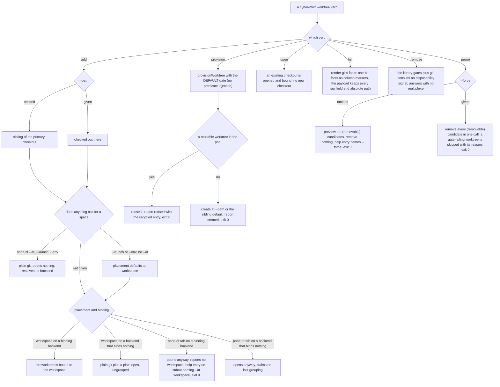

# cli/worktree — the CLI worktree surface

## What

The `cyber-mux worktree <verb>` command surface — **add, provision, open, list, remove, prune** — the
public CLI over the library worktree seam. This node owns **invocation and presentation**: which verbs
exist, how each defaults its flags, how it groups an opened checkout in a workspace where the backend
binds, and how it renders git's facts into the human table and the structured payload. The
surface-independent contract those verbs call — `provisionWorktree` / `WorktreeApi`,
`listWorktreesFromGit`, `isWorktreeRemovable`, `removeWorktreeSafely` — is the **library seam** in
[`mux/worktree/`](../../mux/worktree/README.md); this node does not restate it, it drives it.

The surface split exists because the CLI and the library **diverge in what they expose**: a verb can
only ever use the default availability gate, while the library seam takes an injectable one. That
divergence cannot live in a single capability-first node, so the CLI surface earns its own.

### Non-goals

- **The library contract itself** — what `provisionWorktree` guarantees on reuse, how
  `removeWorktreeSafely` orders its gates against the binding release, how `listWorktreesFromGit`
  resolves the default branch or degrades an undeterminable signal. Those are surface-independent and
  live in [`mux/worktree/`](../../mux/worktree/README.md).
- **Where a pane lands and what `open` reports back** — that is [`mux/placement/`](../../mux/placement/README.md)'s
  business. The worktree **binding** and a pane's workspace **occupancy** are different questions.

## Use Cases

- **`worktree add`** — create a git worktree, and open it when a placement is asked for. `--path`
  defaults to a sibling of the primary checkout (`<parent>/<repo>.worktrees/<branch>`), never nested
  inside it; `--base` sets the branch start-point. With **none of `--at`, `--launch`, `--env`** it is
  plain git: it opens nothing and resolves no backend, so it works outside any multiplexer — the only
  route that does. `--launch` and `--env` each imply `--at workspace` (asking for something *in* a
  pane is asking for the pane), and `workspace` is the only placement a backend can bind a worktree
  to. `--label` names the tier `--at` opened; omitted, the backend's own default stands (herdr's is
  the checkout path's basename).

- **`worktree provision`** — reuse a free worktree, else create — the CLI wiring of the
  `provisionWorktree` seam. It uses the **default availability gate** (`isWorktreeRemovable`): it
  reuses a worktree prune would have removed, else creates a fresh checkout at the sibling path
  (`--path` overrides, `--base` sets the start-point). It reports **what it did** — `action`
  (`reused` | `created`), the worktree `{root, branch}`, and on reuse the recycled entry in full
  (prior branch + workspace occupancy) — on stdout honoring `--format`, exit 0.
  **The surface divergence:** the verb offers **no** flag to inject a host availability predicate. A
  host that must exclude a live-session worktree calls the `provisionWorktree` / `WorktreeApi.provision`
  seam directly — the only surface that takes an injected predicate (see the injectable-predicate
  scenario in [`mux/worktree/`](../../mux/worktree/README.md)).

- **`worktree open`** — open (and, where the backend binds, group) an existing checkout plain git
  created earlier. The remedy that makes "add now, group later" a first-class story.

- **`worktree list`** — every worktree of the repo and the workspace each is open in. It renders git's
  facts and **never restates them**: a one-bit fact earns a **marker on the column it is about**, never
  a column of its own — the primary checkout's branch `(*)`, a vanished checkout's path `(gone)`, a
  disposable worktree's branch `(removable)` (the merged/clean/unoccupied composite compressed to one
  word). A home-rooted path collapses its prefix to `~`, matched at a path **boundary**. Every marker
  is **human-surface only**: every structured payload keeps each raw field (`merged`, `dirty`, `linked`,
  `prunable`) and the **absolute** path, because that is the surface an agent acts on.

- **`worktree remove`** — remove a git worktree through the CLI. It answers outside a multiplexer (a
  git question), and the CLI verb consults **no** disposability signal the listing renders — removal
  keeps exactly the library gates. (The gate ordering and non-delegation are the library seam's, in
  [`mux/worktree/`](../../mux/worktree/README.md).)

- **`worktree prune`** — the bulk remove: every candidate `list` marks `(removable)`, gone in one
  call, through the **same gate** so the two can never disagree about which worktrees are free. The
  **bare form previews** (the destructive default must be side-effect-free — a caller sees what would
  go) and **`--force` applies** it; a worktree that fails the gate is skipped and reported with the
  reason it was kept.

## Control Flow

### The verb dispatch

## Scenario map

Every scenario in [`worktree.feature`](./worktree.feature), one row each, grouped by use case.

### git worktree helpers

| Edge | Path (Given) | Scenario |
|---|---|---|
| `--path` omitted → sibling of the primary checkout | `worktree add --branch` with no `--path` | `worktree add defaults the path to a sibling of the primary checkout` |
| `--path` given → checked out there | `worktree add --branch --path` | `worktree add honors an explicit --path` |
| gate: primary checkout → refused | `worktree remove` against the primary checkout's own path | `worktree remove refuses the primary checkout, even with --force` |
| gate: checkout already gone → tolerated, no git removal | a path with nothing checked out there | `worktree remove tolerates a worktree already gone from disk` |
| gate: dirty and no `--force` → refused | a worktree with uncommitted changes, no `--force` | `worktree remove refuses uncommitted changes unless --force` |
| gate: dirty with `--force` → removed | a worktree with uncommitted changes, `--force` | `worktree remove --force discards uncommitted changes without the dirty check` |

### worktree provision — reuse a free worktree, else create (default gate only)

| Edge | Path (Given) | Scenario |
|---|---|---|
| a reusable candidate exists → reuse it, report the reclaim | `provision --branch` with a merged, clean, unoccupied worktree in the pool | `worktree provision reuses a free worktree in the pool and reports the reclaim` |
| no candidate → create at the sibling path, report created | `provision --branch` with no reusable worktree in the pool | `worktree provision creates a fresh checkout when the pool holds no reusable worktree` |
| explicit `--base` → the provisioned branch starts there | `provision --branch --base` | `worktree provision --base starts the provisioned branch at the given ref` |
| explicit `--path` → a created checkout lands there | `provision --branch --path` with no reusable worktree | `worktree provision --path lands a created checkout at the given path` |
| no predicate-injection flag → the default gate only (the surface divergence) | the flags the verb accepts | `the worktree provision verb offers no availability-predicate injection, using only the default gate` |

### worktree/workspace binding

| Edge | Path (Given) | Scenario |
|---|---|---|
| nothing asks for a space → plain git, no backend resolved | `worktree add` with none of `--at`, `--launch`, `--env` | `a bare worktree add opens nothing, so there is nothing to group` |
| `--launch` with no `--at` → placement defaults to workspace | `worktree add --launch` with no `--at` | `worktree add --launch defaults the placement to workspace` |
| `--env` with no `--at` → placement defaults to workspace | `worktree add --env` with no `--at` and no `--launch` | `worktree add --env defaults the placement to workspace, for --launch's reason` |
| `--at workspace` → bound where the backend binds, ungrouped where it does not | herdr, tmux, wezterm, and zellij | `worktree add --at workspace groups the worktree where the backend binds` |
| pane or tab placement on a binding backend → opens ungrouped | `pane:right`, `pane:down`, and `tab` | `a placement the binding cannot serve falls back rather than failing` |
| pane or tab placement on a backend that binds nothing → no lost-grouping claim | tmux, `--at pane:right` | `a backend that binds nothing falls back without reporting a lost grouping` |
| pane or tab placement on a binding backend → help entry on stdout, exit 0 | a binding backend, `--at pane:right` | `the lost-grouping note is a help entry on stdout, not a line on stderr` |
| `--label` given → names the tier `--at` opened | workspace, tab, and `pane:right` on herdr and tmux | `--label names whatever --at opened, on every backend` |
| `--label` omitted → the backend's own default stands | `cyber-mux` with no `--label` | `--label omitted leaves each backend its own default` |
| `worktree open` → an existing checkout is opened and bound | a checkout made by a bare `add`, open in no workspace | `worktree open groups a worktree that plain git created earlier` |
| `list` → only the binding from the backend | worktrees open in workspaces on a backend that binds | `worktree list reports which workspace each worktree is open in` |
| no multiplexer → `list` and `remove` still answer from git | no multiplexer to be inside of | `worktree list and remove answer outside a multiplexer` |

### The listing renders git's facts; it never restates them

| Edge | Path (Given) | Scenario |
|---|---|---|
| a one-bit fact → a marker on the column it is about, never a column | the primary checkout and a checkout whose directory is gone | `a one-bit worktree fact is marked, never given its own column` |
| composite disposability → one `(removable)` marker, all three inputs required | a merged, clean, unoccupied worktree | `worktree list answers whether a worktree is still needed, not only whether it is occupied` |
| the composite is a rendering, not a payload field | a marked worktree read as structured output | `the disposability composite is the table's compression, never a field of its own` |
| undeterminable signal → never marked `(removable)`, paired against a determined positive | a detached-HEAD and a gone worktree, beside a determined removable one | `an undeterminable disposability signal is never marked (removable) in the human table` |
| a path under home → the prefix collapses to `~`, matched at a boundary | worktrees under home, and a sibling whose name extends home's own | `a home-rooted worktree path is shortened to ~ in the human table` |
| a structured payload → the fields, never the markers | any worktree whose row the human table marks or shortens | `a table marker never reaches a structured payload` |

### worktree prune — bulk remove of every (removable) candidate

| Edge | Path (Given) | Scenario |
|---|---|---|
| bare → preview, remove nothing, help entry names `--force` | worktrees `list` marks `(removable)` | `worktree prune bare previews the removable candidates and removes nothing` |
| `--force` → remove every candidate in one call; a gate-failing one is skipped with its reason | removable worktrees plus one that fails the gate | `worktree prune --force removes every removable candidate in one call` |
