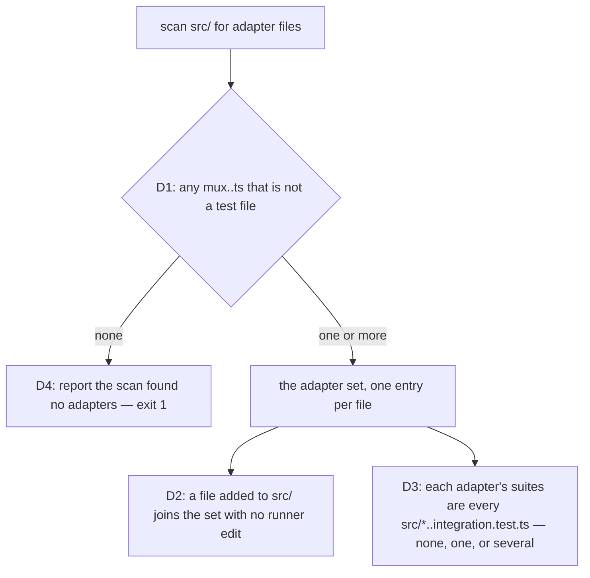
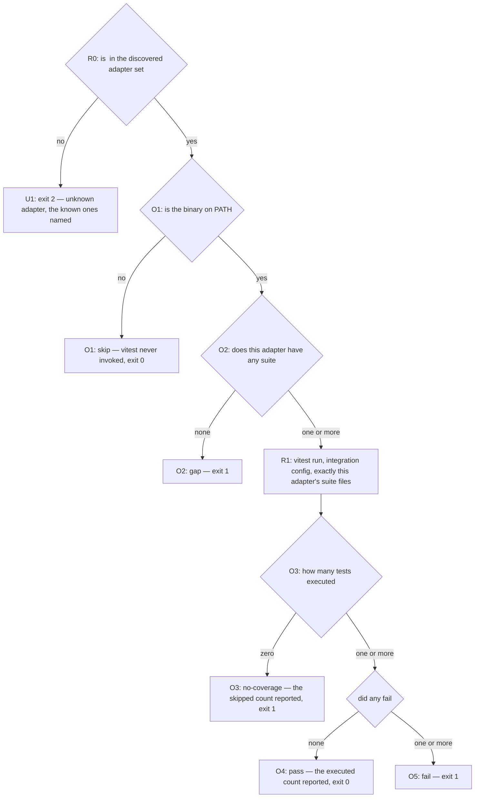
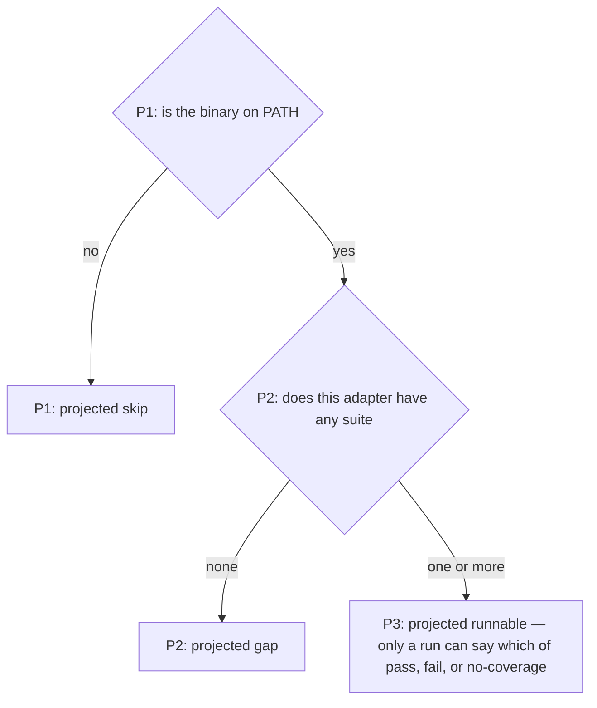
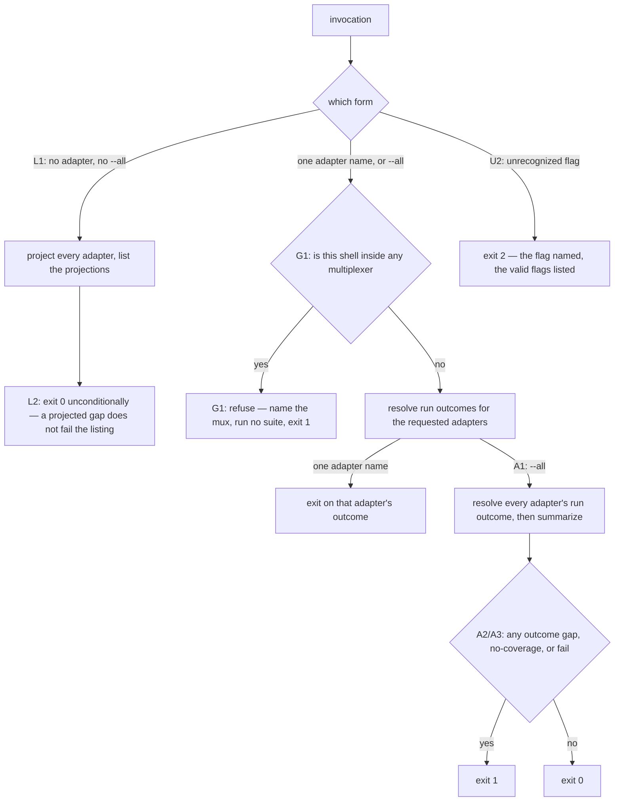

# conformance — verifying one adapter against its real multiplexer

> **A maintainer tool, not a shipped surface.** This node owns `scripts/test-adapter.ts` and its
> `test:adapter` package script — run by hand on a machine that has a given multiplexer installed.
> It is excluded from the published package and has no `cyber-mux <verb>` counterpart, so it gets no
> mirror node under [`cli/`](../cli/README.md). It is nonetheless **behavioral**: its discovery,
> outcome resolution, and exit codes are a contract, and this suite is what holds them.

## What

Continuous integration cannot install every multiplexer, so the real-boundary suites
(`src/*.integration.test.ts` — the ones that drive an actual tmux or herdr rather than a stubbed
command runner) are verified **by hand, per platform**. Today that means `pnpm test:integration`,
which has two defects this node exists to fix:

- **It runs every suite at once.** There is no way to verify one adapter. On a tmux-only machine the
  herdr suites are dead weight, and on a herdr machine the reverse.
- **A skip and a pass look identical.** Every suite quietly excuses itself when its multiplexer is
  missing (`describe.skipIf(!hasTmux())`), so a green run is equally consistent with "everything
  passed" and "nothing ran". The one thing a manual verification pass must tell you is exactly what
  it could not check.

`scripts/test-adapter.ts` answers, per adapter: **is this multiplexer here, is there a real-boundary
suite for it, and did that suite actually exercise anything?**

Exit codes follow the set [`axi.md`](../axi.md) states for every command in this package — `0`
success, `1` error, `2` usage error — which is what lets a bad invocation stay distinguishable from
a failed verification instead of collapsing both into `1`.

### Key terms

- **Adapter** — one multiplexer's implementation of the pane contract, `src/mux.<name>.ts`.
- **Real-boundary suite** — a test file that drives the actual multiplexer binary,
  `src/*.<name>.integration.test.ts`, as opposed to a unit test with a stubbed command runner.
- **Outcome** — the runner's verdict for one adapter: `skip`, `gap`, `no-coverage`, `pass`, or `fail`.

### Derivation, not a registry

Both halves of the runner's knowledge are **read off the filesystem**, so an adapter added tomorrow
is covered with no edit to the runner:

| What | Derived from |
|---|---|
| the set of adapters | `src/mux.<name>.ts`, excluding `*.test.ts` |
| an adapter's suites | `src/*.<name>.integration.test.ts` — an adapter may have several |
| whether it is installed | the binary named `<name>`, looked up on `PATH` |

A hand-maintained adapter table was the alternative and is rejected: it goes stale silently, which
is the same class of lie as a skip rendering as a pass. Deriving the presence probe from the
adapter's own name — rather than a per-adapter command table — is what makes that check
maintenance-free. The `PATH` lookup is deliberately the **coarse** gate; each suite's own internal
skip condition stays the fine one, and the `no-coverage` outcome below is what stops that second
gate from hiding behind a green exit.

Deriving from the filesystem has one failure mode worth naming: a scan pointed at the wrong place
finds nothing and looks exactly like a scan that found nothing to complain about. So **finding no
adapters at all is an error**, not an empty pass — the same rule `scripts/check-features.mjs` already
applies to its own `.feature` scan, for the same reason.

### The five run outcomes

A **run outcome** is the verdict of verifying one adapter. Exactly one is reported per adapter.

| Outcome | Condition | Exit |
|---|---|---|
| `skip` | the multiplexer is not installed | 0 |
| `gap` | installed, but **no real-boundary suite exists** | 1 |
| `no-coverage` | installed, the suite ran, but **no test in it executed** | 1 |
| `pass` | installed, the suite ran, tests executed, none failed | 0 |
| `fail` | installed, the suite ran, a test failed | 1 |

### The three projected outcomes — what the listing can honestly know

The listing form runs nothing, so it cannot report a run outcome. Only `skip` and `gap` are
**statically derivable** (from install state and suite count); `pass`, `fail`, and `no-coverage` are
findings *of a run* and are unknowable without performing it. Reporting them from the listing would
mean executing every installed adapter's suite — exactly as expensive as the verification the
listing exists to preview, and a contradiction of its purpose.

So the listing reports a **projected outcome** drawn from three values:

| Projected | Condition | Becomes, on a run |
|---|---|---|
| `skip` | the multiplexer is not installed | `skip` |
| `gap` | installed, no real-boundary suite | `gap` |
| `runnable` | installed, at least one suite | one of `pass`, `fail`, or `no-coverage` |

`runnable` is the honest name for "this machine can verify this adapter, and only running it will
say how". A projection is never a verdict.

**`gap` and `no-coverage` are the point of the tool.** Four of the six adapters — `wezterm`,
`zellij`, `cmux`, and `otty` — ship with mocked unit tests only and no real-boundary suite at all, so
a runner that reported them green would assert coverage that does not exist. `no-coverage` catches the subtler case, and it is not hypothetical: with the tmux binary made
unavailable, the tmux suite reports six tests, **zero executed, six skipped — and vitest still exits
0 reporting success**. That is precisely the laundering this outcome refuses.

**`skip` does not fail**, and the asymmetry is deliberate: an adapter you cannot test on this machine
is not a defect of this machine's run. The gap is not thereby hidden — the **listing reports suite
presence for every adapter regardless of installation**, so a missing wezterm suite is visible from a
tmux-only box; only the *exit status* is scoped to what this machine could actually verify.

### Non-goals

- **The shared, injected conformance suite.** One `SessionAdapter` suite parameterized by adapter —
  so a new adapter inherits coverage, and a new feature adds one scenario every adapter must satisfy
  — is the natural successor to this runner and is deliberately a **separate change request**. This
  node specifies the runner that would drive it and presumes nothing about its shape.
- **Filling the wezterm, zellij, cmux, and otty gaps.** This node **reports** a missing suite.
  Writing one is the work that report exists to prompt.
- **Replacing `pnpm test:integration`.** The run-everything entry point stays. This is selection and
  honest reporting layered over the same suites and the same
  [`vitest.integration.config.ts`](../../../vitest.integration.config.ts).
- **Being a shipped verb.** The suites it drives are not in the published package, so a
  `cyber-mux <verb>` counterpart would point at files a consumer does not have.
- **Deciding which backend the current session is running inside.** That is
  [`mux/detection/`](../mux/detection/README.md)'s contract, and this node **consumes** it (via
  `currentPane`) for the refusal guard rather than restating it. The two questions stay distinct:
  detection answers *what am I inside*, while this node's presence probe answers *is this binary
  installed on this machine* — different questions with different answers, and only the second is
  specified here.

## Use Cases

Three entry points, all on `scripts/test-adapter.ts` (surfaced as the `test:adapter` package
script). Usage errors are branches within these, not separate entry points.

- **`test-adapter` — the listing form (no adapter, no flags).** *Trigger:* a maintainer wants to know
  what this machine is able to verify before committing to a run. *Inputs:* none. *Outcome:* one line
  per discovered adapter carrying its name, whether the multiplexer is installed, how many
  real-boundary suites it has, and its **projected** outcome (`skip`, `gap`, or `runnable`); exit 0.
  It runs no suite, so it reports no run outcome. Its exit code is **unconditional** — a projected
  `gap` does not make the listing itself fail, because the listing reports a state of affairs rather
  than judging it; only the verifying forms turn a gap into a non-zero exit. Flags alone drive this
  tool — the bare invocation reports rather than prompting, and there is no interactive mode.

- **`test-adapter <adapter>` — verify one adapter.** *Trigger:* a maintainer on a platform that has
  this multiplexer wants to verify it. *Inputs:* one adapter name. *Outcome:* that adapter's suites
  are run through `vitest.integration.config.ts` and exactly one of the five outcomes is reported,
  with its exit code. An unknown name is a usage error, exit 2. This is the selection
  `pnpm test:integration` cannot express.

- **`test-adapter --all` — verify every installed adapter.** *Trigger:* a full manual verification
  pass on one platform. *Inputs:* none. *Outcome:* every discovered adapter is resolved and reported
  on its own line, followed by a summary of the outcome counts; the exit code is 1 if **any** adapter
  ended `gap`, `no-coverage`, or `fail`, and 0 when every one passed or skipped — so a single buried
  bad outcome cannot be averaged away by its neighbors. It is deliberately **thin**: detect the
  installed adapters, call each one's suites, fold the exits. It adds no verification logic of its
  own, which is why it is verified only against the real boundary (below).

### Running from inside a multiplexer is refused

A suite-running invocation is **refused outright when this shell is itself inside any multiplexer**,
and exits 1. The real-boundary suites drive live multiplexers, and several verbs resolve against
*the caller's own current pane* — from inside herdr, `pane split --current` splits **this** pane and
`focus()` yanks **this** focus. `mux.herdr.integration.test.ts` already carries its own
`insideHerdrPane` gate for exactly this reason; the runner lifts that from a per-suite precaution to
a precondition of the tool.

The rule is **blunt on purpose**. Being inside tmux blocks verifying herdr too, even though that
particular pairing is harmless — "which cross-adapter combinations happen to be safe" is a judgment
that would have to be re-derived every time a backend lands, and getting it wrong damages a live
session. A manual verification tool is run from a plain shell; that is the whole rule.

Two consequences worth stating:

- **The listing form is exempt**, because it runs no suite and so carries none of the risk. It stays
  available from anywhere, which is how a caller discovers what a plain shell would be able to verify.
- **For wezterm, cmux, and otty this is the only way anyway.** Those three are GUI applications whose
  CLIs are *clients* — `wezterm cli`, `cmux`, `otty` all talk to an app that must already be running.
  There is no "inside" from which to drive them; you run from a separate terminal while the app is up.

Which mux this shell is inside is read from `currentPane` in
[`mux-probe.ts`](../../../src/mux-probe.ts) — the same per-pane env contract detection itself uses,
not a second copy of it, so a new backend teaches this guard about itself by landing its adapter.

## Control Flow

### Discovery — the shared sub-graph every entry point enters first

### Resolving one adapter's outcome — shared by `<adapter>` and `--all`

### Projecting one adapter — the listing sub-graph, which runs nothing

### Selecting the entry point

## Scenario map

Every scenario in [`conformance.feature`](./conformance.feature), one row each. The first group is
the shared discovery sub-graph both other entry points enter; the rest are grouped by use case.

### Discovery (shared sub-graph)

| Edge | Path (Given) | Scenario |
|---|---|---|
| D1 adapter files become the set; test files are not adapters | four adapter files plus their unit tests | `the adapter set is derived from the mux source files` |
| D1 a test file is not mistaken for an adapter | the same tree | `a unit test sitting beside an adapter does not become an adapter` |
| D2 a new adapter file joins with no runner edit | a tree carrying an adapter the runner never named | `an adapter added to the source tree is discovered without editing the runner` |
| D3 suites resolve per adapter — several | herdr's two integration suites | `an adapter with several integration suites resolves to all of them` |
| D3 suites resolve per adapter — none | wezterm, which has no integration suite | `an adapter with no integration suite resolves to none` |
| D4 an empty scan is an error, not an empty pass | a source tree carrying no adapter files | `discovering no adapters at all exits 1 rather than reporting an empty pass` |

### `test-adapter` — the listing form

| Edge | Path (Given) | Scenario |
|---|---|---|
| L1 every adapter is listed with its installation state and suite count | tmux installed with one suite, the others absent | `the listing reports each adapter's installation state and suite count` |
| P1 projection — not installed | herdr absent from PATH | `the listing projects skip for an adapter whose multiplexer is not installed` |
| P2 projection — installed, no suite | wezterm on PATH, suiteless | `the listing projects gap for an installed adapter with no suite` |
| P3 projection — installed, with a suite; no run outcome is claimed | tmux on PATH with one suite | `the listing projects runnable rather than claiming a run outcome it cannot know` |
| L2 the exit is unconditional — a projected gap does not fail it | wezterm on PATH, suiteless, projecting gap | `the listing exits 0 even when it projects a gap` |
| L1 suite presence is reported even for an uninstalled adapter | wezterm absent from PATH, and suiteless | `the listing reports a missing suite for an adapter this machine cannot exercise` |

### Refusing to run from inside a multiplexer

| Edge | Path (Given) | Scenario |
|---|---|---|
| G1 inside any mux → refuse a named-adapter run | a shell inside each of the six backends | `verifying an adapter from inside any multiplexer is refused` |
| G1 the refusal covers `--all` too | a shell inside herdr | `--all from inside a multiplexer is refused too` |
| G1 the listing is exempt — it runs no suite | a shell inside herdr | `the listing form still works from inside a multiplexer` |

### `test-adapter <adapter>` — verify one adapter

| Edge | Path (Given) | Scenario |
|---|---|---|
| R1 only this adapter's suite files are run | tmux installed, both tmux and herdr suites present | `verifying one adapter runs only that adapter's suite files` |
| O1 not installed → skip, vitest never invoked | herdr absent from PATH | `an uninstalled multiplexer is skipped without invoking vitest, and exits 0` |
| O2 installed with no suite → gap | wezterm on PATH, with no integration suite | `an installed multiplexer with no real-boundary suite is reported as a gap and exits 1` |
| O3 ran, nothing executed → no-coverage | a tmux suite whose every test was skipped by its own gate | `a suite that executed no tests is reported as no coverage and exits 1` |
| O4 executed, none failed → pass | a tmux suite reporting six passing tests | `an installed multiplexer whose suite passes is reported as a pass and exits 0` |
| O5 a test failed → fail | a tmux suite reporting a failing test | `an installed multiplexer whose suite fails is reported as a failure and exits 1` |
| U1 an unknown name is a usage error | the name `screen` | `an unknown adapter name exits 2 and names the adapters that are known` |

### `test-adapter --all` — verify every installed adapter

These three are verified **only against the real boundary**, in
`scripts/test-adapter.integration.test.ts` (opt-in via `pnpm test:integration`, never part of
`pnpm test`). `--all`'s entire job is composition — detect the installed adapters and call each
one's real suites — so a fan-out over faked dependencies would assert only that a fake fan-out fans
out. That is the "green that verified nothing" this node exists to refuse, so the mock is not an
acceptable substitute here even though it is elsewhere in this suite. The consequence is deliberate
and stated: **CI never verifies `--all`**, and neither does a machine sitting inside a multiplexer.

| Edge | Path (Given) | Scenario |
|---|---|---|
| A1 each adapter reported on its own line, counts summarized | tmux passing, herdr absent, wezterm suiteless | `--all reports every adapter on its own line and summarizes the counts` |
| A2 any bad outcome decides the exit | one passing adapter alongside one bad outcome | `--all exits 1 when any single adapter is a gap, no coverage, or a failure` |
| A3 the positive companion — nothing bad, exit 0 | one passing adapter alongside one skipped one | `--all exits 0 when every adapter either passed or was skipped` |
| U2 an unrecognized flag is a usage error | the flag `--everything` | `an unrecognized flag exits 2, naming the flag and listing the valid ones` |

