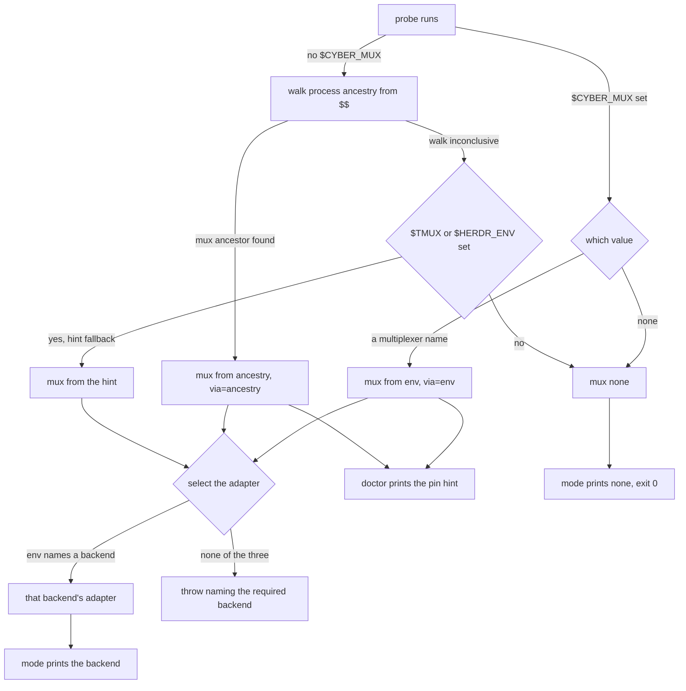
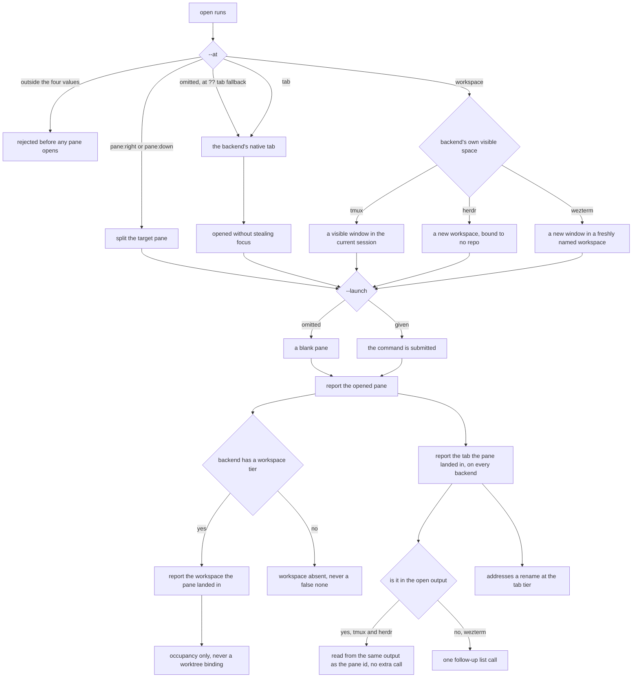
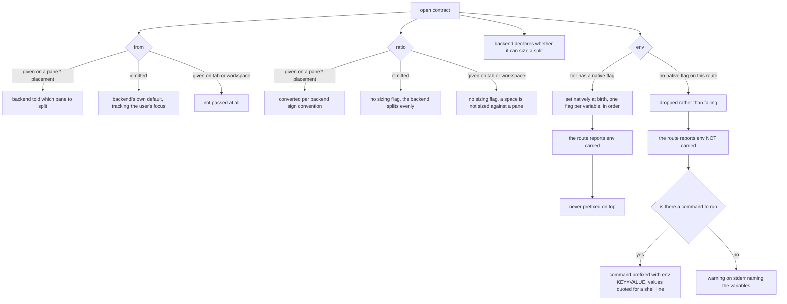
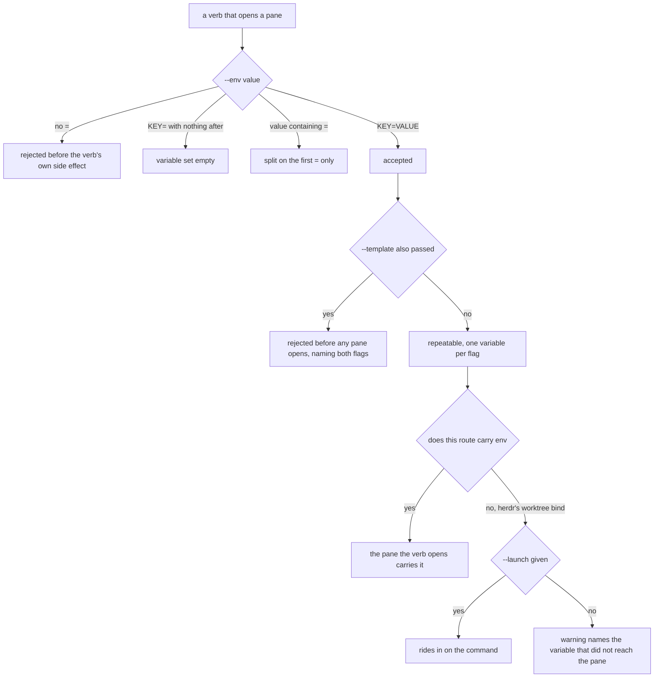
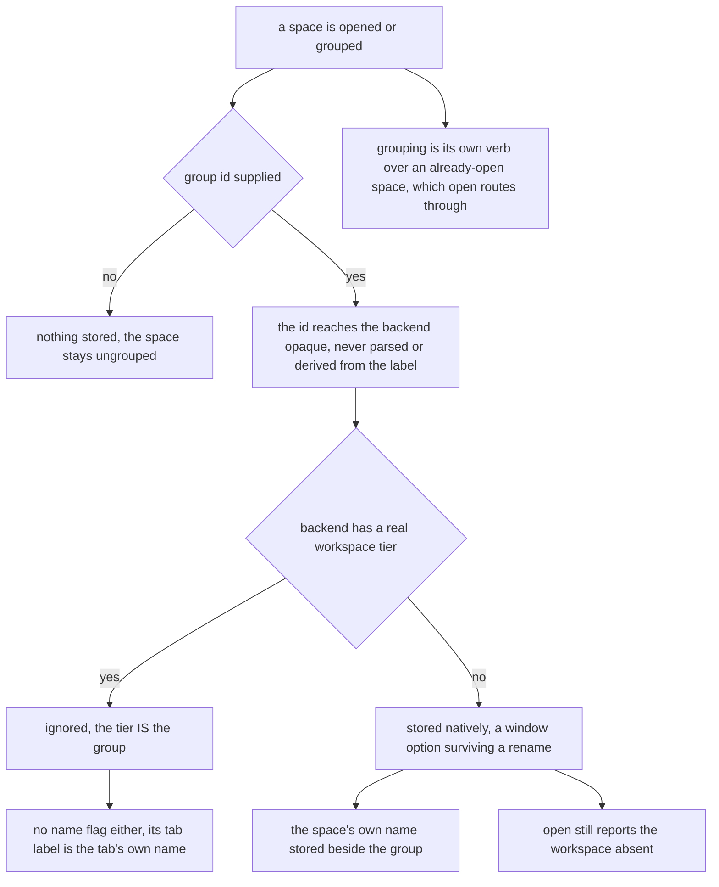
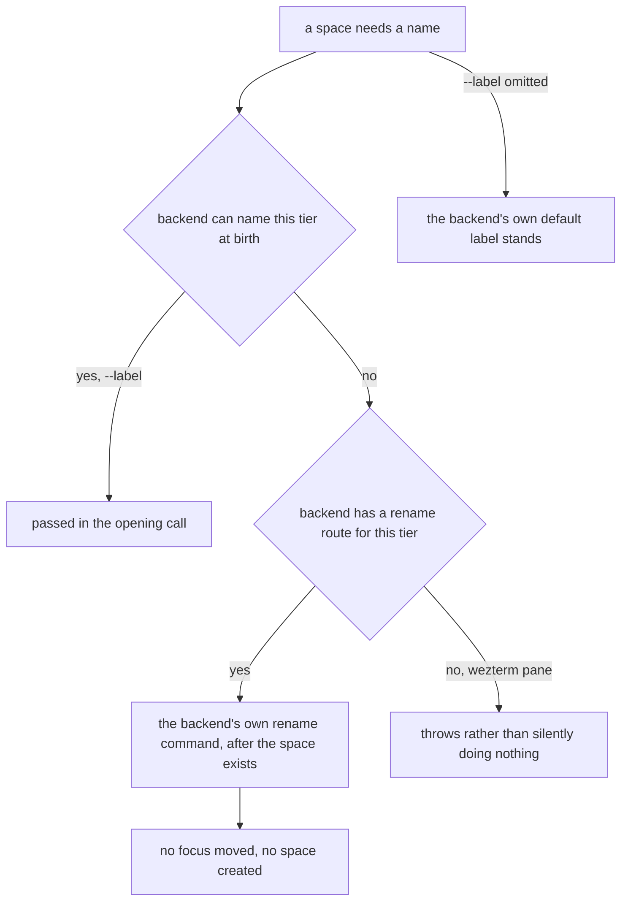
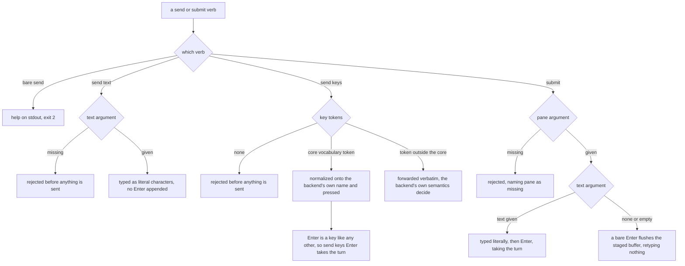
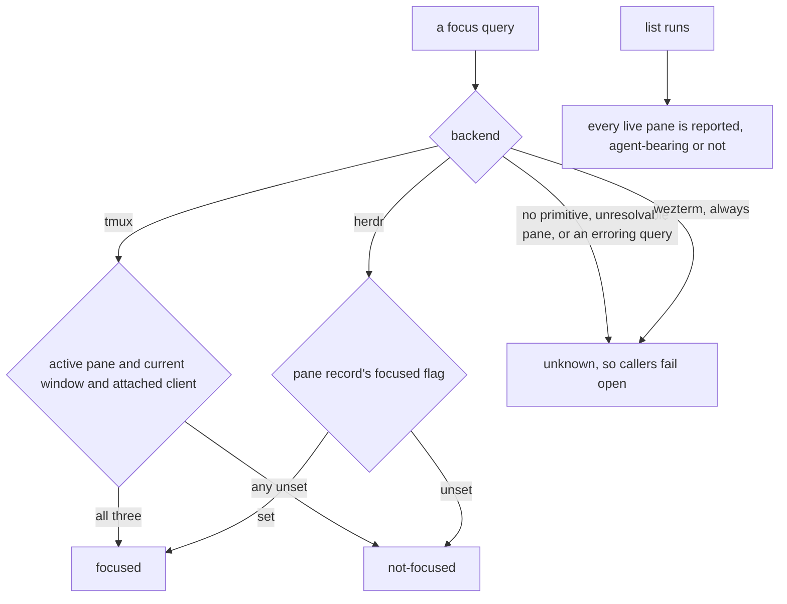
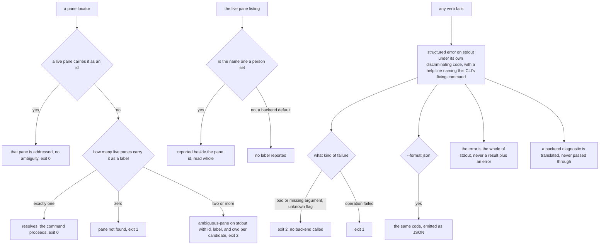
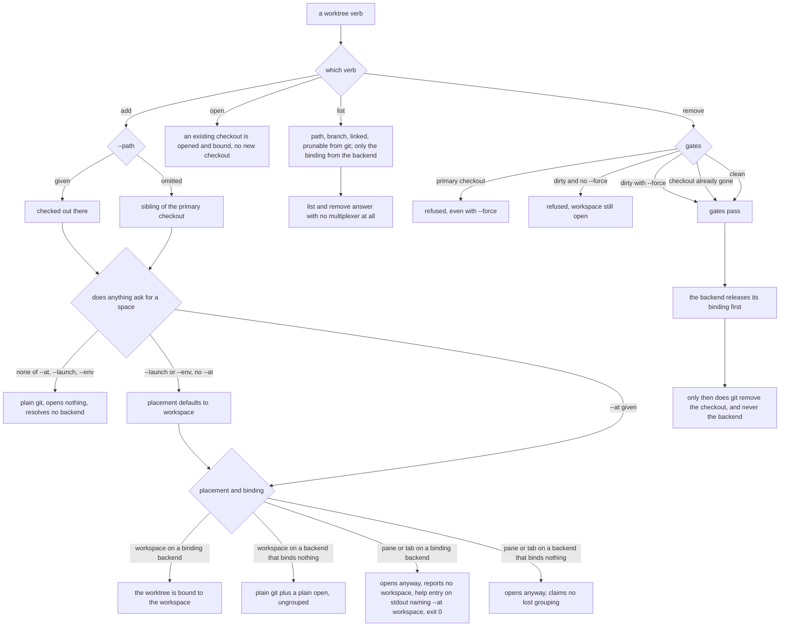

# mux — the pane abstraction

## What

The `cyber-mux` CLI's entire subject: which session backend (tmux, herdr, or wezterm) is available,
where a new pane opens, and how a caller detects the multiplexer it is really running inside. Ported
from
`cyberlegion`'s `spec/mux/` (`packages/cyberlegion/.agents/spec/mux/`, ADR-0024/ADR-0021) when the
mux seam was extracted into this standalone repo (scaffold commit `21557b4`) — adapted from
`cyberlegion`'s command-group verbs (`unit spawn`, `cyberlegion mux doctor`) to this repo's flat
verb surface (`open`, `doctor`, `mode`) and env names (`CYBERLEGION_MUX*` → `CYBER_MUX*`).

### Non-goals

**Non-goals** — the `nudge` (send-and-verify-turn-taken) helper (`nudge.ts`) — a provisional
standalone concern per the `cli.ts` verb-surface note, not yet exposed as a CLI verb and not yet
specced; the unit registry, mail, and doorbell that `cyberlegion` layers on top of a pane once
opened — those stayed behind in `cyberlegion`, this repo owns only backend selection, placement,
multiplexer detection, per-pane send/read/focus/close, and the worktree surface above.

Also a non-goal: **any worktree fact a backend reports of its own** — git answers those on every
backend, so a multiplexer is never asked; see the use cases above.

**Naming a tab inside a workspace was a non-goal here, and this CR reversed it — the constraint was
real but the generalization was not.** The recorded reason was that herdr labels a new workspace's
root tab `1` with no flag to change it (only `tab rename` after the fact), and that the workspace
label is what its UI groups by. The first half holds and is unchanged; the second is beside the point
once a template describes **several** tabs, where the whole question is telling them apart *inside*
one group. What the premise never supported is the conclusion drawn from it: it is true of a new
workspace's **root tab alone**. Every subsequent tab is named at birth on both backends — herdr
`tab create --label`, tmux `new-window -n` — which `--label` above already specifies at every tier.
So the cost is one `tab rename` on herdr's first tab, not a capability neither backend has. Multi-tab
templates ([`template/`](../template/README.md)) are the first real customer, and the non-goal is revisited
here rather than silently contradicted.

## Use Cases

**Subject** — detecting and selecting the pane backend a session opens through, and driving a pane
once opened:

- **The session backend is selected by environment** — tmux when `$TMUX` is set, herdr when
  `$HERDR_ENV` is set and `$TMUX` is not; an environment with neither throws asking for one.
- **Placement maps each `--at` value onto the backend** — `--at pane:right|pane:down|tab|workspace`
  chooses where the new pane opens. Unlike `cyberlegion` (where `unit spawn` always resolved a
  concrete `--at` before calling this layer, making the adapter's own fallback unreachable),
  `cyber-mux open`'s `--at` is optional at the CLI: when omitted, **the adapter's own `at ?? 'tab'`
  fallback is reachable and observable** (`session.tmux.ts`, `session.herdr.ts`) — so it carries a
  scenario here. `tab` maps to each backend's native Tab primitive — tmux `new-window`, herdr
  `tab create` — never a split pane. `workspace` maps to each backend's own **visible** space — herdr
  `workspace create`, tmux `new-window` (a window visible in the status bar). Every placement opens
  without stealing the caller's focus. `open` is placement and nothing more: the workspace it makes
  carries no worktree record even when its cwd is a checkout, so it is never grouped with a repo —
  that is the `worktree` verbs' job, below.
- **A split can be told which pane, how big, and what environment** — three options on the seam's
  own open contract shape a `pane:*` placement. `from` and `ratio` are reached only through the
  adapter, never a CLI flag; `env` also has a `--env` flag (below), whose *surface* is its own
  concern while what env *means* stays this bullet's. The template capability is another such caller.
  What a template *does* with these is [`template/`](../template/README.md)'s business; what they *mean*
  is this node's.
  - **`from` names the pane to split, and passing it is the only way `pane:right` means the same
    thing on both backends.** Omitting it does not mean "the calling pane" — it means "whatever this
    backend defaults to", and the two defaults disagree while both tracking the pane the *user* is
    looking at: tmux always splits the session's active pane and ignores `$TMUX_PANE` entirely; herdr
    resolves `--current` from `$HERDR_PANE_ID`, silently falling back to the UI-focused pane when
    that is unset. They agree whenever a human is typing and diverge exactly when a program is
    driving — which is when this seam's callers are running. `tab` and `workspace` split nothing, so
    they ignore it.
  - **`ratio` is the fraction kept by the ORIGINAL pane, and the sign convention is the trap** — the
    two backends convert in **opposite** directions. herdr's `--ratio` sizes the original, so the
    number passes through unconverted; tmux's `-l` sizes the **new** pane, so it takes `1 - ratio`.
    Applying the inversion to both, or to neither, is the single most likely way to get a split
    backwards. Omitted, each backend takes its own even default. Ratio is a *split* concept: a tab or
    workspace is never sized against a pane, so it is not passed there. **wezterm's `--percent` sizes
    the NEW pane** — the same direction as tmux's `-l`, not herdr's pass-through — probed from the
    issue that requested this backend (#47) and the CLI's own help text, not a live binary.
  - **A backend declares whether it can size a split at all**, so a caller can degrade a ratio rather
    than fail on a backend that cannot honor one — the degrade *policy* is the caller's, not this
    seam's (template warns once and takes the default). All three backends can size, so all three
    declare it; silence is taken as cannot.
  - **`env` is set natively at the birth of whatever tier opens — not just a split — on tmux and
    herdr.** Both take a repeatable flag on every space-creating command (herdr `--env KEY=VALUE`,
    tmux `-e KEY=VALUE`), one per variable. That breadth is load-bearing rather than incidental: a
    pane pool's root pane is born by the region open and never by a split, so a seam that scoped env
    to `pane:*` would drop it silently exactly where a caller needs it. Valid with or without a launch
    — a pane with env and no command is a blank shell with that env set. The one exception among
    herdr's own routes is its **worktree** verbs, whose create/open take no env parameter and refuse
    the flag outright; the checkout is never failed over it. **wezterm has no `--env` flag on ANY
    space-creating command at all** — `spawn` and `split-pane` take no such option — so every one of
    its opens takes the same fallback path herdr's one worktree route alone needs, not just one.
  - **The one route that cannot carry env reports that fact to its caller** — the seam's answer, not
    a message to a human. No env flag reaches herdr's worktree command, and the route that opened the
    region is the only thing that knows env was lost (every other route carries it, and a caller
    cannot see which route ran). So the fact is reported outward rather than inferred, for the same
    reason the workspace grouping is. This report is what makes the compensation below *possible*: it
    is always made on that route, whether or not the compensation then succeeds.
  - **Compensation is a separate altitude, and it either prefixes or warns — never both.** Given that
    report, a caller with a command to run hands env to the command as an `env KEY=VALUE` prefix, and
    the variable lands. A caller with no command has nothing to ride, so the variable genuinely does
    not land and a warning goes to stderr naming it. Only the route that lost env may prefix —
    double-applying over a native set would push the values into `ps` output and shell history on
    every route, which is the exact cost the prefix is a last resort to avoid. The prefix is a shell
    command line, so values are quoted for one.
  - **`--env KEY=VALUE`, repeatable, on every verb that opens a pane** (`open`, `worktree add`,
    `worktree open`) — env is the one split option with a CLI flag, because a variable a caller
    cannot set at birth is one they cannot set at all. Exactly one pane opens on each of those
    routes, so "which pane" needs no rule: it is the one the verb opened — **except on herdr's
    worktree bind route**, the one route that cannot carry env, where the flag degrades to a prefix
    or a warning per the two bullets above. That exception is stated wherever the flag is, because a
    CLI property silently false on one backend's one route is this project's recurring defect.
    Refused alongside `--template` for `--launch`'s reason — the template owns what is in the panes it
    declares. It **implies a placement** for `--launch`'s reason too: asking for something in a pane
    is asking for the pane, and without that a bare `worktree add --env` would open nothing and drop
    the env with nothing to carry it. A missing `=` is malformed and rejected before anything opens;
    a present `=` with nothing after it sets the variable empty, and a value's own `=` is kept by
    splitting on the first one only.

  **Boundary — the seam does not validate `ratio`.** It renders whatever number it is given; the
  `0 < ratio < 1` bar belongs to the caller (template's schema enforces it, and is where a degenerate
  ratio is refused). An adapter author owes the rendering, not the range check.

- **A caller can group the spaces it opens, on a backend with no tier to group them in** — one more
  option on the open contract, and the same shape as the three above: not a CLI flag, reached through
  the adapter, with [`template/`](../template/README.md) as its caller. A caller opening several tabs as
  one workspace needs them recognizable as a group afterwards. Where a real Workspace tier exists the
  tier **is** the group and the option is **ignored** — herdr already stamps every pane and tab record
  with its `workspace_id`, so a second grouping would duplicate a fact the backend never reads. Where
  there is none, the backend stores an **opaque group id** in its own native mechanism: tmux has no
  Workspace level, so the id goes in a **window option**, which the backend can filter on server-side
  and which survives a window rename.

  **The id and the label are separate, and that separation is the whole point.** The obvious cheaper
  design — encode the group in the label and read it back — **does not work**, and not marginally: a
  label is chosen by a human and may contain anything, so a window named `acme - beta - main` reads as
  group `acme` with tab `beta - main` exactly as well as group `acme - beta` with tab `main`. No split
  rule resolves it; each merely picks which legal label to silently mis-group. So a label is never
  parsed to recover a grouping. What a *human* reads in a status bar is the label's job and belongs to
  the caller that composes it (template's business); what a *machine* reads is this id.

  **Grouping is a verb, not only an option on `open`.** `open` cannot be the only way in: a caller
  that did not open the space still has to group it — the `worktree` route opens its region before any
  pool is built — and it holds that space's own id the moment the open returns. So grouping is its own
  member, acting on an already-open space exactly as the rename above does, and `open`'s option
  **routes through it**, so there is one spelling per backend rather than two that can drift. It costs
  nothing: tmux has no birth flag for a window option, so grouping was **already** a second call after
  the window exists.

  **A backend whose display name is composed also stores the space's own name.** This is the same rule
  as the group id, one tier down, and it is not optional bookkeeping. tmux has **one** name field per
  space, so a caller that composes a display name out of a tab's name *destroys the original* — and
  recovering it would mean splitting on the separator already proven ambiguous. So the space's own
  name is stored beside the group, and a reader takes it from there. The display name is a human's to
  read; an opaque option carries what a machine reads back. A backend with a real workspace tier
  stores **neither**: its tier is the group, and its tab label is the tab's own name, never composed.

  **The tag lives exactly as long as the space it tags, and that is a property of the backend rather
  than a promise this seam can make.** On tmux it survives a window rename — the reason it, and not
  the name, carries the grouping. It does **not** survive a server restart; but a restart destroys
  every window too, so there is nothing left to group and nothing is lost. The one real exposure is
  session-restoring tooling (`tmux-resurrect` and kin) that brings windows back **without** their user
  options: a restored workspace reads as N separate workspaces-of-one. That is a stated limit of an
  external tool, not a defect here and not something the seam can defend against — a restored window
  genuinely carries no tag, and reading it as ungrouped is the honest answer.

  **A group id is not a workspace, and `open` never reports it as one.** A caller that asks for no
  grouping gets none — a window nobody grouped stays ungrouped and reads back as a group of one — and
  a backend carrying a tag still reports its workspace **absent**, because a tag cyber-mux wrote is its
  own bookkeeping rather than a tier the backend gained. Same absent-rather-than-false convention the
  focus probe's `unknown` follows; reporting it would be a confident lie about the backend's shape.

- **Multiplexer detection is two-mode** — `probeMultiplexer` first trusts `$CYBER_MUX`
  (`tmux`|`herdr`|`screen`|`none`) outright — this doubles as an override (`=none` forces no-mux even
  inside a real multiplexer). Failing that it walks the process ancestry from `$$` looking for a
  `tmux`/`tmux: server`, `herdr`, or `screen` ancestor; `$TMUX`/`$HERDR_ENV` are used only as a
  fast-positive hint the walk falls back to when it is itself inconclusive, never trusted alone.
  `doctor` runs discovery and prints an `export CYBER_MUX=<m> CYBER_MUX_PANE=
` hint so a caller
  can pin the fast-path.
- **The backend reports whether a pane is currently focused** — a pane locator resolves to `focused`,
  `not-focused`, or `unknown`, so a caller can tell whether a human is actually viewing a pane before
  spending a turn on it. A pane is **focused** only when a live client is currently displaying it.
  Each backend answers with its own primitive: on **tmux**, the pane is the active pane of the
  current window in a session with an attached client (`pane_active` + `window_active` +
  `session_attached`) — any of those unset is **not-focused**; on **herdr**, the pane record's own
  `focused` flag (`pane get <id>`). A backend that has no primitive to report focus — or a query that
  errors or names a pane the backend can no longer resolve — answers **unknown** (a tri-state, not a
  boolean) so callers **fail open** — treat unknown as "go ahead" rather than as "absent" — never
  suppressing behavior on a mux that simply can't tell. **wezterm always answers unknown**: unlike
  tmux/herdr, where unknown is a per-query fallback, wezterm's `list --format json` carries no
  active/focused field for a pane, tab, or window at all — there is no primitive to ask, ever, so
  this is the whole backend's answer rather than an edge case of it. This is a **read-only** probe: it moves no
  focus and opens nothing (unlike `focus`, which drives the attached client's view to a pane).

- **`open` returns the workspace the new pane landed in, and reports it** — not just the pane's id,
  so a caller holding several panes can group them by the space they occupy. The seam is the fact's
  source; every surface reads it from there rather than asking again — `open` prints it beside the
  pane, and the template manifest ([`template/`](../template/README.md)) carries it for a whole pool.
  Reporting it costs **nothing**: the backend already answered when the pane was opened, so a
  surface that hid it would be discarding a fact it already held. A backend with no workspace tier
  reports **absent** rather than a false "none" — the same absent-rather-than-false convention the
  focus probe's `unknown` follows, and the reason tmux (where `workspace` and `tab` both collapse to
  a Window) reports nothing here. On herdr the answer costs **no extra call**: every route already
  emits the pane's own `workspace_id` in the output the pane id is read from — a created workspace
  reports itself, a new tab reports the workspace it was created in, and a split reports the
  workspace it landed in, which is the caller's. Established empirically against herdr 0.7.4.

- **`open` also returns the tab the new pane landed in** — the same move as the workspace above, on
  the tier below it, and reported for the same reason: the backend already answered when the pane was
  opened, so a surface that hid it would discard a fact it already held. The difference is **breadth**.
  Only *some* multiplexers have a Workspace level, so that field is **absent** on a backend without
  one; **every** multiplexer has the Tab level (the vocabulary table below), so every backend answers
  this and none reports it absent. On herdr the create envelope carries the pane's own `tab_id` beside
  its pane id on every route — a new tab reports itself, a created workspace reports its **root tab**,
  and a split reports the tab it landed in, which is the caller's. On tmux the Tab is the Window, read
  from the same `-F` the pane id already rides out on.

  **It is load-bearing rather than a convenience, and the reason is a trap.** Naming a space after
  birth addresses a space *at its own tier*, so renaming a tab needs a **tab** id. A caller reaching
  for the pane id instead is not merely sloppy — it is **green on one backend and silently broken on
  the other**: herdr refuses it outright (`tab_not_found`, exit 1) while tmux resolves a pane id and
  succeeds. Since a failed command's output is discarded, that caller would leave herdr's root tab
  named `1` and never hear about it. Reporting the tab is what makes the rename portable.

  This is **occupancy** — which workspace a pane *lives in* — and it is a different question from the
  worktree **binding** below, though both concern the one workspace tier. A worktree opened at a
  `pane:right` placement lives in the caller's workspace while being bound to none: the pane has a
  workspace, the worktree is still ungrouped. The two are reported by separate outputs and neither
  answers for the other — `open` never claims a grouping, and a binding is never inferred from where
  a pane happens to sit.

- **The checkout itself is always plain `git worktree`** — host-neutral, no legion/unit-registry
  concepts. `add` defaults the checkout path to a sibling of the primary checkout
  (`<parent>/<repo>.worktrees/<branch>`, ported from `cyberlegion`'s `resolveUnitWorktreePath`
  convention), never nested inside the primary's own working tree; `--path` overrides it, `--base`
  sets the branch's start-point. The default holds on **every** backend rather than deferring to a
  multiplexer's own layout (herdr would use `~/.herdr/worktrees/<repo>/<branch>`), so a path means
  the same thing everywhere. `remove` is the safe path ported from `cyberlegion`'s `decommission`:
  it refuses the primary checkout (absolute — `--force` never overrides it), tolerates a worktree
  already gone from disk, and refuses to discard uncommitted changes unless `--force` is passed.

- **A backend either binds a worktree to a workspace, or it does not** — and that binding, *not*
  "knows what a git worktree is", is the capability a backend has or lacks. It is what a
  multiplexer's UI groups a repo's primary checkout and its worktrees by. Established
  **empirically**, because it is not visible in either tool's documentation: `git worktree add`
  followed by herdr `workspace create --cwd <checkout>` yields a workspace with **no worktree
  record** — herdr does not know it is a worktree and leaves it out of the repo's group; only
  routing through herdr's own `worktree create`/`worktree open` produces one. (herdr's `worktree
  list` still shows the ungrouped checkout with an `open_workspace_id`, matching it by path after
  the fact — the list view is misleading here; the workspace record is the truth.) tmux has no
  workspace tier at all and never binds. **wezterm, despite having a real workspace tier, also never
  binds** — its CLI has no `worktree` subcommand or concept of one at all, so like tmux it falls back
  to plain git plus a placement-appropriate `open()`.

- **git owns the worktree facts; a backend contributes only the binding** — path, branch, linked,
  and prunable are read from git on **every** backend, so two backends can never report a different
  branch for the same worktree. A multiplexer that also enumerates worktrees is merely re-reading
  git; the one fact git cannot answer is which workspace a worktree is currently open in, and that
  is the only thing asked of a backend.

- **`worktree add` is plain git until a placement is asked for** — with neither `--at` nor
  `--launch` it creates a checkout, opens nothing, and resolves no backend, so it works outside any
  multiplexer. There is nothing to group because nothing was opened. `--launch` implies
  `--at workspace`: a launch wants its own space rather than a pane crowding the caller's, and
  `workspace` is the only placement a binding can attach to.

- **Grouping happens iff the backend binds and the placement is `workspace`** — herdr's `worktree
  create` *always* opens a workspace, so it cannot serve a pane or tab placement. (It also opens a
  workspace for the **source** checkout when the repo has none — a group needs its parent.)

- **A placement the binding cannot serve degrades; it never fails** — `--at pane:right --branch b`
  on herdr yields a worktree open in a split pane: a complete, useful outcome, just not a grouped
  one. Refusing would make identical flags succeed on tmux and fail on herdr — precisely the backend
  leak this seam exists to prevent. The report is a **field, not prose**: `workspace: null`, with a
  note on stderr so `--format json` stays machine-readable on stdout. Degradation is claimed only
  where the backend *could* have grouped and the placement is what cost it — never on tmux, where no
  grouping was ever on offer.

- **`worktree open` groups a worktree plain git created earlier** — the remedy that makes "add now,
  group later" a first-class story rather than a dead end, and the counterpart to a bare `add`.

- **`worktree list` and `worktree remove` answer outside a multiplexer** — both are git questions; a
  backend can only ever add a binding to the answer, so its absence must not deny one.

- **Removal is never delegated to a backend** — only the binding's release is. A backend's own
  worktree-removal primitive addresses a *workspace* (herdr's takes a workspace id), so it cannot
  reach an unbound worktree at all, and whether it dirty-checks is unknown; delegating would make a
  destructive operation's safety depend on whether a workspace happened to be open. **Gate order is
  a specified property, not an implementation detail**: every gate runs *before* the workspace is
  released, so a refused removal has no side effect; the release runs *before* git removes the
  checkout, so no workspace is left pointing at a directory that no longer exists.

- **`--label` names whatever `--at` opened, at whatever tier it opened it** — host-neutral, because
  every backend names every tier: on herdr a workspace/tab/pane label, on tmux a window name (where
  `workspace` and `tab` both collapse to a Window) or a pane title. Each backend takes it at birth
  where its own CLI allows (herdr `workspace create --label`/`tab create --label`, tmux
  `new-window -n` — which also turns tmux's `automatic-rename` off, so the name survives whatever
  the pane goes on to run) and names it immediately after where it does not (herdr `pane rename`,
  tmux `select-pane -T`). Omitted, each backend keeps its own default.
- **A space is also named after its birth, because one tier cannot be named at birth** — `--label`
  above covers birth wherever each backend's CLI allows it. Exactly one tier does not: herdr labels a
  new **workspace's root tab** `1` and offers no flag to change it. So the seam also renames a space
  that already exists — tmux names a window or a pane title, herdr renames a tab or a pane, the same
  breadth `--label` already relies on. This is the naming route for the case birth cannot serve, not a
  second way to do what `--label` does. It is the mechanism behind the reversed tab-naming non-goal
  below, and the whole of its cost: **one rename, on herdr's first tab**.

  **wezterm widens this beyond one tier.** `spawn` has no title flag at all — unlike tmux's `-n` or
  herdr's `--label` — so *every* new tab's label is a post-birth `set-tab-title`, not just herdr's one
  root-tab case; and a **new workspace's name is native at birth** (it doubles as the `--workspace`
  value spawn already takes). The pane tier has no rename route at all: there is no `set-pane-title`
  or equivalent in the CLI, at birth or after, so `rename(..., 'pane', …)` throws rather than
  silently doing nothing, and `open`'s own pane-tier `--label` degrades to a stderr warning instead.

  A rename is **as read-only in its side effects as the focus probe is**: it moves no focus and opens
  nothing. Naming a space is not visiting it — the same rule every spawn path already holds.

- **A worktree's default label is the backend's own** — worth knowing that `worktree add` always
  passes `--path` (to hold the sibling convention across backends), and herdr labels a workspace by
  the checkout path's **basename** when given one, using the branch only when it picks the location
  itself. So branch `feat/deep/name` defaults to a workspace labeled `name`. `--label` is the
  override.

- **Typing text and pressing keys are separate verbs; only `submit` presses Enter *for you*** —
  driving a pane's input splits on whether Enter is **implied**. `send text` and `send keys` never add
  an Enter the caller did not write; `submit` always adds one. Three verbs cover it:
  - **`send text <pane> <text>`** — type literal characters, press **no** Enter. A word that happens
    to name a key (`Enter`, `Up`) is typed as those characters, never interpreted as that key.
  - **`send keys <pane> <keys...>`** — press named keys in order, each its own key, typing nothing.
    Keys are named in a **portable core vocabulary** — `Up` `Down` `Left` `Right` `Enter` `Escape`
    `Tab` `Space` `Backspace` `C-c` `F1`–`F12` — normalized onto whatever each backend calls them
    (`Backspace` → tmux's `BSpace` is the only rename). A token **outside** the core is forwarded
    verbatim: it reaches backend-specific keys (`Home`, `M-x`) at the cost of portability, and its
    failure is the backend's own — herdr refuses an unknown key (`unsupported key <k>`), while
    **tmux has no refusal path** and types the token as characters. Neither reaches the caller today:
    the `Exec` seam reports failure as `null`, so `send keys` exits 0 either way. The seam now
    *captures* a backend's stderr into an optional `lastError` (added for the template walk, which
    needed to say why a split was refused), so the reason is no longer thrown away — but `send keys`
    does not read it, and a `null` still cannot be told from an empty stdout. So the gap **narrows
    rather than closes**: it is still the seam's, not this verb's, it still predates the split, and a
    follow-up still owns it. `Enter` is a key like any other: `send keys <pane>
    Enter` **does** press it and **does** take the pane's turn — because the caller asked for it, not
    because the verb implied it. `send keys` adds nothing.
  - **`submit <pane> [text]`** — **always** presses Enter. Given text it types it — **literally, on
    the same guarantee `send text` gives**: text that happens to name a key is typed, never
    interpreted — and presses Enter, taking the pane's turn. Given no text (or empty text) it sends a
    **bare Enter only**, flushing an already-staged input buffer without re-typing it, so a repeated
    flush cannot duplicate the message. `submit` is the verb *for* taking a turn — `open --launch`
    uses it — and the only one that supplies the Enter itself. The guarantee is that **outcome**,
    never a particular
    backend command: a backend with an atomic text-plus-Enter primitive uses it, one without composes
    typing and Enter.

  Every live view a bare `cyber-mux send` could derive already belongs to a verb — the pane
  enumeration to `list`, the current pane to `doctor` — so rather than ship a second name for an
  existing verb, a bare `send` is treated as *incomplete input*: help to **stdout**, **exit 2**.

  **That is [`axi.md`](../axi.md)'s #6 deciding it, not #8, and the difference is not
  bookkeeping.** Bare `send` is a missing required parameter, which #6 already puts at `2` — the
  decision needs no content-first reasoning at all. It was previously called an "acknowledged
  amendment to #8", which conceded a divergence this repo never had to concede: AXI's #8 governs the
  bare **binary** ("running your CLI with no arguments", its example being `$ tasks`) and says nothing
  about a command **group** invoked without a subcommand. So #8 was never violated here — it was never
  addressed to this case. What remains genuinely open is whether the contract *should* extend #8 to
  groups; that question belongs to the contract, not to this node.

  The core vocabulary is **probed, not derived** from either backend's documentation, and it is the
  whole of the portable set: everything else diverges, `C-c` is the only portable control key, and
  the `Backspace` spelling is a judgment call the probe underdetermines. Why each of these was
  decided the way it was — and what it costs — is logged in
  [`design/decisions/`](../design/decisions/README.md), not restated here.

- **A pane is addressed by a name or an id, and an ambiguous name fails with its candidates** —
  every verb that takes a pane (`read`, `submit`, `exists`, `focus`, `close`, `send text`,
  `send keys`, and `template save --from`) accepts either. A template template names its panes and the
  apply manifest reports `(label, pane)` per pane, so a caller wanting "the `worker` pane" would
  otherwise do the lookup itself — which is the surface [`template/`](../template/README.md)'s manifest
  already promises it will not need.

  - **An id outranks a name, and the ladder is what keeps this additive.** A string is taken as an
    id when a live pane carries it, and only otherwise resolved as a name — so a caller that works
    today can never be made to mean something else by a person renaming an unrelated pane. A label
    is a human name, so nothing stops one from *being* `%3`; the pane whose id that is still wins.
    Ambiguity is a **fuzzy-tier condition only** — the same shape git resolves a refname by (a
    documented six-step ladder), Docker a container by (full id → exact name → prefix), and tmux its
    own targets by (id → exact → prefix → glob). Two matches at *different* tiers are not peers and
    need no report.
  - **An id is recognized by matching a live pane, never by the shape of the string.** Docker sniffs
    (`sg-` → treat as an id), and it is the cheaper rule; it is refused here because encoding a
    backend's id format in the resolution is exactly the backend leak this seam exists to prevent —
    a new backend would owe a new syntax rule. Resolution reads the live pane list, which answers
    ids and labels in one read.
  - **Two or more matches fail and report the entries** — id, label, and working directory: the three
    that discriminate (a report listing `worker, worker` helps nobody), and within axi #2's 3–4-field
    default row. Each candidate's id is directly usable as the retry. The report is a **structured
    error** under the stable code `ambiguous-pane`, on **stdout** per [`axi.md`](../axi.md)'s
    stream discipline, honoring `--format`. Zero matches is the existing not-found path, not an
    ambiguity.

    This report was originally contracted onto **stderr**, on the reading that stdout must stay clean
    so a redirect never corrupts a parsed result. That inverted AXI, which puts errors on stdout
    precisely "so the agent can read and act on them" and calls stderr the stream agents don't read —
    and this report exists to hand a caller candidates to retry with, so it was the last thing that
    belonged there. The clean-stdout worry does not survive: a verb writes its result or its error,
    never both, so exit `2` separates them before anything is parsed.
  - **The outcome rides the exit code: `0` one match, `1` zero, `2` ambiguous — and `2` is
    [`axi.md`](../axi.md)'s own `usage error` (#6), not a code this node invented.** An ambiguous
    locator is a usage error in the strict sense AXI means: the argument is underspecified, nothing
    was attempted, and the fix is a different argument — the same family as the missing required
    parameter AXI already puts at `2`. So this is an **application** of the contract, not an amendment
    to it; the earlier reading — that `2` was a third code added for a predicate that *couldn't
    answer* — mistook an incomplete restatement of AXI (this repo's node listed only `0`/`1`) for
    AXI's actual set. It reaches the same code either way: `grep` (2), POSIX `test` (`>1`, normative),
    `diff`, `expr` and `pgrep` all reserve one for couldn't-answer, and `systemctl is-active` is the
    counter-case that kills the alternative — it prints `inactive` for both a stopped unit and a
    missing one, leaving only exit 3 vs 4 to tell them apart. So `exists` keeps answering
    `live`/`gone` on stdout and spends the code rather than a fourth word. Exit `2` means the same
    thing on **every** pane verb; one meaning per code is what lets an agent detect it without
    parsing.

  **Uniqueness was considered and refused.** tmux and Docker both enforce unique names at creation,
  which is precisely why ambiguity is unrepresentable for them and their lookups stay binary. That
  door is deliberately closed here: a label reaches a live pane because a person set it, herdr labels
  every new workspace's root tab `1`, and nothing keys on a name — so refusing a duplicate made the
  capture verb *drop* labels a user had chosen. Removing that rule relocated the ambiguity rather
  than deleting it; this is where it lands, and lookup is where the candidates are known and the
  caller is present.

  **Boundary — the label the listing reports is the one a person set, never a backend's default.**
  tmux has no unset title: it defaults `pane_title` to the hostname, so an untouched pane reports a
  name nobody chose. Reporting that would label every pane in a session identically and make the
  hostname resolve to all of them — ambiguity manufactured out of nothing. A title differing from the
  host is the author's and is reported; the listing already applies this rule for a region
  (`describeRegion`). herdr has the honest primitive and simply omits the key until `pane rename`.
  **wezterm never reports a label at all** — not a filtering rule like tmux's, but the honest
  consequence of there being no primitive to set one in the first place (see above): its `title`
  field is always the ambient running-program name, never something an author chose, so exporting it
  would manufacture the same collision the hostname guard exists to prevent.

- **Every failure is a structured error on stdout, coded, with the command that fixes it** — this
  node is where [`axi.md`](../axi.md)'s #6 is verified, because a reference node carries no suite
  of its own. One `fail()` helper reaches all ~15 verbs, so the contract is pinned once at the surface
  rather than twenty times per verb: an error goes to **stdout** (AXI's stream for what the agent
  consumes), under a **stable `code`** a caller matches instead of parsing prose, with an actionable
  **`help:`** naming this CLI's own fixing command — never `see --help`, and never the wrapped
  multiplexer's raw diagnostic, which an agent cannot act on through `cyber-mux`.

  - **A usage error is `2`; a failed operation is `1`.** `2` says *your invocation is wrong, fix it and
    retry* — an unrecognized flag, a missing required parameter, incomplete input like a bare
    `cyber-mux send`. `1` says *your invocation was fine, the operation failed*. Both were `1` before,
    which is commander's default restated as the contract, and it left the repo exiting `2` for one
    kind of bad input (an ambiguous locator) and `1` for the others — the confusing state, and the
    reason this is one pass rather than a per-verb patch.
  - **An unknown flag names the flag AND the command's valid flags**, validated against the
    **subcommand's** set rather than the group's, since a group's subcommands need not share one:
    `template save` takes `--from`/`--workspace`/`--description`/`--force` and `template list` takes none
    of them, so validating against the group's union would accept `--force` on `list` and then
    silently drop it — the exact failure fail-loud exists to prevent, and only the subcommand layer
    knows which set is in play. (`send text` and `send keys` are **not** an example of this: they
    define identical flag sets. An earlier draft cited them and was wrong on source.) AXI's reasoning
    is a token argument: the
    agent's deterministic next move is `--help`, so folding that answer into the error collapses a
    two-turn correction into one. `--help` itself always passes, on every command.
  - **The `worktree` verbs share one catch-all (`reportWorktreeFailure`), and it owes the same
    translation as every other verb.** It sits downstream of two error sources with different safety:
    this CLI's own worktree refusals (a dirty-checkout guard, a primary-checkout guard) are its own
    text and are forwarded verbatim; a failure opening or binding the worktree's pane comes from the
    multiplexer and is translated the same as any other verb's backend failure, its raw diagnostic
    never reaching stdout. The two are told apart by a dedicated `WorktreeGitError` the worktree module
    throws for its own refusals — anything else reaching the catch-all is backend-originated.
  - **`exists` is the deliberate exception, and it is a divergence rather than an amendment.** It
    spends `1` on `gone` — an answer, not an error — the predicate framing `grep`, POSIX `test` and
    `systemctl is-active` take. That is kept, but it is **not** AXI's code set, and calling it "an
    amendment to the `0`/`1` set" (as this corpus did) was wrong twice: the set was always `0`/`1`/`2`,
    and what `exists` actually diverges on is the *meaning* of `1`. Recorded, not settled here.

## Multiplexer concept vocabulary

The four placement tiers — **Session › Workspace › Tab › Pane** — and what each backend calls them
are defined once in [`glossary.md`](../glossary.md). What follows is this node's *behavior* against
that vocabulary, not a second definition of it.

`--at` exposes three of the levels — `pane:right`/`pane:down` (**Pane**), `tab` (**Tab**),
`workspace` (**Workspace**). The property
`workspace` guarantees is **its own space, VISIBLE in the attached client and navigable** — not a
structural tier. tmux, having no Workspace level, maps `workspace` onto the finest unit that keeps
that property: a new **Window** (visible in the status bar, `select-window`-able) — the same unit
`tab` maps to, so under tmux `workspace` and `tab` collapse to a Window. It is deliberately **not** a
new detached **Session** (`new-session -d`): a detached session is invisible to the attached client
and unreachable by beaming (`focus`), so a pane is never opened there — a truly detached session
would be a separate explicit intent, out of scope. There is no `window` value — "window" is tmux's
local name for the **Tab** concept, already covered by `tab`.

**WezTerm's own native tiers are Workspace › Window › Tab › Pane** — a genuine fourth level between
Workspace and Tab that neither tmux nor herdr has, and it is what `--at workspace` maps onto: a new
**Window**, spawned into a fresh (or caller-named) **Workspace** via `wezterm cli spawn --new-window
--workspace <name>` — never a bare new tab in the current window/workspace, and never wezterm's own
higher-level "switch workspace" affordance, which the CLI does not expose a command for at all.
`--at tab` maps onto a real wezterm **Tab** in the current window (`wezterm cli spawn`, no
`--new-window`) — never a new Window, and never a new Workspace. Both collapse onto tmux's one
Window level; wezterm keeps them genuinely distinct.

Every scenario in [`mux.feature`](./mux.feature) maps to one of these behaviors:

| Behavior | What it covers |
|---|---|
| **backend selected by environment** | tmux vs herdr selection; neither present errors |
| **placement** | `--at` choices; tab honored per backend, never a split; `workspace` → each backend's own visible space (herdr `workspace create`, tmux window), never a detached tmux session; a workspace `open` makes is bound to no repo; omitted `--at` falls back to `tab` |
| **split options — which pane, how big, what environment** | `from` targets a `pane:*` split on both backends (tmux `-t`, herdr positional) and is ignored by `tab`/`workspace`; omitted, each backend takes its own default, which tracks the user's focus rather than the caller's. `ratio` is the fraction kept by the ORIGINAL pane and converts in opposite directions (herdr passes it through, tmux inverts to `1 - ratio`); omitted, each backend splits evenly; never passed to a tab or workspace. Each backend declares whether it can size a split at all. `env` is native at the birth of every tier on both backends, one repeated flag per variable, with or without a launch — except herdr's worktree verbs, which take no env param and refuse the flag; that route reports to its caller that it could not carry env (both directions of the report are pinned, so neither answer can be hardcoded), and the caller then compensates — prefixing `env K=V` onto the command where there is one, warning on stderr where there is none, and never prefixing over a native set |
| **open returns the pane's tab, and reports it** | the tab the new pane landed in, per placement on every backend (herdr: a new tab reports itself, a created workspace its root tab, a split the caller's; tmux: the Window the pane landed in); reported by every backend and absent on none, because every multiplexer has the Tab level; read from the output the pane id already comes from on tmux/herdr, so it costs no extra call there — wezterm's spawn/split-pane report only the bare pane id, so its tab (and, on a tab or pane:* placement, its workspace) cost one follow-up `list --format json` call; it is what addresses a rename at the tab tier, which a pane id cannot do portably |
| **naming a space after its birth** | every backend renames every tier it can name at birth (tmux a window name or pane title; herdr a tab or pane rename); a new workspace's root tab is named this way because herdr offers no flag to name it at birth; a rename moves no focus and opens nothing |
| **the workspace group — carrying a grouping a backend has no tier for** | the open contract carries an opaque group id, never parsed, split, or derived from the label; a backend with no workspace tier stores it natively (tmux: a window option it can filter on, surviving a rename); a backend with a real workspace tier ignores it, its tier being the group; no id is invented for a caller that did not ask; the id is not a workspace, so `open` still reports the workspace absent; grouping is also a **verb** over an already-open space, which `open`'s own option routes through; a backend whose display name is composed stores the space's **own name** beside the group, since one name field means composing destroys the original |
| **text and keys are separate; only submit presses Enter for you** | `send text` types literal characters and presses no Enter (a key-named word is typed, not interpreted; no text → rejected); `send keys` presses named keys in order and types nothing — core keys normalized onto each backend, a non-core token forwarded verbatim to the backend's own semantics (no tokens at all → rejected); `send keys Enter` presses Enter and takes the turn, because the caller wrote it; bare `send` is incomplete input — help to **stdout**, **exit 2**, axi #6's `usage error` for a missing required parameter (it is #6 that decides this, not #8); `submit` always presses Enter — with text it types it literally then Enters, with none (or empty text) it bare-Enter flushes without retyping; `open --launch` submits |
| **addressing a pane by name or id** | every pane-taking verb accepts either; an id outranks a name and is recognized by matching a live pane rather than by the string's shape; exactly one match resolves; zero is the existing not-found path (exit 1); two or more fail with the candidates (id, label, cwd — each id usable as the retry) as a structured `ambiguous-pane` error on **stdout** honoring `--format`, exit 2 on every verb — axi #6's own `usage error`, an underspecified argument, applied rather than amended; `exists` keeps `live`/`gone` on stdout and spends the code rather than a fourth word; the listing reports only a label a person set, never tmux's hostname default |
| **multiplexer detection is two-mode** | `$CYBER_MUX` fast-path + override; ancestry walk; hint fallback; `doctor` hint |
| **mux mode** | reports the detected session backend; "none" (exit 0) when no adapter is selectable |
| **pane focus reporting** | tri-state focused / not-focused / unknown per backend (tmux: pane+window active & session attached; herdr: pane record `focused`); a query that can't be answered → unknown so callers fail open |
| **open returns the pane's workspace, and reports it** | the workspace the new pane landed in, per placement on herdr (a created workspace reports itself; a tab reports the workspace it was created in; a split reports the caller's); absent on a backend with no workspace tier; read from the output the pane id already comes from, so it costs no extra call; reported beside the pane by `open` itself and carried for a pool by the template manifest; occupancy is never a worktree binding |
| **git worktree helpers** | `worktree add` defaults the path to a sibling of the primary checkout on every backend; `--base` sets the start-point; `worktree remove` refuses the primary checkout, tolerates an already-gone worktree, and refuses uncommitted changes unless `--force` |
| **worktree/workspace binding** | a bare `add` — none of `--at`, `--launch` or `--env` — opens nothing and resolves no backend, which is what makes it the only route that works outside a multiplexer at all; `--launch` and `--env` each imply `--at workspace`, both being a request for something IN a pane; `--at workspace` groups where the backend binds and falls back where it does not; a pane/tab placement degrades (reports no workspace) rather than failing, and only where a grouping was on offer, the caller told through a stdout `help[N]:` entry naming `--at workspace` per [`axi.md`](../axi.md)'s #9; `open` groups a checkout plain git made |
| **`--env`, the CLI surface for the seam's env option** | repeatable `--env KEY=VALUE` on every verb that opens a pane (`open`, `worktree add`, `worktree open`) — the one split option with a flag, since a variable not set at birth cannot be set at all; it names the pane the verb opens, exactly one being opened on each route, **except** on herdr's worktree bind route, where it degrades to a prefix on `--launch` or a stderr warning with no command to ride — stated on BOTH worktree verbs, which are exposed identically; refused alongside `--template`, which owns its own panes' env; implies a placement; a missing `=` is rejected before anything opens, a trailing `=` sets the variable empty, and a value's own `=` survives by splitting on the first only |
| **naming what was opened** | `--label` names the tier `--at` opened, on every backend (herdr workspace/tab/pane label; tmux window name or pane title); taken at birth where the backend's CLI allows, set immediately after where it does not; omitted leaves the backend's own default |
| **worktree facts vs binding** | `list` reads path/branch/linked/prunable from git on every backend and reports only the binding from the backend; `list`/`remove` answer with no multiplexer |
| **worktree removal ordering** | never delegated to a backend — cyber-mux's gates plus git, the backend only releasing its binding; gates run before the release (a refused removal has no side effect); the release runs before git's removal (no workspace on a dead directory), including for a checkout already gone |

## Logic

The use cases above run genuinely distinct decision logic — a pane-opening verb decides nothing a
pane-addressing verb decides — so the graph is sectioned by sub-graph. Each use case enters the one
named here.

### Detection and backend selection

Entered by `probeMultiplexer`, `doctor`, `mode`, and every verb that needs an adapter.

### `open` — placement, launch, and what it reports back

### Split options — which pane, how big, what environment

### `--env` — the CLI surface for the seam's env option

### The workspace group — carrying a grouping a backend has no tier for

### Naming a space after its birth

### Driving a pane's turn

### Reporting whether a pane is focused, and listing panes

### Addressing a pane, and the error surface

### The worktree surface

## Scenario map

Every scenario in [`mux.feature`](./mux.feature), one row each, grouped by use case.

### The session backend is selected by environment

| Edge | Path (Given) | Scenario |
|---|---|---|
| env names a backend → that adapter | `$TMUX`, `$HERDR_ENV` without `$TMUX`, or `$WEZTERM_PANE` set | `the session backend is selected by environment` |
| none of the three → throw before opening | no `$TMUX`, `$HERDR_ENV`, or `$WEZTERM_PANE` | `no backend detected errors before opening anything` |

### Placement

| Edge | Path (Given) | Scenario |
|---|---|---|
| `--at` given → open at that placement | `open --at pane:down` | `--at chooses where the new pane opens` |
| `--at` omitted → the adapter's `at ?? 'tab'` fallback | `open` with no `--at` | `--at omitted falls back to tab` |

### workspace — its own visible space

| Edge | Path (Given) | Scenario |
|---|---|---|
| `at=workspace` → the backend's own visible space | each of the three adapters | `--at workspace opens the pane's own VISIBLE space on each backend` |
| `at=workspace` → the backend's own visible space | tmux | `tmux --at workspace opens a visible window in the current session, never a detached session` |
| `at=workspace` → the backend's own visible space | herdr | `herdr --at workspace creates its own workspace, unattached to any repo` |
| `at=workspace` → the backend's own visible space | wezterm | `wezterm --at workspace spawns a new window into a freshly named workspace` |
| `at=tab` → the backend's native tab, never a split | each of the three adapters | `--at tab opens a new tab in the current window, never a split pane` |
| tab opened → focus not stolen | any backend, `--at tab` | `the tab placement opens in the background without stealing focus` |

### open reports the workspace the new pane landed in

| Edge | Path (Given) | Scenario |
|---|---|---|
| open returns → the workspace the pane landed in | herdr, each placement | `open returns the workspace the new pane landed in` |
| open returns → the workspace the pane landed in | wezterm, each placement | `wezterm reports the workspace on every placement, never absent` |
| not in the open output → one follow-up list call | wezterm | `wezterm's workspace and tab cost a follow-up call, unlike herdr's free report` |
| no workspace tier → workspace absent | tmux | `a backend with no workspace tier returns no workspace at all` |
| in the open output → no extra call | herdr | `the workspace costs no extra backend call` |
| CLI report → the workspace beside the pane | `--format json` on herdr, tmux, wezterm | `open reports the workspace alongside the pane it opened` |
| occupancy → never a worktree binding | `worktree add --at pane:right` on a backend that binds | `the workspace a pane landed in is not a worktree binding` |
| `--at` outside the four values → rejected before any pane opens | `open` with an unlisted `--at` value | `--at accepts only pane:right, pane:down, tab, and workspace` |

### Split options — which pane, how big, what environment

| Edge | Path (Given) | Scenario |
|---|---|---|
| `from` given on a `pane:*` placement → that pane is split | each of the three adapters | `from names the pane a pane:* split targets` |
| `from` omitted → the backend's own default | each of the three adapters | `from omitted leaves each backend its own default, which tracks the USER's focus` |
| `from` given on tab or workspace → not passed | tab and workspace on each adapter | `from is ignored by tab and workspace, which split nothing` |
| `ratio` given on a `pane:*` placement → converted per backend | each of the three adapters, ratio 0.333 | `the ratio sign convention converts in opposite directions per backend` |
| `ratio` omitted → no sizing flag, an even split | each of the three adapters | `ratio omitted leaves each backend its own even default` |
| `ratio` given on tab or workspace → no sizing flag | tmux | `ratio is a split concept — a tab or workspace is never sized against a pane` |
| `ratio` given on tab or workspace → no sizing flag | wezterm | `ratio is a split concept on wezterm too — a tab or workspace is never sized against a pane` |
| tier has a native env flag → set at birth | every tier on tmux and herdr | `env is set natively at the birth of whatever tier is opened` |
| no native env flag on this route → the fallback | every tier on wezterm | `env is native at NO tier on wezterm — every route takes the fallback, not just one` |
| tier has a native env flag → one flag per variable, in order | tmux and herdr, two variables | `each env variable gets its own flag, in the order given` |
| tier has a native env flag → set at birth | tmux and herdr, env with no launch | `env with no launch opens a blank shell carrying the env` |
| no native env flag on this route → dropped rather than failing | herdr's worktree create/open | `herdr's worktree verbs cannot set env at birth, and drop it rather than failing` |
| the route reports whether env was carried | each route, both directions | `whether a route carried env is reported by the route, because only it knows` |
| env not carried and a command exists → `env KEY=VALUE` prefix | a region opened with env the route lost, command present | `env a route could not carry rides in on the command instead` |
| env not carried and no command → warn on stderr | a region opened with env the route lost, no command | `env a route could not carry, with no command to ride, warns rather than vanishing` |
| env carried natively → never prefixed on top | every tier on tmux and herdr | `a route that set env natively never prefixes it on top` |
| the prefix is a shell line → values quoted | a value containing a space and a quote | `an env value carrying a space or a quote survives the prefix intact` |

### --env, the CLI surface for the seam's env option

| Edge | Path (Given) | Scenario |
|---|---|---|
| `KEY=VALUE` on a carrying route → the opened pane carries it | `open`, `worktree add`, `worktree open` | `--env sets the variable in the pane the verb opens, on every route that carries env` |
| bind route with `--launch` → rides in on the command | herdr worktree verbs at workspace | `--env on the one route that cannot carry it rides in on --launch` |
| bind route with no `--launch` → warn | herdr worktree verbs at workspace | `--env on the one route that cannot carry it, with no command to ride, warns` |
| accepted → repeatable, one variable per flag | `open`, `worktree add`, `worktree open` | `--env is repeatable, one variable per flag, on every verb that has it` |
| `--template` also passed → rejected before any pane opens | `open` and `worktree add`, the two verbs with `--template` | `--env is refused alongside --template, which owns its own panes' env` |
| no `=` → rejected before the verb's own side effect | each verb, `ROLE` and `=worker` | `--env without a KEY=VALUE pair is rejected before any side effect` |
| `KEY=` with nothing after → variable set empty | each verb, carrying route | `--env with an empty value sets the variable empty, rather than rejecting` |
| value containing `=` → split on the first `=` only | each verb, carrying route | `an env value containing = splits on the first = only` |

### The workspace group

| Edge | Path (Given) | Scenario |
|---|---|---|
| group id supplied → reaches the backend opaque | opening a tab with a group id | `the open contract carries an opaque workspace group id` |
| no workspace tier → stored natively | tmux | `a backend with no workspace tier stores the group id natively` |
| real workspace tier → ignored | herdr | `a backend with a real workspace tier ignores the group id` |
| real workspace tier → ignored | wezterm | `wezterm also ignores the group id, for the same reason herdr does` |
| no group id supplied → nothing stored | tmux, no group id | `a group id is never invented for a caller that did not ask for one` |
| grouping is its own verb → same command `open` routes through | tmux, a tab already open | `a space already open is grouped by the same verb open uses` |
| no workspace tier → the space's own name stored beside the group | tmux, tab named editor | `a backend whose display name is composed stores the space's own name beside the group` |
| real workspace tier → neither group nor name stored | herdr | `a backend with a real workspace tier stores neither` |
| group id stored → `open` still reports the workspace absent | tmux, group id supplied | `the group id is not a workspace, and open never reports it as one` |

### open reports the tab the pane landed in

| Edge | Path (Given) | Scenario |
|---|---|---|
| open returns → the tab the pane landed in | every placement on herdr and tmux | `open reports the tab the new pane landed in` |
| reported tab → addresses a rename at the tab tier | herdr, a new workspace's root tab | `the reported tab is what names a new workspace's root tab` |

### Naming a space after its birth

| Edge | Path (Given) | Scenario |
|---|---|---|
| backend has a rename route for the tier → its own rename command | tab and pane on tmux and herdr, tab on wezterm | `a space is named after birth on every backend` |
| no rename route for the tier → throws | a wezterm pane | `wezterm cannot name a pane at any tier — rename throws rather than silently doing nothing` |
| tier cannot be named at birth → named after birth | a wezterm tab with a label | `every new tab on wezterm is named after birth, not just a new workspace's root tab` |
| tier cannot be named at birth → named after birth | herdr, a new workspace's root tab | `renaming is the only way to name a new workspace's root tab` |
| rename → no focus moved, no space created | a tab the caller is not focused on | `a rename moves no focus and opens nothing` |
| backend declares whether it can size a split | each of the three adapters | `a backend declares whether it can size a split` |

### --launch is optional

| Edge | Path (Given) | Scenario |
|---|---|---|
| `--launch` omitted → a blank pane | `open` with no `--launch` | `open with no --launch creates a blank pane` |
| `--launch` given → the command is submitted | `open --launch` with a command line | `open --launch submits the command, so it actually runs` |

### Driving a pane's turn

| Edge | Path (Given) | Scenario |
|---|---|---|
| `send text` with text → literal characters, no Enter | a word that also names a key, each backend | `send text types literal text and presses no Enter` |
| `send keys` core token → normalized and pressed | several core keys, each backend | `send keys presses core-vocabulary keys and types nothing` |
| `send keys` core token → normalized and pressed | `Backspace` on tmux, the one renamed key | `Backspace is the core's one renamed key, and tmux gets tmux's name for it` |
| `send keys` non-core token → forwarded verbatim | `Home` on tmux, which knows it | `a non-core key that the backend does know is pressed` |
| `send keys` non-core token → forwarded verbatim | `Home` on herdr, which refuses it | `a non-core token that the backend does not know is refused where the backend refuses` |
| `send keys` non-core token → forwarded verbatim | a token naming no key, on tmux, which cannot refuse | `a token no backend knows is not rescued by cyber-mux on a backend that cannot refuse it` |
| `send keys` core token → normalized and pressed | `Up` on wezterm, which has no key-name primitive | `wezterm has no send-keys primitive at all — a key is its own raw terminal byte sequence` |
| `send keys` non-core token → forwarded verbatim | `Home` on wezterm, which can encode it | `a non-core key wezterm also knows (by the same extras a backend "knowing" Home means) is pressed` |
| `send keys` non-core token → forwarded verbatim | a token wezterm cannot encode | `a token wezterm cannot encode is typed as its own literal characters, unable to refuse it` |
| `send keys Enter` → Enter pressed, the turn taken | text already staged, each backend | `send keys Enter presses Enter and takes the turn, because the caller asked for it` |
| `send keys` with no tokens → rejected | a pane named, no key tokens | `send keys with no key tokens is rejected` |
| `send text` with no text → rejected | a pane named, no text | `send text with no text argument is rejected` |
| bare `send` → help on stdout, exit 2 | neither `text` nor `keys` named | `bare send is incomplete input, so it fails loud with help rather than acting` |
| `submit` with text → typed then Enter | a message as the text argument, each backend | `submit with text types the text and presses Enter, taking the pane's turn` |
| `submit` with text → typed then Enter | a message that also names a key, each backend | `submit types its text literally, never interpreting it as a key` |
| `submit` with no text → a bare Enter flush | text already staged, each backend | `submit with no text presses a bare Enter and retypes nothing` |
| `submit` with no pane → rejected | no pane argument | `submit with no pane is rejected` |
| `submit` with empty text → a bare Enter flush | text already staged, tmux and herdr | `submit with empty text is the bare flush, not a second contract` |

### Multiplexer detection is two-mode

| Edge | Path (Given) | Scenario |
|---|---|---|
| `$CYBER_MUX` set → trusted outright | `$CYBER_MUX=tmux` with `$CYBER_MUX_PANE=%3` | `$CYBER_MUX is trusted outright as a fast-path` |
| `$CYBER_MUX=none` → mux none | `$CYBER_MUX=none` while `$TMUX` is set | `$CYBER_MUX=none is an override even inside a real multiplexer` |
| no `$CYBER_MUX` → walk the process ancestry | a tmux server is an ancestor | `absent the env fast-path, the probe walks the process ancestry from $$` |
| walk inconclusive → fall back to the hint | `$TMUX` set, ancestry walk inconclusive | `$TMUX/$HERDR_ENV alone are not trusted — only a fast-positive hint the walk falls back to` |
| probe result → `doctor` prints the pin hint | running behind a detected multiplexer | `doctor reports the detected mux and prints a pin hint` |

### mode reports the selected backend

| Edge | Path (Given) | Scenario |
|---|---|---|
| adapter selected → `mode` prints the backend | inside a detected multiplexer | `mode reports the detected session backend` |
| no backend selectable → `mode` prints none, exit 0 | in no detectable multiplexer | `mode reports none when no backend is selectable` |

### Reporting whether a pane is currently focused

| Edge | Path (Given) | Scenario |
|---|---|---|
| tmux: active pane, current window, attached client → focused | a tmux pane meeting all three | `tmux reports a pane focused when an attached client is currently viewing it` |
| tmux: any of the three unset → not-focused | a tmux pane failing one of the three | `tmux reports a pane not focused when no attached client is viewing it` |
| herdr: pane record focused → focused | a herdr pane record reporting a viewing client | `herdr reports a pane focused when its pane record is focused` |
| herdr: pane record not focused → not-focused | a herdr pane record reporting no viewing client | `herdr reports a pane not focused when its pane record is not focused` |
| query cannot be answered → unknown | no primitive, an unresolvable pane, or an erroring query | `a focus query that cannot be answered is unknown, not a boolean` |
| query cannot be answered → unknown | any wezterm pane, always | `wezterm always reports unknown — it has no focus primitive at all, not just a per-query gap` |

### list enumerates every live pane

| Edge | Path (Given) | Scenario |
|---|---|---|
| `list` → every live pane | a mix of agent-bearing and plain panes | `list enumerates every live pane, including one running no agent/harness` |

### Addressing a pane

| Edge | Path (Given) | Scenario |
|---|---|---|
| exactly one label match → resolves and the verb acts | three panes, one labeled worker, per pane verb | `every pane verb addresses a pane by name as readily as by id` |
| zero matches → pane not found | a wezterm pane, which never carries a label | `a name never resolves a wezterm pane — only an id can` |
| two or more label matches → ambiguous-pane, exit 2 | three panes all labeled worker, per pane verb | `an ambiguous name fails the same way on every pane verb` |
| a live pane carries it as an id → that pane is addressed | one pane's id, another pane's label, the same string | `an id addresses the pane whose id it is, even when another pane is labeled with that id` |
| no live pane carries it as an id → resolved as a name | an id-shaped string carried only as a label | `an id is recognized by matching a live pane, never by the shape of the string` |
| exactly one label match → resolves and the verb acts | three panes, exactly one labeled worker | `a name matching exactly one live pane resolves to it and the command proceeds` |
| zero matches → pane not found, exit 1 | no pane labeled or ided worker | `a name matching no live pane is not found, rather than ambiguous` |
| two or more label matches → fail, acting on none | three panes all labeled worker | `a name matching two or more live panes fails rather than guessing which was meant` |
| two or more label matches → candidates carry id, label, cwd | three worker panes in different working directories | `the ambiguity report carries what tells the candidates apart, and what retries them` |
| two or more label matches → structured error on stdout, exit 2 | two panes labeled worker | `the ambiguity report is a structured error on stdout, where the agent reads` |
| two or more label matches → the report honors `--format` | two panes labeled worker, `--format json` | `--format json emits the ambiguity as a structured error carrying its candidates` |
| `exists` → live, gone, or ambiguous by exit code | one, zero, and two-or-more matches | `exists distinguishes its three outcomes by exit code, not by prose` |
| two or more label matches → the report replaces the answer | `exists` against two panes labeled worker | `an ambiguous exists reports its candidates rather than answering the question` |
| a name a person set → reported beside the pane id | a labeled tmux pane and a labeled herdr pane | `the live pane listing carries each pane's label, so a name resolves from it` |
| a backend default name → no label reported | a tmux pane whose title was never set | `a tmux pane nobody named carries no label, so the hostname addresses no pane` |
| a backend default name → no label reported | a herdr pane never renamed | `a herdr pane nobody named carries no label, with no comparison needed to tell` |
| a backend default name → no label reported | any wezterm pane, which has no titling primitive | `a wezterm pane never carries a label, because nothing can ever set one` |
| a name a person set → each field read whole | a tmux pane labeled `my worker`, cwd containing a space | `a label containing spaces resolves, and never corrupts what is listed beside it` |

### The error surface

| Edge | Path (Given) | Scenario |
|---|---|---|
| any verb fails → structured error on stdout under its own code | no-mux, pane-not-found, and ambiguous-pane failures | `a failure is a structured error on stdout, under the code for THAT failure` |
| codes discriminate → no shared catch-all | an ambiguous locator and a missing multiplexer | `two different failures never share one code` |
| missing required argument → exit 2, no backend called | `read`, `focus`, `send text` without the pane argument | `a missing required argument is a usage error, not a failed operation` |
| unknown flag → exit 2 with the command's valid flags | `list` with a flag it does not define | `an unknown flag is a usage error, and says what the valid flags are` |
| unknown flag → validated against the subcommand's set | `template list` with `--force`, a `template save` flag | `an unknown flag is rejected against the SUBCOMMAND's flags, not the group's` |
| `--help` → passes on every command, exit 0 | any command with `--help` | `--help is never an unknown flag` |
| error → honors `--format json` under the same code | a failing command with `--format json` | `a structured error honors --format json` |
| error → the whole of stdout, never a result before it | `read` against a pane whose capture fails | `a failed verb's stdout is its structured error alone, with no result before it` |
| partial outcome → one result payload, not result plus error | a tabs template whose second tab fails | `a partially-applied template is one result payload, not a result plus an error` |
| backend diagnostic → translated into this CLI's code and help | a verb whose backend command fails with its own diagnostic | `an error never leaks the multiplexer's own output` |
| backend diagnostic → translated into this CLI's code and help | `worktree add` whose backend fails opening the pane | `the worktree catch-all never forwards the multiplexer's raw diagnostic either` |

### git worktree helpers

| Edge | Path (Given) | Scenario |
|---|---|---|
| `--path` omitted → sibling of the primary checkout | `worktree add --branch` with no `--path` | `worktree add defaults the path to a sibling of the primary checkout` |
| `--path` given → checked out there | `worktree add --branch --path` | `worktree add honors an explicit --path` |
| gate: primary checkout → refused | `worktree remove` against the primary checkout's own path | `worktree remove refuses the primary checkout, even with --force` |
| gate: checkout already gone → tolerated, no git removal | a path with nothing checked out there | `worktree remove tolerates a worktree already gone from disk` |
| gate: dirty and no `--force` → refused | a worktree with uncommitted changes, no `--force` | `worktree remove refuses uncommitted changes unless --force` |
| gate: dirty with `--force` → removed | a worktree with uncommitted changes, `--force` | `worktree remove --force discards uncommitted changes without the dirty check` |

### worktree/workspace binding

| Edge | Path (Given) | Scenario |
|---|---|---|
| nothing asks for a space → plain git, no backend resolved | `worktree add` with none of `--at`, `--launch`, `--env` | `a bare worktree add opens nothing, so there is nothing to group` |
| `--launch` with no `--at` → placement defaults to workspace | `worktree add --launch` with no `--at` | `worktree add --launch defaults the placement to workspace` |
| `--env` with no `--at` → placement defaults to workspace | `worktree add --env` with no `--at` and no `--launch` | `worktree add --env defaults the placement to workspace, for --launch's reason` |
| `--at workspace` → bound where the backend binds, ungrouped where it does not | herdr, tmux, and wezterm | `worktree add --at workspace groups the worktree where the backend binds` |
| pane or tab placement on a binding backend → opens ungrouped | `pane:right`, `pane:down`, and `tab` | `a placement the binding cannot serve falls back rather than failing` |
| pane or tab placement on a backend that binds nothing → no lost-grouping claim | tmux, `--at pane:right` | `a backend that binds nothing falls back without reporting a lost grouping` |
| pane or tab placement on a binding backend → help entry on stdout, exit 0 | a binding backend, `--at pane:right` | `the lost-grouping note is a help entry on stdout, not a line on stderr` |
| `--label` given → names the tier `--at` opened | workspace, tab, and `pane:right` on herdr and tmux | `--label names whatever --at opened, on every backend` |
| `--label` omitted → the backend's own default stands | `cyber-mux` with no `--label` | `--label omitted leaves each backend its own default` |
| `worktree open` → an existing checkout is opened and bound | a checkout made by a bare `add`, open in no workspace | `worktree open groups a worktree that plain git created earlier` |
| `list` → every worktree fact from git | a backend that also enumerates worktrees | `worktree list reads every worktree fact from git, whatever the backend` |
| `list` → only the binding from the backend | worktrees open in workspaces on a backend that binds | `worktree list reports which workspace each worktree is open in` |
| no multiplexer → `list` and `remove` still answer from git | no multiplexer to be inside of | `worktree list and remove answer outside a multiplexer` |
| gates run before the release | a dirty worktree open in a workspace on a binding backend | `worktree remove refuses uncommitted changes BEFORE releasing the workspace` |
| release runs before git removes the checkout | a worktree open in a workspace, every gate passing | `worktree remove releases the workspace before git removes the checkout` |
| release runs before git removes the checkout | a path already gone, still open in a workspace | `worktree remove releases the workspace of a checkout already gone from disk` |
| removal never delegated → this CLI's gates plus git | a backend with a worktree-removal primitive of its own | `worktree removal is never delegated to the backend` |
