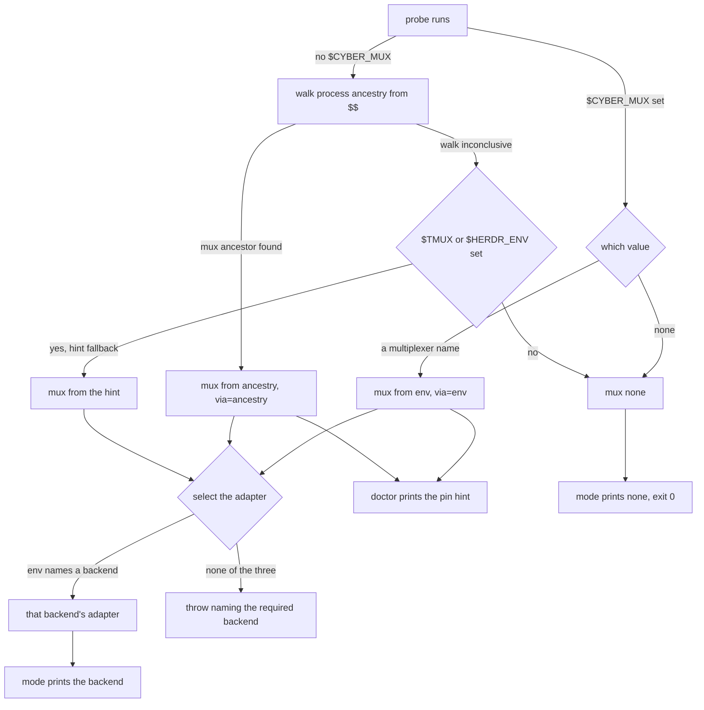

# mux/detection — which multiplexer, and which backend adapter

## What

Which multiplexer a caller is really running inside, and which session backend that selects. Two
questions with one answer: `probeMultiplexer` decides *what is out there* (a fast-path env override,
else a walk up the process ancestry), and `selectSessionAdapter` turns that into the one adapter
every pane-opening verb drives. `doctor` prints a pin hint for the fast-path; `mode` prints the
selected backend, or `none`.

### Non-goals

Detection answers *which backend*, never *what it does with a pane* — placement, driving, lookup,
and the worktree surface are the sibling units. It also never opens anything: a probe reads the
environment and the process table and nothing else.

## Use Cases

- **The session backend is selected by environment** — tmux when `$TMUX` is set, herdr when
  `$HERDR_ENV` is set and `$TMUX` is not; an environment with neither throws asking for one.

- **Multiplexer detection is two-mode** — `probeMultiplexer` first trusts `$CYBER_MUX`
  (`tmux`|`herdr`|`wezterm`|`screen`|`none`) outright — this doubles as an override (`=none` forces
  no-mux even inside a real multiplexer). Failing that it walks the process ancestry from `$$`
  looking for a `tmux`/`tmux: server`, `herdr`, `wezterm`, or `screen` ancestor; `$TMUX`/`$HERDR_ENV`
  are used only as a fast-positive hint the walk falls back to when it is itself inconclusive, never
  trusted alone. `doctor` runs discovery and prints an `export CYBER_MUX=<m> CYBER_MUX_PANE=
` hint
  so a caller can pin the fast-path.

- **`screen` is DETECTED but not DRIVABLE** — the probe recognizes `screen` (an override pinning it,
  or a real screen ancestor) so it is reported truthfully, but `selectSessionAdapter` rejects it with
  a reason rather than returning an adapter. Detection is not support: a caller who pinned
  `CYBER_MUX=screen` declared a real multiplexer, so the honest answer is a named rejection, not the
  generic "run inside a multiplexer" throw. Why screen and not the other three: empirically (screen
  5.0.2) its split regions are addressed positionally (no per-pane id) and `$WINDOW` is unset in
  panes opened via `screen -X`, so a driver-created pane has no stable identity — the affordance
  `SessionTarget.id`/`currentPane`/`LivePane.id` are load-bearing on, and the one wezterm (#47) had
  and screen lacks. Full probe + decision: the ADR log
  ([`design/decisions`](../../design/decisions/README.md)).
## Logic

### Detection and backend selection

Entered by `probeMultiplexer`, `doctor`, `mode`, and every verb that needs an adapter.

## Scenario map

Every scenario in [`detection.feature`](./detection.feature), one row each, grouped by use case.

### The session backend is selected by environment

| Edge | Path (Given) | Scenario |
|---|---|---|
| env names a backend → that adapter | `$TMUX`, `$HERDR_ENV` without `$TMUX`, or `$WEZTERM_PANE` set | `the session backend is selected by environment` |
| none of the three → throw before opening | no `$TMUX`, `$HERDR_ENV`, or `$WEZTERM_PANE` | `no backend detected errors before opening anything` |
| detected screen → rejected by name, with the reason | `$CYBER_MUX=screen`, or a screen ancestor | `a detected screen is rejected by name, not with the generic no-backend error` |

### Multiplexer detection is two-mode

| Edge | Path (Given) | Scenario |
|---|---|---|
| `$CYBER_MUX` set → trusted outright | `$CYBER_MUX=tmux` with `$CYBER_MUX_PANE=%3` | `$CYBER_MUX is trusted outright as a fast-path` |
| `$CYBER_MUX=none` → mux none | `$CYBER_MUX=none` while `$TMUX` is set | `$CYBER_MUX=none is an override even inside a real multiplexer` |
| no `$CYBER_MUX` → walk the process ancestry | a tmux server is an ancestor | `absent the env fast-path, the probe walks the process ancestry from $$` |
| walk inconclusive → fall back to the hint | `$TMUX` set, ancestry walk inconclusive | `$TMUX/$HERDR_ENV alone are not trusted — only a fast-positive hint the walk falls back to` |
| probe result → `doctor` prints the pin hint | running behind a detected multiplexer | `doctor reports the detected mux and prints a pin hint` |

### mode reports the selected backend

| Edge | Path (Given) | Scenario |
|---|---|---|
| adapter selected → `mode` prints the backend | inside a detected multiplexer | `mode reports the detected session backend` |
| no backend selectable → `mode` prints none, exit 0 | in no detectable multiplexer | `mode reports none when no backend is selectable` |
