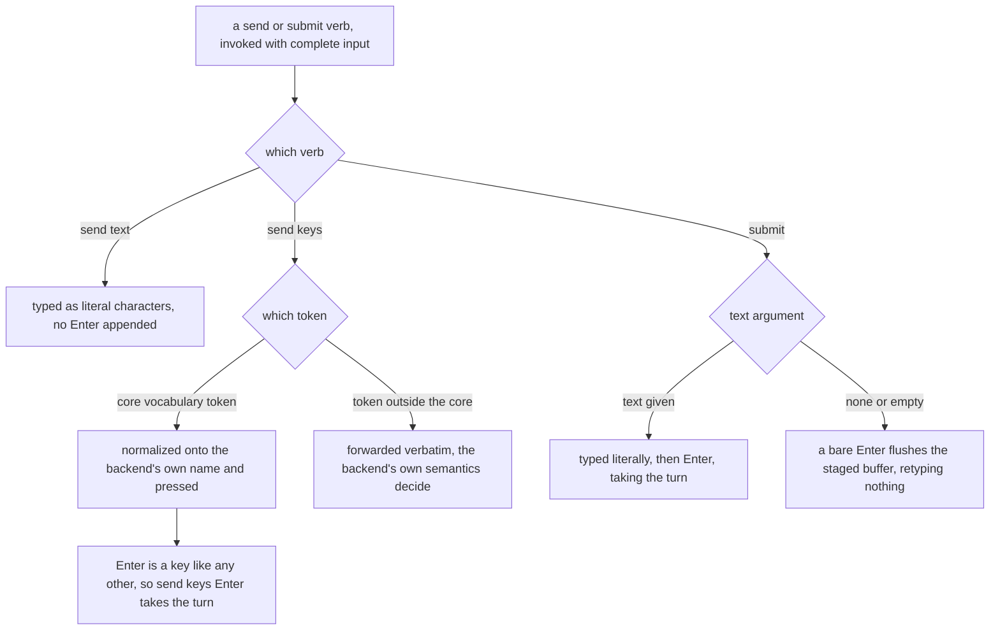

# mux/driving — taking a pane's turn

> The **CLI verb surface** — how `cyber-mux send` and `cyber-mux submit` reject an incomplete
> invocation (no tokens, no text, a bare `send`, a missing pane) before anything reaches a pane —
> lives in [`cli/driving/`](../../cli/driving/README.md). This node owns the **surface-independent
> drive contract** those verbs invoke once the input is complete.

## What

Driving a pane's input once it is open: typing literal text, pressing named keys, and submitting.
The whole unit turns on one distinction — whether Enter is **implied**. `send text` and `send keys`
never add an Enter the caller did not write; `submit` always adds one, so it is the verb *for*
taking a pane's turn.

### Non-goals

**Non-goals** — the `nudge` (send-and-verify-turn-taken) helper (`nudge.ts`) — a provisional
standalone concern per the `cli.ts` verb-surface note, not yet exposed as a CLI verb and not yet
specced; the unit registry, mail, and doorbell that `cyberlegion` layers on top of a pane once
opened — those stayed behind in `cyberlegion`, this repo owns only backend selection, placement,
multiplexer detection, per-pane send/read/focus/close, and the worktree surface above.

Resolving *which* pane a verb acts on, and the structured error a failure carries, belong to
[`lookup/`](../lookup/README.md); this unit owns what is sent once the pane is known.

## Use Cases

- **Typing text and pressing keys are separate verbs; only `submit` presses Enter *for you*** —
  driving a pane's input splits on whether Enter is **implied**. `send text` and `send keys` never add
  an Enter the caller did not write; `submit` always adds one. Three verbs cover it:
  - **`send text <pane> <text>`** — type literal characters, press **no** Enter. A word that happens
    to name a key (`Enter`, `Up`) is typed as those characters, never interpreted as that key.
  - **`send keys <pane> <keys...>`** — press named keys in order, each its own key, typing nothing.
    Keys are named in a **portable core vocabulary** — `Up` `Down` `Left` `Right` `Enter` `Escape`
    `Tab` `Space` `Backspace` `C-c` `F1`–`F12` — normalized onto whatever each backend calls them
    (`Backspace` → tmux's `BSpace` is the only rename). A token **outside** the core is forwarded
    verbatim: it reaches backend-specific keys (`Home`, `M-x`) at the cost of portability, and its
    failure is the backend's own — herdr refuses an unknown key (`unsupported key <k>`), while
    **tmux has no refusal path** and types the token as characters. Neither reaches the caller today:
    the `Exec` seam reports failure as `null`, so `send keys` exits 0 either way. The seam now
    *captures* a backend's stderr into an optional `lastError` (added for the template walk, which
    needed to say why a split was refused), so the reason is no longer thrown away — but `send keys`
    does not read it, and a `null` still cannot be told from an empty stdout. So the gap **narrows
    rather than closes**: it is still the seam's, not this verb's, it still predates the split, and a
    follow-up still owns it. `Enter` is a key like any other: `send keys <pane>
    Enter` **does** press it and **does** take the pane's turn — because the caller asked for it, not
    because the verb implied it. `send keys` adds nothing.
  - **`submit <pane> [text]`** — **always** presses Enter. Given text it types it — **literally, on
    the same guarantee `send text` gives**: text that happens to name a key is typed, never
    interpreted — and presses Enter, taking the pane's turn. Given no text (or empty text) it sends a
    **bare Enter only**, flushing an already-staged input buffer without re-typing it, so a repeated
    flush cannot duplicate the message. `submit` is the verb *for* taking a turn — `open --launch`
    uses it — and the only one that supplies the Enter itself. The guarantee is that **outcome**,
    never a particular
    backend command: a backend with an atomic text-plus-Enter primitive uses it, one without composes
    typing and Enter.

  The core vocabulary is **probed, not derived** from either backend's documentation, and it is the
  whole of the portable set: everything else diverges, `C-c` is the only portable control key, and
  the `Backspace` spelling is a judgment call the probe underdetermines. Why each of these was
  decided the way it was — and what it costs — is logged in
  [`design/decisions/`](../../design/decisions/README.md), not restated here.

## Control Flow

### Driving a pane's turn

The verb's incomplete-invocation rejections (a bare `send`, no tokens, no text, a missing pane) are
the CLI surface's — [`cli/driving/`](../../cli/driving/README.md). This is the drive contract once the
input is complete.

## Scenario map

Every scenario in [`driving.feature`](./driving.feature), one row each, grouped by use case.

### Driving a pane's turn

| Edge | Path (Given) | Scenario |
|---|---|---|
| `send text` with text → literal characters, no Enter | a word that also names a key, each backend | `send text types literal text and presses no Enter` |
| `send keys` core token → normalized and pressed | several core keys, each backend | `send keys presses core-vocabulary keys and types nothing` |
| `send keys` core token → normalized and pressed | `Backspace` on tmux, the one renamed key | `Backspace is the core's one renamed key, and tmux gets tmux's name for it` |
| `send keys` non-core token → forwarded verbatim | `Home` on tmux, which knows it | `a non-core key that the backend does know is pressed` |
| `send keys` non-core token → forwarded verbatim | `Home` on herdr, which refuses it | `a non-core token that the backend does not know is refused where the backend refuses` |
| `send keys` non-core token → forwarded verbatim | a token naming no key, on tmux, which cannot refuse | `a token no backend knows is not rescued by cyber-mux on a backend that cannot refuse it` |
| `send keys` core token → normalized and pressed | `Up` on wezterm, which has no key-name primitive | `wezterm has no send-keys primitive at all — a key is its own raw terminal byte sequence` |
| `send keys` non-core token → forwarded verbatim | `Home` on wezterm, which can encode it | `a non-core key wezterm also knows (by the same extras a backend "knowing" Home means) is pressed` |
| `send keys` non-core token → forwarded verbatim | a token wezterm cannot encode | `a token wezterm cannot encode is typed as its own literal characters, unable to refuse it` |
| `send keys Enter` → Enter pressed, the turn taken | text already staged, each backend | `send keys Enter presses Enter and takes the turn, because the caller asked for it` |
| `submit` with text → typed then Enter | a message as the text argument, each backend | `submit with text types the text and presses Enter, taking the pane's turn` |
| `submit` with text → typed then Enter | a message that also names a key, each backend | `submit types its text literally, never interpreting it as a key` |
| `submit` with no text → a bare Enter flush | text already staged, each backend | `submit with no text presses a bare Enter and retypes nothing` |
| `submit` with empty text → a bare Enter flush | text already staged, tmux and herdr | `submit with empty text is the bare flush, not a second contract` |

> The verbs' incomplete-invocation rejections — `send keys` with no tokens, `send text` with no
> text, a bare `send`, and `submit` with no pane — are the CLI surface's, one scenario each in
> [`cli/driving/`](../../cli/driving/README.md).
