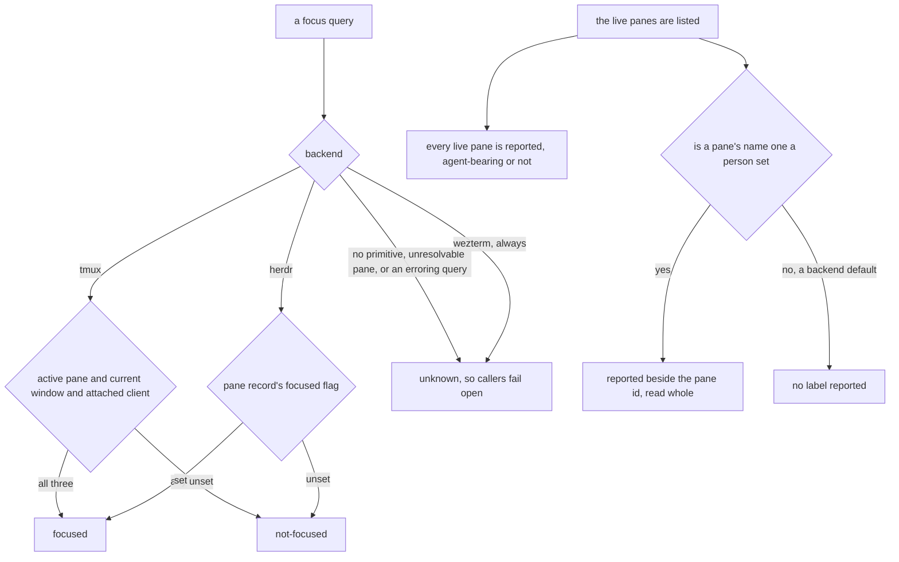
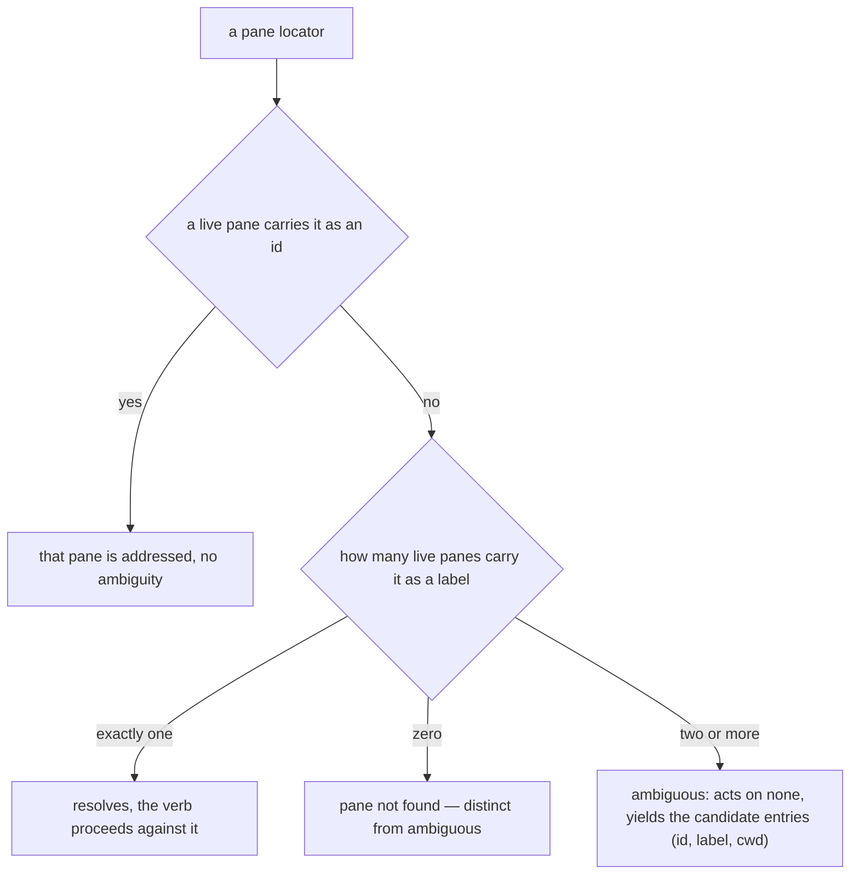

# mux/lookup — resolving a pane, the focus probe, and the listing content

> The **CLI surface** over this seam — the `cyber-mux read` / `focus` / `close` / `list` / `exists`
> verbs, their stdout and exit codes, and the shared structured-error/usage contract every verb fails
> through — lives in [`cli/lookup/`](../../cli/lookup/README.md). This node owns the
> **surface-independent library contract** those verbs drive.

## What

How a caller's string resolves to the one pane it means, whether a pane is currently focused, and what
the live pane listing carries so a name can resolve from it. One resolution ladder — an id outranks a
name, exactly one match resolves, two or more is ambiguous — serves every pane-taking verb, and it
reads the live pane list, which answers ids and labels in one read.

### Non-goals

- **The CLI presentation of these outcomes** — what a verb writes to stdout, which exit code an
  ambiguity or a not-found rides, how the ambiguity report is rendered as a structured error, and the
  one `fail()` error/usage contract every `cyber-mux` verb routes through. Those are **surface**
  concerns and live in [`cli/lookup/`](../../cli/lookup/README.md). This node specifies the
  **decisions** (resolves / not-found / ambiguous; focused / not-focused / unknown; which labels the
  listing carries), never their rendering.
- **Moving focus** — the focus probe here is **read-only** and opens nothing; the focus *verb* (which
  drives the attached client's view) is [`cli/lookup/`](../../cli/lookup/README.md), and where a pane
  opens is [`placement/`](../placement/README.md).
- **What is *sent* to a resolved pane** — that belongs to [`driving/`](../driving/README.md).

## Use Cases

- **The backend reports whether a pane is currently focused** — a pane locator resolves to `focused`,
  `not-focused`, or `unknown`, so a caller can tell whether a human is actually viewing a pane before
  spending a turn on it. A pane is **focused** only when a live client is currently displaying it.
  Each backend answers with its own primitive: on **tmux**, the pane is the active pane of the
  current window in a session with an attached client (`pane_active` + `window_active` +
  `session_attached`) — any of those unset is **not-focused**; on **herdr**, the pane record's own
  `focused` flag (`pane get <id>`). A backend that has no primitive to report focus — or a query that
  errors or names a pane the backend can no longer resolve — answers **unknown** (a tri-state, not a
  boolean) so callers **fail open** — treat unknown as "go ahead" rather than as "absent" — never
  suppressing behavior on a mux that simply can't tell. **wezterm always answers unknown**: unlike
  tmux/herdr, where unknown is a per-query fallback, wezterm's `list --format json` carries no
  active/focused field for a pane, tab, or window at all — there is no primitive to ask, ever, so
  this is the whole backend's answer rather than an edge case of it. This is a **read-only** probe: it
  moves no focus and opens nothing (unlike the focus *verb*, which drives the attached client's view).

- **A pane is addressed by a name or an id, and an ambiguous name fails with its candidates** —
  every verb that takes a pane (`read`, `submit`, `exists`, `focus`, `close`, `send text`,
  `send keys`, and `template save --from`) accepts either. A template names its panes and the apply
  manifest reports `(label, pane)` per pane, so a caller wanting "the `worker` pane" would otherwise do
  the lookup itself — which is the surface [`template/`](../../template/README.md)'s manifest already
  promises it will not need.

  - **An id outranks a name, and the ladder is what keeps this additive.** A string is taken as an
    id when a live pane carries it, and only otherwise resolved as a name — so a caller that works
    today can never be made to mean something else by a person renaming an unrelated pane. A label
    is a human name, so nothing stops one from *being* `%3`; the pane whose id that is still wins.
    Ambiguity is a **fuzzy-tier condition only** — the same shape git resolves a refname by (a
    documented six-step ladder), Docker a container by (full id → exact name → prefix), and tmux its
    own targets by (id → exact → prefix → glob). Two matches at *different* tiers are not peers and
    need no report.
  - **An id is recognized by matching a live pane, never by the shape of the string.** Docker sniffs
    (`sg-` → treat as an id), and it is the cheaper rule; it is refused here because encoding a
    backend's id format in the resolution is exactly the backend leak this seam exists to prevent —
    a new backend would owe a new syntax rule. Resolution reads the live pane list, which answers
    ids and labels in one read.
  - **The resolution decision: exactly one match resolves; zero is not-found (distinct from
    ambiguous); two or more is ambiguous and acts on none.** On two or more, resolution yields the
    matching entries — id, label, and working directory: the three that discriminate (a report
    listing `worker, worker` helps nobody) — so the caller can choose between them. Zero matches is
    the not-found path, **not** an ambiguity. The *rendering* of these outcomes — the exit codes, the
    `ambiguous-pane` structured error on stdout, the `--format` handling — is the CLI surface in
    [`cli/lookup/`](../../cli/lookup/README.md).

  **Uniqueness was considered and refused.** tmux and Docker both enforce unique names at creation,
  which is precisely why ambiguity is unrepresentable for them and their lookups stay binary. That
  door is deliberately closed here: a label reaches a live pane because a person set it, herdr labels
  every new workspace's root tab `1`, and nothing keys on a name — so refusing a duplicate made the
  capture verb *drop* labels a user had chosen. Removing that rule relocated the ambiguity rather
  than deleting it; this is where it lands, and lookup is where the candidates are known and the
  caller is present.

- **The live pane listing carries the label a person set, never a backend's default** — the listing
  reports every live pane (agent-bearing or not) with the label a name resolves from, and the label
  it reports is the one a person set. tmux has no unset title: it defaults `pane_title` to the
  hostname, so an untouched pane reports a name nobody chose. Reporting that would label every pane in
  a session identically and make the hostname resolve to all of them — ambiguity manufactured out of
  nothing. A title differing from the host is the author's and is reported; the listing already
  applies this rule for a region (`describeRegion`). herdr has the honest primitive and simply omits
  the key until `pane rename`. **wezterm never reports a label at all** — not a filtering rule like
  tmux's, but the honest consequence of there being no primitive to set one in the first place: its
  `title` field is always the ambient running-program name, never something an author chose, so
  exporting it would manufacture the same collision the hostname guard exists to prevent.

## Control Flow

### Reporting whether a pane is focused, and what the listing carries

### Resolving a pane locator

## Scenario map

Every scenario in [`lookup.feature`](./lookup.feature), one row each, grouped by use case. The CLI
rendering of these outcomes — exit codes, the structured error, `--format` — is in
[`cli/lookup/`](../../cli/lookup/README.md).

### Reporting whether a pane is currently focused

| Edge | Path (Given) | Scenario |
|---|---|---|
| tmux: active pane, current window, attached client → focused | a tmux pane meeting all three | `tmux reports a pane focused when an attached client is currently viewing it` |
| tmux: any of the three unset → not-focused | a tmux pane failing one of the three | `tmux reports a pane not focused when <condition>` |
| herdr: pane record focused → focused | a herdr pane record reporting a viewing client | `herdr reports a pane focused when its pane record is focused` |
| herdr: pane record not focused → not-focused | a herdr pane record reporting no viewing client | `herdr reports a pane not focused when its pane record is not focused` |
| query cannot be answered → unknown | no primitive, an unresolvable pane, or an erroring query | `a focus query that cannot be answered is unknown, not a boolean` |
| query cannot be answered → unknown | any wezterm pane, always | `wezterm always reports unknown — it has no focus primitive at all, not just a per-query gap` |

### The live pane listing carries the labels a name resolves from

| Edge | Path (Given) | Scenario |
|---|---|---|
| `list` → every live pane | a mix of agent-bearing and plain panes | `the live pane listing enumerates every live pane, including one running no agent/harness` |
| a name a person set → reported beside the pane id | a labeled tmux pane and a labeled herdr pane | `the live pane listing carries each pane's label, so a name resolves from it` |
| a backend default name → no label reported | a tmux pane whose title was never set | `a tmux pane nobody named carries no label, so the hostname addresses no pane` |
| a backend default name → no label reported | a herdr pane never renamed | `a herdr pane nobody named carries no label, with no comparison needed to tell` |
| a backend default name → no label reported | any wezterm pane, which has no titling primitive | `a wezterm pane never carries a label, because nothing can ever set one` |

### Resolving a pane locator — id, name, and the ambiguity decision

| Edge | Path (Given) | Scenario |
|---|---|---|
| exactly one label match → resolves and the verb acts | three panes, one labeled worker, per pane verb | `every pane verb addresses a pane by name as readily as by id` |
| zero matches → pane not found | a wezterm pane, which never carries a label | `a name never resolves a wezterm pane — only an id can` |
| two or more label matches → acts on none, uniformly across verbs | three panes all labeled worker, per pane verb | `an ambiguous name fails the same way on every pane verb, acting on none` |
| a live pane carries it as an id → that pane is addressed | one pane's id, another pane's label, the same string | `an id addresses the pane whose id it is, even when another pane is labeled with that id` |
| no live pane carries it as an id → resolved as a name | an id-shaped string carried only as a label | `an id is recognized by matching a live pane, never by the shape of the string` |
| exactly one label match → resolves and the verb acts | three panes, exactly one labeled worker | `a name matching exactly one live pane resolves to it and the command proceeds` |
| zero matches → not found, distinct from ambiguous | no pane labeled or ided worker | `a name matching no live pane is not found, rather than ambiguous` |
| two or more label matches → fail acting on none, yield candidates to choose from | three panes all labeled worker | `a name matching two or more live panes fails rather than guessing which was meant` |
| whole spaced label → taken as one locator | a tmux pane labeled `my worker` | `a label containing spaces resolves to its pane` |
