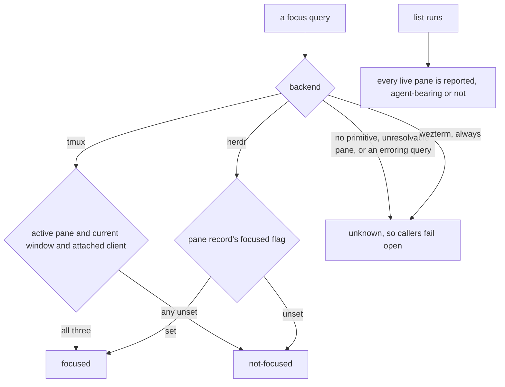
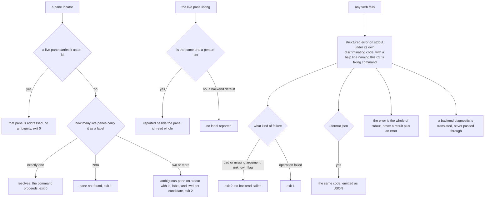

# mux/lookup — addressing a pane, and the error surface

## What

How a caller names the pane it means, what the live pane listing reports, whether a pane is
currently focused, and what every verb does when it fails. One resolution ladder — an id outranks a
name, exactly one match resolves, two or more fail with the candidates — serves every pane-taking
verb, and one `fail()` helper pins the structured-error contract once at the surface for all of
them.

### Non-goals

Moving focus is not asked here: the focus probe is **read-only** and opens nothing (that is
`focus`'s job, in [`placement/`](../placement/README.md)). What is *sent* to a resolved pane belongs
to [`driving/`](../driving/README.md).

## Use Cases

- **The backend reports whether a pane is currently focused** — a pane locator resolves to `focused`,
  `not-focused`, or `unknown`, so a caller can tell whether a human is actually viewing a pane before
  spending a turn on it. A pane is **focused** only when a live client is currently displaying it.
  Each backend answers with its own primitive: on **tmux**, the pane is the active pane of the
  current window in a session with an attached client (`pane_active` + `window_active` +
  `session_attached`) — any of those unset is **not-focused**; on **herdr**, the pane record's own
  `focused` flag (`pane get <id>`). A backend that has no primitive to report focus — or a query that
  errors or names a pane the backend can no longer resolve — answers **unknown** (a tri-state, not a
  boolean) so callers **fail open** — treat unknown as "go ahead" rather than as "absent" — never
  suppressing behavior on a mux that simply can't tell. **wezterm always answers unknown**: unlike
  tmux/herdr, where unknown is a per-query fallback, wezterm's `list --format json` carries no
  active/focused field for a pane, tab, or window at all — there is no primitive to ask, ever, so
  this is the whole backend's answer rather than an edge case of it. This is a **read-only** probe: it moves no
  focus and opens nothing (unlike `focus`, which drives the attached client's view to a pane).

- **A pane is addressed by a name or an id, and an ambiguous name fails with its candidates** —
  every verb that takes a pane (`read`, `submit`, `exists`, `focus`, `close`, `send text`,
  `send keys`, and `template save --from`) accepts either. A template template names its panes and the
  apply manifest reports `(label, pane)` per pane, so a caller wanting "the `worker` pane" would
  otherwise do the lookup itself — which is the surface [`template/`](../../template/README.md)'s manifest
  already promises it will not need.

  - **An id outranks a name, and the ladder is what keeps this additive.** A string is taken as an
    id when a live pane carries it, and only otherwise resolved as a name — so a caller that works
    today can never be made to mean something else by a person renaming an unrelated pane. A label
    is a human name, so nothing stops one from *being* `%3`; the pane whose id that is still wins.
    Ambiguity is a **fuzzy-tier condition only** — the same shape git resolves a refname by (a
    documented six-step ladder), Docker a container by (full id → exact name → prefix), and tmux its
    own targets by (id → exact → prefix → glob). Two matches at *different* tiers are not peers and
    need no report.
  - **An id is recognized by matching a live pane, never by the shape of the string.** Docker sniffs
    (`sg-` → treat as an id), and it is the cheaper rule; it is refused here because encoding a
    backend's id format in the resolution is exactly the backend leak this seam exists to prevent —
    a new backend would owe a new syntax rule. Resolution reads the live pane list, which answers
    ids and labels in one read.
  - **Two or more matches fail and report the entries** — id, label, and working directory: the three
    that discriminate (a report listing `worker, worker` helps nobody), and within axi #2's 3–4-field
    default row. Each candidate's id is directly usable as the retry. The report is a **structured
    error** under the stable code `ambiguous-pane`, on **stdout** per [`axi.md`](../../axi.md)'s
    stream discipline, honoring `--format`. Zero matches is the existing not-found path, not an
    ambiguity.

    This report was originally contracted onto **stderr**, on the reading that stdout must stay clean
    so a redirect never corrupts a parsed result. That inverted AXI, which puts errors on stdout
    precisely "so the agent can read and act on them" and calls stderr the stream agents don't read —
    and this report exists to hand a caller candidates to retry with, so it was the last thing that
    belonged there. The clean-stdout worry does not survive: a verb writes its result or its error,
    never both, so exit `2` separates them before anything is parsed.
  - **The outcome rides the exit code: `0` one match, `1` zero, `2` ambiguous — and `2` is
    [`axi.md`](../../axi.md)'s own `usage error` (#6), not a code this node invented.** An ambiguous
    locator is a usage error in the strict sense AXI means: the argument is underspecified, nothing
    was attempted, and the fix is a different argument — the same family as the missing required
    parameter AXI already puts at `2`. So this is an **application** of the contract, not an amendment
    to it; the earlier reading — that `2` was a third code added for a predicate that *couldn't
    answer* — mistook an incomplete restatement of AXI (this repo's node listed only `0`/`1`) for
    AXI's actual set. It reaches the same code either way: `grep` (2), POSIX `test` (`>1`, normative),
    `diff`, `expr` and `pgrep` all reserve one for couldn't-answer, and `systemctl is-active` is the
    counter-case that kills the alternative — it prints `inactive` for both a stopped unit and a
    missing one, leaving only exit 3 vs 4 to tell them apart. So `exists` keeps answering
    `live`/`gone` on stdout and spends the code rather than a fourth word. Exit `2` means the same
    thing on **every** pane verb; one meaning per code is what lets an agent detect it without
    parsing.

  **Uniqueness was considered and refused.** tmux and Docker both enforce unique names at creation,
  which is precisely why ambiguity is unrepresentable for them and their lookups stay binary. That
  door is deliberately closed here: a label reaches a live pane because a person set it, herdr labels
  every new workspace's root tab `1`, and nothing keys on a name — so refusing a duplicate made the
  capture verb *drop* labels a user had chosen. Removing that rule relocated the ambiguity rather
  than deleting it; this is where it lands, and lookup is where the candidates are known and the
  caller is present.

  **Boundary — the label the listing reports is the one a person set, never a backend's default.**
  tmux has no unset title: it defaults `pane_title` to the hostname, so an untouched pane reports a
  name nobody chose. Reporting that would label every pane in a session identically and make the
  hostname resolve to all of them — ambiguity manufactured out of nothing. A title differing from the
  host is the author's and is reported; the listing already applies this rule for a region
  (`describeRegion`). herdr has the honest primitive and simply omits the key until `pane rename`.
  **wezterm never reports a label at all** — not a filtering rule like tmux's, but the honest
  consequence of there being no primitive to set one in the first place (see above): its `title`
  field is always the ambient running-program name, never something an author chose, so exporting it
  would manufacture the same collision the hostname guard exists to prevent.

- **Every failure is a structured error on stdout, coded, with the command that fixes it** — this
  node is where [`axi.md`](../../axi.md)'s #6 is verified, because a reference node carries no suite
  of its own. One `fail()` helper reaches all ~15 verbs, so the contract is pinned once at the surface
  rather than twenty times per verb: an error goes to **stdout** (AXI's stream for what the agent
  consumes), under a **stable `code`** a caller matches instead of parsing prose, with an actionable
  **`help:`** naming this CLI's own fixing command — never `see --help`, and never the wrapped
  multiplexer's raw diagnostic, which an agent cannot act on through `cyber-mux`.

  - **A usage error is `2`; a failed operation is `1`.** `2` says *your invocation is wrong, fix it and
    retry* — an unrecognized flag, a missing required parameter, incomplete input like a bare
    `cyber-mux send`. `1` says *your invocation was fine, the operation failed*. Both were `1` before,
    which is commander's default restated as the contract, and it left the repo exiting `2` for one
    kind of bad input (an ambiguous locator) and `1` for the others — the confusing state, and the
    reason this is one pass rather than a per-verb patch.
  - **An unknown flag names the flag AND the command's valid flags**, validated against the
    **subcommand's** set rather than the group's, since a group's subcommands need not share one:
    `template save` takes `--from`/`--workspace`/`--description`/`--force` and `template list` takes none
    of them, so validating against the group's union would accept `--force` on `list` and then
    silently drop it — the exact failure fail-loud exists to prevent, and only the subcommand layer
    knows which set is in play. (`send text` and `send keys` are **not** an example of this: they
    define identical flag sets. An earlier draft cited them and was wrong on source.) AXI's reasoning
    is a token argument: the
    agent's deterministic next move is `--help`, so folding that answer into the error collapses a
    two-turn correction into one. `--help` itself always passes, on every command.
  - **The `worktree` verbs share one catch-all (`reportWorktreeFailure`), and it owes the same
    translation as every other verb.** It sits downstream of two error sources with different safety:
    this CLI's own worktree refusals (a dirty-checkout guard, a primary-checkout guard) are its own
    text and are forwarded verbatim; a failure opening or binding the worktree's pane comes from the
    multiplexer and is translated the same as any other verb's backend failure, its raw diagnostic
    never reaching stdout. The two are told apart by a dedicated `WorktreeGitError` the worktree module
    throws for its own refusals — anything else reaching the catch-all is backend-originated.
  - **`exists` is the deliberate exception, and it is a divergence rather than an amendment.** It
    spends `1` on `gone` — an answer, not an error — the predicate framing `grep`, POSIX `test` and
    `systemctl is-active` take. That is kept, but it is **not** AXI's code set, and calling it "an
    amendment to the `0`/`1` set" (as this corpus did) was wrong twice: the set was always `0`/`1`/`2`,
    and what `exists` actually diverges on is the *meaning* of `1`. Recorded, not settled here.
## Logic

### Reporting whether a pane is focused, and listing panes

### Addressing a pane, and the error surface

## Scenario map

Every scenario in [`lookup.feature`](./lookup.feature), one row each, grouped by use case.

### Reporting whether a pane is currently focused

| Edge | Path (Given) | Scenario |
|---|---|---|
| tmux: active pane, current window, attached client → focused | a tmux pane meeting all three | `tmux reports a pane focused when an attached client is currently viewing it` |
| tmux: any of the three unset → not-focused | a tmux pane failing one of the three | `tmux reports a pane not focused when <condition>` |
| herdr: pane record focused → focused | a herdr pane record reporting a viewing client | `herdr reports a pane focused when its pane record is focused` |
| herdr: pane record not focused → not-focused | a herdr pane record reporting no viewing client | `herdr reports a pane not focused when its pane record is not focused` |
| query cannot be answered → unknown | no primitive, an unresolvable pane, or an erroring query | `a focus query that cannot be answered is unknown, not a boolean` |
| query cannot be answered → unknown | any wezterm pane, always | `wezterm always reports unknown — it has no focus primitive at all, not just a per-query gap` |

### list enumerates every live pane

| Edge | Path (Given) | Scenario |
|---|---|---|
| `list` → every live pane | a mix of agent-bearing and plain panes | `list enumerates every live pane, including one running no agent/harness` |

### Addressing a pane

| Edge | Path (Given) | Scenario |
|---|---|---|
| exactly one label match → resolves and the verb acts | three panes, one labeled worker, per pane verb | `every pane verb addresses a pane by name as readily as by id` |
| zero matches → pane not found | a wezterm pane, which never carries a label | `a name never resolves a wezterm pane — only an id can` |
| two or more label matches → ambiguous-pane, exit 2 | three panes all labeled worker, per pane verb | `an ambiguous name fails the same way on every pane verb` |
| a live pane carries it as an id → that pane is addressed | one pane's id, another pane's label, the same string | `an id addresses the pane whose id it is, even when another pane is labeled with that id` |
| no live pane carries it as an id → resolved as a name | an id-shaped string carried only as a label | `an id is recognized by matching a live pane, never by the shape of the string` |
| exactly one label match → resolves and the verb acts | three panes, exactly one labeled worker | `a name matching exactly one live pane resolves to it and the command proceeds` |
| zero matches → pane not found, exit 1 | no pane labeled or ided worker | `a name matching no live pane is not found, rather than ambiguous` |
| two or more label matches → fail, acting on none | three panes all labeled worker | `a name matching two or more live panes fails rather than guessing which was meant` |
| two or more label matches → candidates carry id, label, cwd | three worker panes in different working directories | `the ambiguity report carries what tells the candidates apart, and what retries them` |
| two or more label matches → structured error on stdout, exit 2 | two panes labeled worker | `the ambiguity report is a structured error on stdout, where the agent reads` |
| two or more label matches → the report honors `--format` | two panes labeled worker, `--format json` | `--format json emits the ambiguity as a structured error carrying its candidates` |
| `exists` → live, gone, or ambiguous by exit code | one, zero, and two-or-more matches | `exists distinguishes its three outcomes by exit code, not by prose` |
| two or more label matches → the report replaces the answer | `exists` against two panes labeled worker | `an ambiguous exists reports its candidates rather than answering the question` |
| a name a person set → reported beside the pane id | a labeled tmux pane and a labeled herdr pane | `the live pane listing carries each pane's label, so a name resolves from it` |
| a backend default name → no label reported | a tmux pane whose title was never set | `a tmux pane nobody named carries no label, so the hostname addresses no pane` |
| a backend default name → no label reported | a herdr pane never renamed | `a herdr pane nobody named carries no label, with no comparison needed to tell` |
| a backend default name → no label reported | any wezterm pane, which has no titling primitive | `a wezterm pane never carries a label, because nothing can ever set one` |
| a name a person set → each field read whole | a tmux pane labeled `my worker`, cwd containing a space | `a label containing spaces resolves, and never corrupts what is listed beside it` |

### The error surface

| Edge | Path (Given) | Scenario |
|---|---|---|
| any verb fails → structured error on stdout under its own code | no-mux, pane-not-found, and ambiguous-pane failures | `a failure is a structured error on stdout, under the code for THAT failure` |
| codes discriminate → no shared catch-all | an ambiguous locator and a missing multiplexer | `two different failures never share one code` |
| missing required argument → exit 2, no backend called | `read`, `focus`, `send text` without the pane argument | `a missing required argument is a usage error, not a failed operation` |
| unknown flag → exit 2 with the command's valid flags | `list` with a flag it does not define | `an unknown flag is a usage error, and says what the valid flags are` |
| unknown flag → validated against the subcommand's set | `template list` with `--force`, a `template save` flag | `an unknown flag is rejected against the SUBCOMMAND's flags, not the group's` |
| `--help` → passes on every command, exit 0 | any command with `--help` | `--help is never an unknown flag` |
| error → honors `--format json` under the same code | a failing command with `--format json` | `a structured error honors --format json` |
| error → the whole of stdout, never a result before it | `read` against a pane whose capture fails | `a failed verb's stdout is its structured error alone, with no result before it` |
| partial outcome → one result payload, not result plus error | a tabs template whose second tab fails | `a partially-applied template is one result payload, not a result plus an error` |
| backend diagnostic → translated into this CLI's code and help | a verb whose backend command fails with its own diagnostic | `an error never leaks the multiplexer's own output` |
| backend diagnostic → translated into this CLI's code and help | `worktree add` whose backend fails opening the pane | `the worktree catch-all never forwards the multiplexer's raw diagnostic either` |
