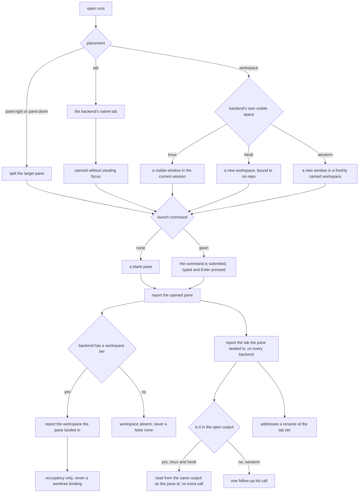
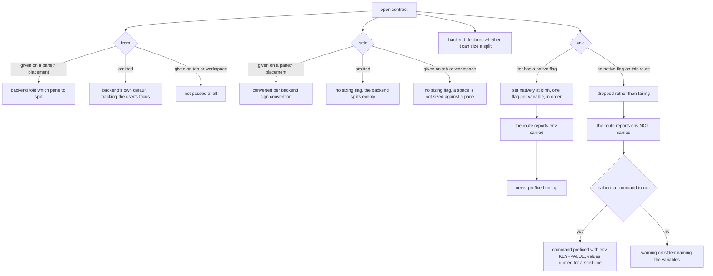
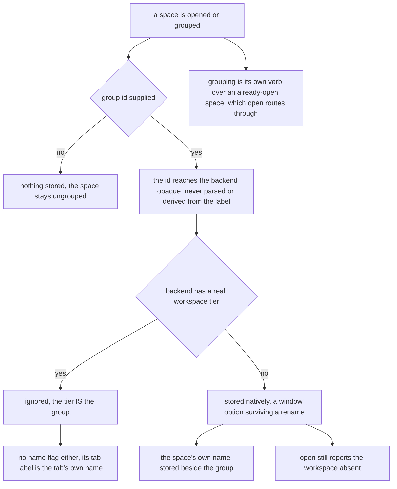
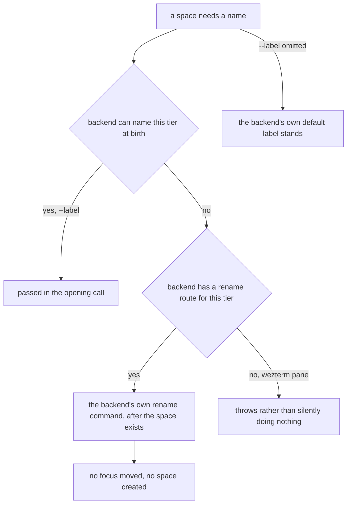

# mux/placement — where a new pane opens, and what open reports back

## What

Where `cyber-mux open` puts a new pane on each backend, and everything the seam's own open contract
carries with it: which pane a split targets, how big it is, what environment it is born with, which
group it belongs to, what it is called, and what the open reports back — the pane, its tab, and its
workspace.

This node owns the **surface-independent library contract**. The `cyber-mux open` **flag surface** —
how `--at`, `--launch`, and `--env` are parsed, defaulted, validated, and refused — is its CLI
counterpart in [`cli/placement/`](../../cli/placement/README.md); this node does not restate those
flags, it defines what their values mean once handed to the seam.

### Non-goals

**Naming a tab inside a workspace was a non-goal here, and this CR reversed it — the constraint was
real but the generalization was not.** The recorded reason was that herdr labels a new workspace's
root tab `1` with no flag to change it (only `tab rename` after the fact), and that the workspace
label is what its UI groups by. The first half holds and is unchanged; the second is beside the point
once a template describes **several** tabs, where the whole question is telling them apart *inside*
one group. What the premise never supported is the conclusion drawn from it: it is true of a new
workspace's **root tab alone**. Every subsequent tab is named at birth on both backends — herdr
`tab create --label`, tmux `new-window -n` — which `--label` above already specifies at every tier.
So the cost is one `tab rename` on herdr's first tab, not a capability neither backend has. Multi-tab
templates ([`template/`](../../template/README.md)) are the first real customer, and the non-goal is revisited
here rather than silently contradicted.

The `--at`, `--launch`, and `--env` **flag surface** — how each is parsed, defaulted, validated, and
refused at the CLI — is [`cli/placement/`](../../cli/placement/README.md)'s, not this node's; this node
owns only what those flags' values mean once handed to the seam.

Detecting *which* backend is in play is [`detection/`](../detection/README.md); addressing a pane
after it exists is [`lookup/`](../lookup/README.md); binding a checkout to a workspace is
[`worktree/`](../worktree/README.md).

## Use Cases

- **Each placement value maps onto the backend's own primitive** — `pane:right|pane:down|tab|workspace`.
  `tab` maps to each backend's native Tab primitive — tmux `new-window`, herdr `tab create` — never a
  split pane. `workspace` maps to each backend's own **visible** space — herdr `workspace create`, tmux
  `new-window` (a window visible in the status bar). Every placement opens without stealing the caller's
  focus. `open` is placement and nothing more: the workspace it makes carries no worktree record even
  when its cwd is a checkout, so it is never grouped with a repo — that is the `worktree` verbs' job,
  below. Which value the `--at` flag carries, how it defaults when omitted (the adapter's own
  `at ?? 'tab'` fallback, reachable exactly because the CLI flag is optional — `session.tmux.ts`,
  `session.herdr.ts`), and how an out-of-set value is refused are the **flag surface**'s, in
  [`cli/placement/`](../../cli/placement/README.md).
- **A split can be told which pane, how big, and what environment** — three options on the seam's
  own open contract shape a `pane:*` placement. `from` and `ratio` are reached only through the
  adapter, never a CLI flag; `env` also has a `--env` flag (below), whose *surface* is its own
  concern while what env *means* stays this bullet's. The template capability is another such caller.
  What a template *does* with these is [`template/`](../../template/README.md)'s business; what they *mean*
  is this node's.
  - **`from` names the pane to split, and passing it is the only way `pane:right` means the same
    thing on both backends.** Omitting it does not mean "the calling pane" — it means "whatever this
    backend defaults to", and the two defaults disagree while both tracking the pane the *user* is
    looking at: tmux always splits the session's active pane and ignores `$TMUX_PANE` entirely; herdr
    resolves `--current` from `$HERDR_PANE_ID`, silently falling back to the UI-focused pane when
    that is unset. They agree whenever a human is typing and diverge exactly when a program is
    driving — which is when this seam's callers are running. `tab` and `workspace` split nothing, so
    they ignore it.
  - **`ratio` is the fraction kept by the ORIGINAL pane, and the sign convention is the trap** — the
    two backends convert in **opposite** directions. herdr's `--ratio` sizes the original, so the
    number passes through unconverted; tmux's `-l` sizes the **new** pane, so it takes `1 - ratio`.
    Applying the inversion to both, or to neither, is the single most likely way to get a split
    backwards. Omitted, each backend takes its own even default. Ratio is a *split* concept: a tab or
    workspace is never sized against a pane, so it is not passed there. **wezterm's `--percent` sizes
    the NEW pane** — the same direction as tmux's `-l`, not herdr's pass-through — probed from the
    issue that requested this backend (#47) and the CLI's own help text, not a live binary.
  - **A backend declares whether it can size a split at all**, so a caller can degrade a ratio rather
    than fail on a backend that cannot honor one — the degrade *policy* is the caller's, not this
    seam's (template warns once and takes the default). All three backends can size, so all three
    declare it; silence is taken as cannot.
  - **`env` is set natively at the birth of whatever tier opens — not just a split — on tmux and
    herdr.** Both take a repeatable flag on every space-creating command (herdr `--env KEY=VALUE`,
    tmux `-e KEY=VALUE`), one per variable. That breadth is load-bearing rather than incidental: a
    pane pool's root pane is born by the region open and never by a split, so a seam that scoped env
    to `pane:*` would drop it silently exactly where a caller needs it. Valid with or without a launch
    — a pane with env and no command is a blank shell with that env set. The one exception among
    herdr's own routes is its **worktree** verbs, whose create/open take no env parameter and refuse
    the flag outright; the checkout is never failed over it. **wezterm has no `--env` flag on ANY
    space-creating command at all** — `spawn` and `split-pane` take no such option — so every one of
    its opens takes the same fallback path herdr's one worktree route alone needs, not just one.
  - **The one route that cannot carry env reports that fact to its caller** — the seam's answer, not
    a message to a human. No env flag reaches herdr's worktree command, and the route that opened the
    region is the only thing that knows env was lost (every other route carries it, and a caller
    cannot see which route ran). So the fact is reported outward rather than inferred, for the same
    reason the workspace grouping is. This report is what makes the compensation below *possible*: it
    is always made on that route, whether or not the compensation then succeeds.
  - **Compensation is a separate altitude, and it either prefixes or warns — never both.** Given that
    report, a caller with a command to run hands env to the command as an `env KEY=VALUE` prefix, and
    the variable lands. A caller with no command has nothing to ride, so the variable genuinely does
    not land and a warning goes to stderr naming it. Only the route that lost env may prefix —
    double-applying over a native set would push the values into `ps` output and shell history on
    every route, which is the exact cost the prefix is a last resort to avoid. The prefix is a shell
    command line, so values are quoted for one.
  - **The `--env` CLI flag is the surface for this option** — how a `KEY=VALUE` pair is parsed,
    repeated, refused alongside `--template`, and degraded on the one route that cannot carry env — and
    it is the **flag surface**'s, in [`cli/placement/`](../../cli/placement/README.md). This node owns
    what env *means* (the six bullets above); that node owns the flag that carries it. The two meet at
    "the route that cannot carry env": what the seam does about it is here, how the flag reports it is
    there.

  **Boundary — the seam does not validate `ratio`.** It renders whatever number it is given; the
  `0 < ratio < 1` bar belongs to the caller (template's schema enforces it, and is where a degenerate
  ratio is refused). An adapter author owes the rendering, not the range check.

- **A caller can group the spaces it opens, on a backend with no tier to group them in** — one more
  option on the open contract, and the same shape as the three above: not a CLI flag, reached through
  the adapter, with [`template/`](../../template/README.md) as its caller. A caller opening several tabs as
  one workspace needs them recognizable as a group afterwards. Where a real Workspace tier exists the
  tier **is** the group and the option is **ignored** — herdr already stamps every pane and tab record
  with its `workspace_id`, so a second grouping would duplicate a fact the backend never reads. Where
  there is none, the backend stores an **opaque group id** in its own native mechanism: tmux has no
  Workspace level, so the id goes in a **window option**, which the backend can filter on server-side
  and which survives a window rename.

  **The id and the label are separate, and that separation is the whole point.** The obvious cheaper
  design — encode the group in the label and read it back — **does not work**, and not marginally: a
  label is chosen by a human and may contain anything, so a window named `acme - beta - main` reads as
  group `acme` with tab `beta - main` exactly as well as group `acme - beta` with tab `main`. No split
  rule resolves it; each merely picks which legal label to silently mis-group. So a label is never
  parsed to recover a grouping. What a *human* reads in a status bar is the label's job and belongs to
  the caller that composes it (template's business); what a *machine* reads is this id.

  **Grouping is a verb, not only an option on `open`.** `open` cannot be the only way in: a caller
  that did not open the space still has to group it — the `worktree` route opens its region before any
  pool is built — and it holds that space's own id the moment the open returns. So grouping is its own
  member, acting on an already-open space exactly as the rename above does, and `open`'s option
  **routes through it**, so there is one spelling per backend rather than two that can drift. It costs
  nothing: tmux has no birth flag for a window option, so grouping was **already** a second call after
  the window exists.

  **A backend whose display name is composed also stores the space's own name.** This is the same rule
  as the group id, one tier down, and it is not optional bookkeeping. tmux has **one** name field per
  space, so a caller that composes a display name out of a tab's name *destroys the original* — and
  recovering it would mean splitting on the separator already proven ambiguous. So the space's own
  name is stored beside the group, and a reader takes it from there. The display name is a human's to
  read; an opaque option carries what a machine reads back. A backend with a real workspace tier
  stores **neither**: its tier is the group, and its tab label is the tab's own name, never composed.

  **The tag lives exactly as long as the space it tags, and that is a property of the backend rather
  than a promise this seam can make.** On tmux it survives a window rename — the reason it, and not
  the name, carries the grouping. It does **not** survive a server restart; but a restart destroys
  every window too, so there is nothing left to group and nothing is lost. The one real exposure is
  session-restoring tooling (`tmux-resurrect` and kin) that brings windows back **without** their user
  options: a restored workspace reads as N separate workspaces-of-one. That is a stated limit of an
  external tool, not a defect here and not something the seam can defend against — a restored window
  genuinely carries no tag, and reading it as ungrouped is the honest answer.

  **A group id is not a workspace, and `open` never reports it as one.** A caller that asks for no
  grouping gets none — a window nobody grouped stays ungrouped and reads back as a group of one — and
  a backend carrying a tag still reports its workspace **absent**, because a tag cyber-mux wrote is its
  own bookkeeping rather than a tier the backend gained. Same absent-rather-than-false convention the
  focus probe's `unknown` follows; reporting it would be a confident lie about the backend's shape.

- **`open` returns the workspace the new pane landed in, and reports it** — not just the pane's id,
  so a caller holding several panes can group them by the space they occupy. The seam is the fact's
  source; every surface reads it from there rather than asking again — `open` prints it beside the
  pane, and the template manifest ([`template/`](../../template/README.md)) carries it for a whole pool.
  Reporting it costs **nothing**: the backend already answered when the pane was opened, so a
  surface that hid it would be discarding a fact it already held. A backend with no workspace tier
  reports **absent** rather than a false "none" — the same absent-rather-than-false convention the
  focus probe's `unknown` follows, and the reason tmux (where `workspace` and `tab` both collapse to
  a Window) reports nothing here. On herdr the answer costs **no extra call**: every route already
  emits the pane's own `workspace_id` in the output the pane id is read from — a created workspace
  reports itself, a new tab reports the workspace it was created in, and a split reports the
  workspace it landed in, which is the caller's. Established empirically against herdr 0.7.4.

- **`open` also returns the tab the new pane landed in** — the same move as the workspace above, on
  the tier below it, and reported for the same reason: the backend already answered when the pane was
  opened, so a surface that hid it would discard a fact it already held. The difference is **breadth**.
  Only *some* multiplexers have a Workspace level, so that field is **absent** on a backend without
  one; **every** multiplexer has the Tab level (the vocabulary table below), so every backend answers
  this and none reports it absent. On herdr the create envelope carries the pane's own `tab_id` beside
  its pane id on every route — a new tab reports itself, a created workspace reports its **root tab**,
  and a split reports the tab it landed in, which is the caller's. On tmux the Tab is the Window, read
  from the same `-F` the pane id already rides out on.

  **It is load-bearing rather than a convenience, and the reason is a trap.** Naming a space after
  birth addresses a space *at its own tier*, so renaming a tab needs a **tab** id. A caller reaching
  for the pane id instead is not merely sloppy — it is **green on one backend and silently broken on
  the other**: herdr refuses it outright (`tab_not_found`, exit 1) while tmux resolves a pane id and
  succeeds. Since a failed command's output is discarded, that caller would leave herdr's root tab
  named `1` and never hear about it. Reporting the tab is what makes the rename portable.

  This is **occupancy** — which workspace a pane *lives in* — and it is a different question from the
  worktree **binding** below, though both concern the one workspace tier. A worktree opened at a
  `pane:right` placement lives in the caller's workspace while being bound to none: the pane has a
  workspace, the worktree is still ungrouped. The two are reported by separate outputs and neither
  answers for the other — `open` never claims a grouping, and a binding is never inferred from where
  a pane happens to sit.

- **`--label` names whatever `--at` opened, at whatever tier it opened it** — host-neutral, because
  every backend names every tier: on herdr a workspace/tab/pane label, on tmux a window name (where
  `workspace` and `tab` both collapse to a Window) or a pane title. Each backend takes it at birth
  where its own CLI allows (herdr `workspace create --label`/`tab create --label`, tmux
  `new-window -n` — which also turns tmux's `automatic-rename` off, so the name survives whatever
  the pane goes on to run) and names it immediately after where it does not (herdr `pane rename`,
  tmux `select-pane -T`). Omitted, each backend keeps its own default.

- **A space is also named after its birth, because one tier cannot be named at birth** — `--label`
  above covers birth wherever each backend's CLI allows it. Exactly one tier does not: herdr labels a
  new **workspace's root tab** `1` and offers no flag to change it. So the seam also renames a space
  that already exists — tmux names a window or a pane title, herdr renames a tab or a pane, the same
  breadth `--label` already relies on. This is the naming route for the case birth cannot serve, not a
  second way to do what `--label` does. It is the mechanism behind the reversed tab-naming non-goal
  below, and the whole of its cost: **one rename, on herdr's first tab**.

  **wezterm widens this beyond one tier.** `spawn` has no title flag at all — unlike tmux's `-n` or
  herdr's `--label` — so *every* new tab's label is a post-birth `set-tab-title`, not just herdr's one
  root-tab case; and a **new workspace's name is native at birth** (it doubles as the `--workspace`
  value spawn already takes). The pane tier has no rename route at all: there is no `set-pane-title`
  or equivalent in the CLI, at birth or after, so `rename(..., 'pane', …)` throws rather than
  silently doing nothing, and `open`'s own pane-tier `--label` degrades to a stderr warning instead.

  A rename is **as read-only in its side effects as the focus probe is**: it moves no focus and opens
  nothing. Naming a space is not visiting it — the same rule every spawn path already holds.

## Control Flow

### `open` — placement, launch, and what it reports back

### Split options — which pane, how big, what environment

The `--env` **CLI flag** that carries this option — its `KEY=VALUE` parsing, repeatability,
`--template` conflict, and per-route degrade — has its own control-flow graph in the flag surface node,
[`cli/placement/`](../../cli/placement/README.md).

### The workspace group — carrying a grouping a backend has no tier for

### Naming a space after its birth

## Scenario map

Every scenario in [`placement.feature`](./placement.feature), one row each, grouped by use case.

### workspace — its own visible space

| Edge | Path (Given) | Scenario |
|---|---|---|
| `at=workspace` → the backend's own visible space | each of the three adapters | `--at workspace opens the pane's own VISIBLE space on each backend` |
| `at=workspace` → the backend's own visible space | tmux | `tmux --at workspace opens a visible window in the current session, never a detached session` |
| `at=workspace` → the backend's own visible space | herdr | `herdr --at workspace creates its own workspace, unattached to any repo` |
| `at=workspace` → the backend's own visible space | wezterm | `wezterm --at workspace spawns a new window into a freshly named workspace` |
| `at=tab` → the backend's native tab, never a split | each of the three adapters | `--at tab opens a new tab in the current window, never a split pane` |
| tab opened → focus not stolen | any backend, `--at tab` | `the tab placement opens in the background without stealing focus` |
| placement omitted → the adapter's own `at ?? 'tab'` default | open() with `at` undefined | `an omitted placement falls back to tab — the adapter's own default, not the CLI's` |

### open reports the workspace the new pane landed in

| Edge | Path (Given) | Scenario |
|---|---|---|
| open returns → the workspace the pane landed in | herdr, each placement | `open returns the workspace the new pane landed in` |
| open returns → the workspace the pane landed in | wezterm, each placement | `wezterm reports the workspace on every placement, never absent` |
| not in the open output → one follow-up list call | wezterm | `wezterm's workspace and tab cost a follow-up call, unlike herdr's free report` |
| no workspace tier → workspace absent | tmux | `a backend with no workspace tier returns no workspace at all` |
| in the open output → no extra call | herdr | `the workspace costs no extra backend call` |
| CLI report → the workspace beside the pane | `--format json` on herdr, tmux, wezterm | `open reports the workspace alongside the pane it opened` |
| occupancy → never a worktree binding | `worktree add --at pane:right` on a backend that binds | `the workspace a pane landed in is not a worktree binding` |

### Split options — which pane, how big, what environment

| Edge | Path (Given) | Scenario |
|---|---|---|
| `from` given on a `pane:*` placement → that pane is split | each of the three adapters | `from names the pane a pane:* split targets` |
| `from` omitted → the backend's own default | each of the three adapters | `from omitted leaves each backend its own default, which tracks the USER's focus` |
| `from` given on tab or workspace → not passed | tab and workspace on each adapter | `from is ignored by tab and workspace, which split nothing` |
| `ratio` given on a `pane:*` placement → converted per backend | each of the three adapters, ratio 0.333 | `the ratio sign convention converts in opposite directions per backend` |
| `ratio` omitted → no sizing flag, an even split | each of the three adapters | `ratio omitted leaves each backend its own even default` |
| `ratio` given on tab or workspace → no sizing flag | tmux | `ratio is a split concept — a tab or workspace is never sized against a pane` |
| `ratio` given on tab or workspace → no sizing flag | wezterm | `ratio is a split concept on wezterm too — a tab or workspace is never sized against a pane` |
| tier has a native env flag → set at birth | every tier on tmux and herdr | `env is set natively at the birth of whatever tier is opened` |
| no native env flag on this route → the fallback | every tier on wezterm | `env is native at NO tier on wezterm — every route takes the fallback, not just one` |
| tier has a native env flag → one flag per variable, in order | tmux and herdr, two variables | `each env variable gets its own flag, in the order given` |
| tier has a native env flag → set at birth | tmux and herdr, env with no launch | `env with no launch opens a blank shell carrying the env` |
| no native env flag on this route → dropped rather than failing | herdr's worktree create/open | `herdr's worktree verbs cannot set env at birth, and drop it rather than failing` |
| the route reports whether env was carried | each route, both directions | `whether a route carried env is reported by the route, because only it knows` |
| env not carried and a command exists → `env KEY=VALUE` prefix | a region opened with env the route lost, command present | `env a route could not carry rides in on the command instead` |
| env not carried and no command → warn on stderr | a region opened with env the route lost, no command | `env a route could not carry, with no command to ride, warns rather than vanishing` |
| env carried natively → never prefixed on top | every tier on tmux and herdr | `a route that set env natively never prefixes it on top` |
| the prefix is a shell line → values quoted | a value containing a space and a quote | `an env value carrying a space or a quote survives the prefix intact` |

### The workspace group

| Edge | Path (Given) | Scenario |
|---|---|---|
| group id supplied → reaches the backend opaque | opening a tab with a group id | `the open contract carries an opaque workspace group id` |
| no workspace tier → stored natively | tmux | `a backend with no workspace tier stores the group id natively` |
| real workspace tier → ignored | herdr | `a backend with a real workspace tier ignores the group id` |
| real workspace tier → ignored | wezterm | `wezterm also ignores the group id, for the same reason herdr does` |
| no group id supplied → nothing stored | tmux, no group id | `a group id is never invented for a caller that did not ask for one` |
| grouping is its own verb → same command `open` routes through | tmux, a tab already open | `a space already open is grouped by the same verb open uses` |
| no workspace tier → the space's own name stored beside the group | tmux, tab named editor | `a backend whose display name is composed stores the space's own name beside the group` |
| real workspace tier → neither group nor name stored | herdr | `a backend with a real workspace tier stores neither` |
| group id stored → `open` still reports the workspace absent | tmux, group id supplied | `the group id is not a workspace, and open never reports it as one` |

### open reports the tab the pane landed in

| Edge | Path (Given) | Scenario |
|---|---|---|
| open returns → the tab the pane landed in | every placement on herdr and tmux | `open reports the tab the new pane landed in` |
| reported tab → addresses a rename at the tab tier | herdr, a new workspace's root tab | `the reported tab is what names a new workspace's root tab` |

### Naming a space after its birth

| Edge | Path (Given) | Scenario |
|---|---|---|
| backend has a rename route for the tier → its own rename command | tab and pane on tmux and herdr, tab on wezterm | `a space is named after birth on every backend` |
| no rename route for the tier → throws | a wezterm pane | `wezterm cannot name a pane at any tier — rename throws rather than silently doing nothing` |
| tier cannot be named at birth → named after birth | a wezterm tab with a label | `every new tab on wezterm is named after birth, not just a new workspace's root tab` |
| tier cannot be named at birth → named after birth | herdr, a new workspace's root tab | `renaming is the only way to name a new workspace's root tab` |
| rename → no focus moved, no space created | a tab the caller is not focused on | `a rename moves no focus and opens nothing` |
| backend declares whether it can size a split | each of the three adapters | `a backend declares whether it can size a split` |

### launch is optional — a blank pane is a valid open() outcome

| Edge | Path (Given) | Scenario |
|---|---|---|
| no launch command → a blank pane | `open` called with no launch command | `open with no launch command creates a blank pane` |
| a launch command → submitted, typed and Enter pressed | `open` called with a launch command | `a launch command is submitted, so it actually runs` |
