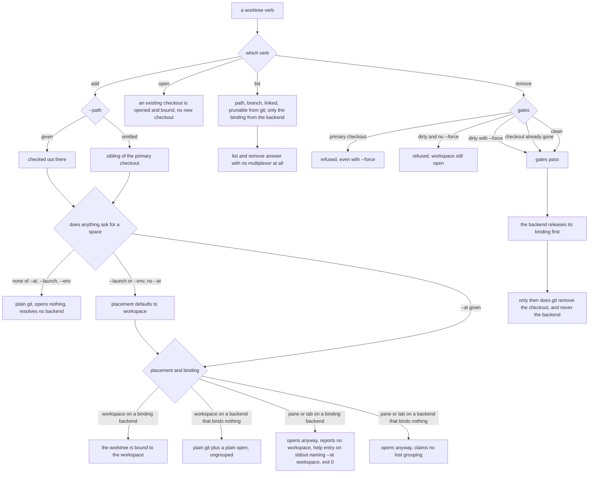

# mux/worktree — git worktree helpers and the workspace binding

## What

The worktree surface: plain `git worktree` for the checkout itself, plus the one fact a multiplexer
contributes — whether a worktree is **bound** to a workspace, which is what a UI groups a repo's
checkouts by. git owns path, branch, linked, and prunable on every backend; a backend is asked only
for the binding, and removal is never delegated to it.

### Non-goals

Also a non-goal: **any worktree fact a backend reports of its own** — git answers those on every
backend, so a multiplexer is never asked; see the use cases above.

Where a pane lands and what `open` reports back is [`placement/`](../placement/README.md)'s
business; the worktree **binding** and a pane's workspace **occupancy** are different questions and
neither answers for the other.

## Use Cases

- **The checkout itself is always plain `git worktree`** — host-neutral, no legion/unit-registry
  concepts. `add` defaults the checkout path to a sibling of the primary checkout
  (`<parent>/<repo>.worktrees/<branch>`, ported from `cyberlegion`'s `resolveUnitWorktreePath`
  convention), never nested inside the primary's own working tree; `--path` overrides it, `--base`
  sets the branch's start-point. The default holds on **every** backend rather than deferring to a
  multiplexer's own layout (herdr would use `~/.herdr/worktrees/<repo>/<branch>`), so a path means
  the same thing everywhere. `remove` is the safe path ported from `cyberlegion`'s `decommission`:
  it refuses the primary checkout (absolute — `--force` never overrides it), tolerates a worktree
  already gone from disk, and refuses to discard uncommitted changes unless `--force` is passed.

- **A backend either binds a worktree to a workspace, or it does not** — and that binding, *not*
  "knows what a git worktree is", is the capability a backend has or lacks. It is what a
  multiplexer's UI groups a repo's primary checkout and its worktrees by. Established
  **empirically**, because it is not visible in either tool's documentation: `git worktree add`
  followed by herdr `workspace create --cwd <checkout>` yields a workspace with **no worktree
  record** — herdr does not know it is a worktree and leaves it out of the repo's group; only
  routing through herdr's own `worktree create`/`worktree open` produces one. (herdr's `worktree
  list` still shows the ungrouped checkout with an `open_workspace_id`, matching it by path after
  the fact — the list view is misleading here; the workspace record is the truth.) tmux has no
  workspace tier at all and never binds. **wezterm, despite having a real workspace tier, also never
  binds** — its CLI has no `worktree` subcommand or concept of one at all, so like tmux it falls back
  to plain git plus a placement-appropriate `open()`.

- **git owns the worktree facts; a backend contributes only the binding** — path, branch, linked,
  prunable, merged and dirty are read from git on **every** backend, so two backends can never report a different
  branch for the same worktree. A multiplexer that also enumerates worktrees is merely re-reading
  git; the one fact git cannot answer is which workspace a worktree is currently open in, and that
  is the only thing asked of a backend.

- **The listing renders those facts; it never restates them** — a fact worth **one bit** does not
  earn a column, which would cost every row its full width to carry a value only one row differs on.
  The bit becomes a **marker on the column the fact is about**: the primary checkout is marked on its
  *branch* (`<branch> (*)`), and a checkout whose directory is gone is marked on its *path*
  (`<path> (gone)` — git's own word for a target that vanished, where "stale" would read as merely
  out of date). A home-rooted path collapses its prefix to `~`, the same shortening [`axi/`](../axi/README.md)'s
  #10 already owes the home view — matched at a path **boundary**, so a sibling directory whose name
  merely starts with the home directory's name is left whole rather than rewritten into a path the
  caller cannot `cd` to. Every marker is **human-surface only**, and the boundary is the *surface*
  rather than any one `--format` value: **every** structured payload keeps `linked`, `prunable`, and
  the **absolute** path as their own fields, so a later structured default cannot inherit the markers
  by omission. A marker is a way of *showing* a fact and never the fact itself, and the payload is
  the surface an agent acts on.

- **Occupied is not the same question as needed** — the binding says only what is currently *holding*
  a worktree, so a free one is either finished or merely idle and the listing could not tell them
  apart. Two further git facts close that gap: **merged** (the branch's tip is an ancestor of the
  repo's default branch, so its work has landed) and **dirty** (the checkout has uncommitted changes,
  which exist nowhere else). The default branch is **resolved, never assumed** — the remote-tracking
  ref first, because "merged" means landed *upstream* in the workflow this serves, then the primary
  checkout's own branch, which is the trunk for a local-only repo and costs no extra read.

  Those two plus the binding compose into **one composite** the table compresses to a single
  `(removable)` marker on the *branch* — merged **and** clean **and** unoccupied. A composite earns one
  marker by the same rule a one-bit fact does: the reader's question is one question, and three
  markers would spend the width of an answer on its inputs. It rides on the branch because the branch
  carries the work that landed, and it is mutually exclusive with `(*)`, so no row shows two.

  The composite is a **rendering, never a field**. It is fully derivable from facts already in the
  payload, and baking it in would freeze *one* policy into the wire format — a consumer that scores
  disposability differently composes it from `merged` and `dirty` instead.

  Every signal degrades to an **absent field, never `false`**: a detached HEAD has no branch to ask
  about, a vanished checkout no working tree to read, a repo with no resolvable default branch nothing
  to measure against. Undeterminable must never render as safe to delete, so the marker demands the
  positive facts rather than the absence of negative ones. A **squash** merge rewrites the commits and
  so reads unmerged — the signal errs toward "still needed", because under-reporting a candidate costs
  the reader one check while over-reporting costs them work.

  The listing **reports; it never acts**. Removal keeps exactly the gates it always had and consults
  no disposability signal, and nothing here deletes or prunes of its own accord.

- **`worktree add` is plain git until a placement is asked for** — with neither `--at` nor
  `--launch` it creates a checkout, opens nothing, and resolves no backend, so it works outside any
  multiplexer. There is nothing to group because nothing was opened. `--launch` implies
  `--at workspace`: a launch wants its own space rather than a pane crowding the caller's, and
  `workspace` is the only placement a binding can attach to.

- **Grouping happens iff the backend binds and the placement is `workspace`** — herdr's `worktree
  create` *always* opens a workspace, so it cannot serve a pane or tab placement. (It also opens a
  workspace for the **source** checkout when the repo has none — a group needs its parent.)

- **A placement the binding cannot serve degrades; it never fails** — `--at pane:right --branch b`
  on herdr yields a worktree open in a split pane: a complete, useful outcome, just not a grouped
  one. Refusing would make identical flags succeed on tmux and fail on herdr — precisely the backend
  leak this seam exists to prevent. The report is a **field, not prose**: `workspace: null`, with a
  note on stderr so `--format json` stays machine-readable on stdout. Degradation is claimed only
  where the backend *could* have grouped and the placement is what cost it — never on tmux, where no
  grouping was ever on offer.

- **`worktree open` groups a worktree plain git created earlier** — the remedy that makes "add now,
  group later" a first-class story rather than a dead end, and the counterpart to a bare `add`.

- **`worktree list` and `worktree remove` answer outside a multiplexer** — both are git questions; a
  backend can only ever add a binding to the answer, so its absence must not deny one.

- **Removal is never delegated to a backend** — only the binding's release is. A backend's own
  worktree-removal primitive addresses a *workspace* (herdr's takes a workspace id), so it cannot
  reach an unbound worktree at all, and whether it dirty-checks is unknown; delegating would make a
  destructive operation's safety depend on whether a workspace happened to be open. **Gate order is
  a specified property, not an implementation detail**: every gate runs *before* the workspace is
  released, so a refused removal has no side effect; the release runs *before* git removes the
  checkout, so no workspace is left pointing at a directory that no longer exists.

- **A worktree's default label is the backend's own** — worth knowing that `worktree add` always
  passes `--path` (to hold the sibling convention across backends), and herdr labels a workspace by
  the checkout path's **basename** when given one, using the branch only when it picks the location
  itself. So branch `feat/deep/name` defaults to a workspace labeled `name`. `--label` is the
  override.

## Logic

### The worktree surface

## Scenario map

Every scenario in [`worktree.feature`](./worktree.feature), one row each, grouped by use case.

### git worktree helpers

| Edge | Path (Given) | Scenario |
|---|---|---|
| `--path` omitted → sibling of the primary checkout | `worktree add --branch` with no `--path` | `worktree add defaults the path to a sibling of the primary checkout` |
| `--path` given → checked out there | `worktree add --branch --path` | `worktree add honors an explicit --path` |
| gate: primary checkout → refused | `worktree remove` against the primary checkout's own path | `worktree remove refuses the primary checkout, even with --force` |
| gate: checkout already gone → tolerated, no git removal | a path with nothing checked out there | `worktree remove tolerates a worktree already gone from disk` |
| gate: dirty and no `--force` → refused | a worktree with uncommitted changes, no `--force` | `worktree remove refuses uncommitted changes unless --force` |
| gate: dirty with `--force` → removed | a worktree with uncommitted changes, `--force` | `worktree remove --force discards uncommitted changes without the dirty check` |

### worktree/workspace binding

| Edge | Path (Given) | Scenario |
|---|---|---|
| nothing asks for a space → plain git, no backend resolved | `worktree add` with none of `--at`, `--launch`, `--env` | `a bare worktree add opens nothing, so there is nothing to group` |
| `--launch` with no `--at` → placement defaults to workspace | `worktree add --launch` with no `--at` | `worktree add --launch defaults the placement to workspace` |
| `--env` with no `--at` → placement defaults to workspace | `worktree add --env` with no `--at` and no `--launch` | `worktree add --env defaults the placement to workspace, for --launch's reason` |
| `--at workspace` → bound where the backend binds, ungrouped where it does not | herdr, tmux, and wezterm | `worktree add --at workspace groups the worktree where the backend binds` |
| pane or tab placement on a binding backend → opens ungrouped | `pane:right`, `pane:down`, and `tab` | `a placement the binding cannot serve falls back rather than failing` |
| pane or tab placement on a backend that binds nothing → no lost-grouping claim | tmux, `--at pane:right` | `a backend that binds nothing falls back without reporting a lost grouping` |
| pane or tab placement on a binding backend → help entry on stdout, exit 0 | a binding backend, `--at pane:right` | `the lost-grouping note is a help entry on stdout, not a line on stderr` |
| `--label` given → names the tier `--at` opened | workspace, tab, and `pane:right` on herdr and tmux | `--label names whatever --at opened, on every backend` |
| `--label` omitted → the backend's own default stands | `cyber-mux` with no `--label` | `--label omitted leaves each backend its own default` |
| `worktree open` → an existing checkout is opened and bound | a checkout made by a bare `add`, open in no workspace | `worktree open groups a worktree that plain git created earlier` |
| `list` → every worktree fact from git | a backend that also enumerates worktrees | `worktree list reads every worktree fact from git, whatever the backend` |
| `list` → only the binding from the backend | worktrees open in workspaces on a backend that binds | `worktree list reports which workspace each worktree is open in` |
| no multiplexer → `list` and `remove` still answer from git | no multiplexer to be inside of | `worktree list and remove answer outside a multiplexer` |
| gates run before the release | a dirty worktree open in a workspace on a binding backend | `worktree remove refuses uncommitted changes BEFORE releasing the workspace` |
| release runs before git removes the checkout | a worktree open in a workspace, every gate passing | `worktree remove releases the workspace before git removes the checkout` |
| release runs before git removes the checkout | a path already gone, still open in a workspace | `worktree remove releases the workspace of a checkout already gone from disk` |
| removal never delegated → this CLI's gates plus git | a backend with a worktree-removal primitive of its own | `worktree removal is never delegated to the backend` |

### The listing renders those facts; it never restates them

| Edge | Path (Given) | Scenario |
|---|---|---|
| a one-bit fact → a marker on the column it is about, never a column | the primary checkout and a checkout whose directory is gone | `a one-bit worktree fact is marked, never given its own column` |
| composite disposability → one `(removable)` marker, all three inputs required | a merged, clean, unoccupied worktree | `worktree list answers whether a worktree is still needed, not only whether it is occupied` |
| the composite is a rendering, not a payload field | a marked worktree read as structured output | `the disposability composite is the table's compression, never a field of its own` |
| the default branch is resolved, never assumed | a repo whose default branch is not `main` | `the default branch merged is measured against is resolved, never assumed` |
| an undeterminable signal → absent, never `false`, and never marked | a detached HEAD and a vanished checkout | `a disposability signal git cannot determine is absent, never false` |
| the listing reports; removal consults nothing it reports | a marked worktree passed to `worktree remove` | `the listing reports disposability and never acts on it` |
| a path under home → the prefix collapses to `~`, matched at a boundary | worktrees under home, and a sibling whose name extends home's own | `a home-rooted worktree path is shortened to ~ in the human table` |
| a structured payload → the fields, never the markers | any worktree whose row the human table marks or shortens | `a table marker never reaches a structured payload` |
