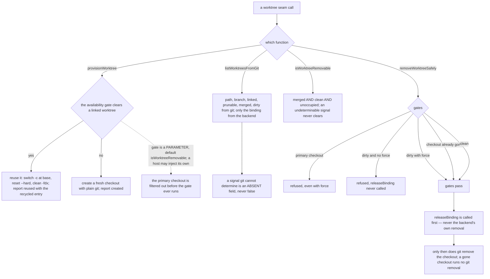

# mux/worktree — the library git-worktree seam

> The **CLI surface** for these helpers — the `cyber-mux worktree <verb>` verbs, their flag defaults,
> and the human table — lives in [`cli/worktree/`](../../cli/worktree/README.md). This node owns the
> **surface-independent library contract** those verbs call.

## What

The worktree seam a host links against: `provisionWorktree` / `WorktreeApi`, `listWorktreesFromGit`,
`isWorktreeRemovable`, and `removeWorktreeSafely` — plain `git worktree` for the checkout facts, plus
the one thing a multiplexer contributes, whether a worktree is **bound** to a workspace. git owns
path, branch, linked, prunable, merged, and dirty on every backend; a backend is asked only for the
binding, supplied to `removeWorktreeSafely` as a `releaseBinding` callback, and removal is never
delegated to it. Because the contract is the same however it is reached, both surfaces — the CLI verbs
and a host calling the functions directly — rest on it.

### Non-goals

- **The CLI presentation** — how a verb defaults its flags, groups an opened checkout, or renders
  git's facts into a `(*)` / `(gone)` / `(removable)` marked table. That is a **surface** concern and
  lives in [`cli/worktree/`](../../cli/worktree/README.md). This node specifies the facts the table
  renders (merged, dirty, removability) and the seam behavior, never the rendering.
- **Any worktree fact a backend reports of its own** — git answers those on every backend, so a
  multiplexer is never asked.

Where a pane lands and a pane's workspace **occupancy** are [`placement/`](../placement/README.md)'s
business; the worktree **binding** is a different question and neither answers for the other.

## Use Cases

- **`provisionWorktree` / `WorktreeApi.provision` reuses a free worktree instead of always creating
  one — the twin of prune.** Given a pool, hand back a **free** one, else create. It is the exact
  mirror of `pruneWorktrees` — prune **removes** disposable worktrees, provision **recycles** one —
  and it asks the *same* question through the *same* predicate, so the two can never disagree about
  which worktrees are free. The **default availability gate is the disposability composite**
  (`isWorktreeRemovable`): a reuse candidate is one prune would have deleted. It reports **what it
  did** — `reused` or `created`, which worktree, and (on reuse) the recycled entry in full, so its
  prior branch and its `workspace` occupancy reach the caller.

  Availability is an **injected predicate**, and that is the **load-bearing boundary — and the one
  power the CLI verb does not have.** The clean / landed / on-disk / unoccupied part is generic git
  and is the default here; but *"no **live agent session** is attached"* is a **host** concept — a
  cyberlegion ship/pane — this seam must never know, so it enters as a `(entry) => boolean` parameter
  the host composes on top. A host may narrow the default (a live-pane check) or loosen it, because
  the predicate *replaces* the default rather than only ANDing with it. **Only a caller of the seam
  can inject one**; the [`cli/worktree/`](../../cli/worktree/README.md) `provision` verb wires this
  function with the default gate and no injection — that is the surface divergence the split records.

  On reuse the candidate is reset to a **pristine tree on a fresh branch** — `switch -c <branch>
  <base>`, then `reset --hard`, then `clean -fdx`. The safety is the gate's own: `merged` proves the
  old branch landed (repointing it destroys nothing the trunk lacks — the very fact prune deletes on),
  `dirty === false` proves nothing uncommitted is clobbered. `base` is the caller's, else the resolved
  default branch, else `HEAD`. The destructive clean is a **ratified** choice, not a silent default
  (see the `worktree-provision` decision).

- **`listWorktreesFromGit` reads the worktree facts; a backend contributes only the binding** — path,
  branch, linked, prunable, merged, and dirty are read from git on **every** backend, so two backends
  can never yield a different branch for the same worktree. A multiplexer that also enumerates
  worktrees is merely re-reading git; the one fact git cannot answer is which workspace a worktree is
  currently open in, and that is the only thing asked of a backend.

- **Disposability is a determination over git facts, computed here** — the binding says only what is
  currently *holding* a worktree, so a free one is either finished or merely idle. Two further git
  facts close that gap: **merged** (the branch's tip is an ancestor of the repo's default branch, so
  its work has landed) and **dirty** (the checkout has uncommitted changes). The default branch is
  **resolved, never assumed** — the remote-tracking ref first, because "merged" means landed *upstream*
  in the workflow this serves, then the primary checkout's own branch, which is the trunk for a
  local-only repo. `isWorktreeRemovable` composes merged **and** clean **and** unoccupied into the one
  predicate provision and prune share.

  Every signal degrades to an **absent field, never `false`**: a detached HEAD has no branch to ask
  about, a vanished checkout no working tree to read, a repo with no resolvable default branch nothing
  to measure against. Undeterminable must never count as safe to delete, so `isWorktreeRemovable`
  demands the positive facts rather than the absence of negative ones. A **squash** merge rewrites the
  commits and so reads unmerged — the signal errs toward "still needed", because under-reporting a
  candidate costs the reader one check while over-reporting costs them work.

  The library **reports; it never acts.** `listWorktreesFromGit` is a pure read; `removeWorktreeSafely`
  keeps exactly the gates it always had and consults no disposability signal. Removability is a fact
  the library computes, never a removal trigger.

- **`removeWorktreeSafely` removal is cyber-mux's own gates plus git; only the binding's release is
  delegated.** A backend's own worktree-removal primitive addresses a *workspace* (herdr's takes a
  workspace id), so it cannot reach an unbound worktree at all, and whether it dirty-checks is unknown;
  delegating would make a destructive operation's safety depend on whether a workspace happened to be
  open. **Gate order is a specified property, not an implementation detail**: every gate runs *before*
  the `releaseBinding` callback fires, so a refused removal has no side effect; the release runs
  *before* git removes the checkout, so no binding is left pointing at a directory that no longer
  exists — including for a checkout already gone from disk, where the release still fires and no git
  removal runs.

## Control Flow

### The worktree seam

## Scenario map

Every scenario in [`worktree.feature`](./worktree.feature), one row each, grouped by use case.

### provision — reuse a free worktree, else create (prune's twin)

| Edge | Path (Given) | Scenario |
|---|---|---|
| a free candidate exists → reuse it, reset to a pristine fresh branch | a pool with a merged, clean, unoccupied worktree | `provision reuses a free worktree, resetting it to a pristine tree on a fresh branch` |
| explicit `base` → the reused branch starts there | `provision` with a `base` given | `provision branches a reused worktree from an explicit base` |
| no candidate → create, recycling nothing | a pool with no available worktree | `provision creates a fresh worktree when none is available` |
| default gate is the disposability composite → an unmerged worktree is never reused | a pool whose only free-looking worktrees are unmerged | `provision never reuses an unmerged worktree under the default gate` |
| the injected (library-only) predicate excludes a held one → the next free one is picked | a live session bound to the first candidate | `provision never hands back a worktree the availability predicate excludes` |
| the primary checkout is never a candidate | a predicate that would clear everything | `provision never reuses the primary checkout` |

### the worktree facts are git's, computed by the library

| Edge | Path (Given) | Scenario |
|---|---|---|
| `list` → every worktree fact from git, never the backend's | a backend that also enumerates worktrees | `the library reads every worktree fact from git, whatever the backend` |
| the default branch is resolved, never assumed | a repo whose default branch is not `main` | `the default branch merged is measured against is resolved, never assumed` |
| an undeterminable signal → absent, never `false`, and never removable | a detached HEAD and a vanished checkout | `a disposability signal git cannot determine is absent, never false` |

### removal is the library's own gates + git; disposability is read, never acted on

| Edge | Path (Given) | Scenario |
|---|---|---|
| the listing reports; remove consults no disposability signal | a worktree `isWorktreeRemovable` would clear | `the library's remove consults no disposability signal, and the listing never acts` |
| gates run before the binding release | a dirty worktree with a `releaseBinding` callback, no force | `removeWorktreeSafely refuses uncommitted changes BEFORE releasing the binding` |
| release runs before git removes the checkout | a clean worktree with a `releaseBinding` callback, every gate passing | `removeWorktreeSafely releases the binding before git removes the checkout` |
| release runs before git removes the checkout | a path already gone, with a `releaseBinding` callback | `removeWorktreeSafely releases the binding of a checkout already gone from disk` |
| removal never delegated → this seam's gates plus git | a backend with a worktree-removal primitive of its own | `worktree removal is never delegated to the backend` |
