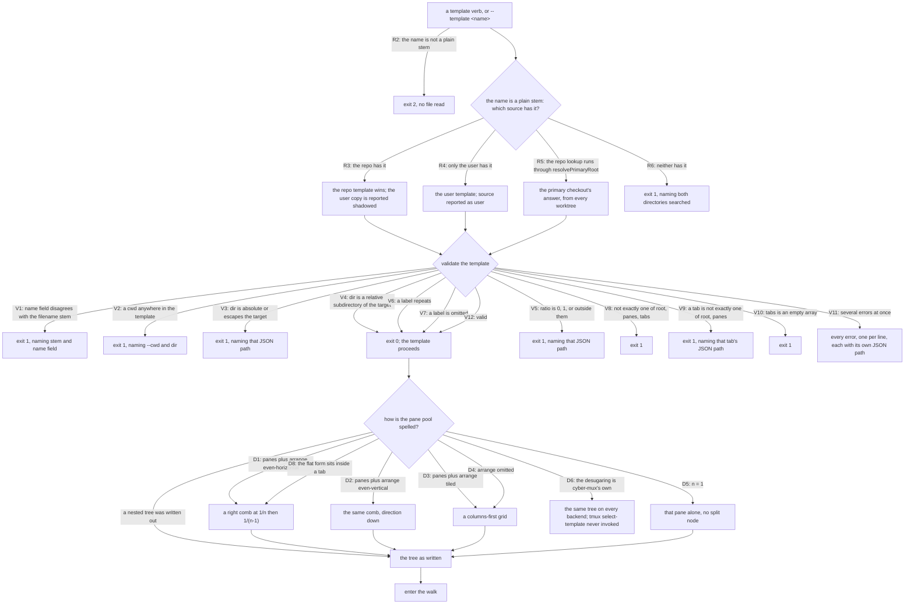
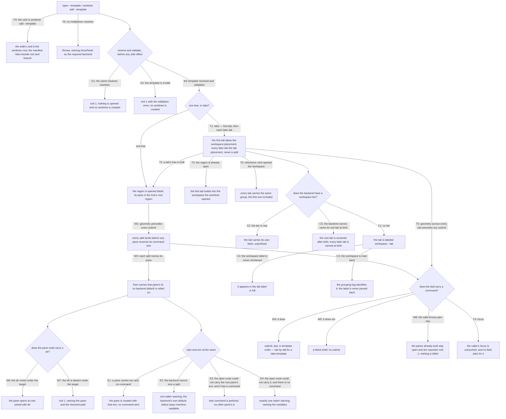

# template/apply — resolving a template and building what it describes

## What

This unit owns the **read direction** of the [`template`](../README.md) capability: taking a
template — by name or by path — validating it, expanding its sugar, and walking it into live panes
and tabs against a target directory supplied at apply time.

This is the **engine** — the surface-independent read contract. The `cyber-mux` command line that
drives it — the read verbs (`list`/`show`/`validate`), the `--file`/`--desugar` flags, the
`--template` flag and its defaults, and the `--format json` manifest shape — is the **CLI surface**,
specified in [`cli/template/apply/`](../../cli/template/apply/README.md) (cyberuni/cyberplace#360).
The atomicity guarantee below (an unresolvable or invalid template leaves no worktree behind, opens
nothing) is the engine's and stays here, verified against both `open --template` and
`worktree add --template`.

A **template** is a recipe for standing up a working workspace. It names three things at once, and
re-targets all of them at a different directory on every apply:

- **arrangement** — the pane tree, and the ratios its splits cut at
- **environment** — the variables each pane is born with
- **launch commands** — what runs as each pane is created or restored

All three, not just the first. A template that only described arrangement would leave the two things
that make a restored workspace actually *work* to be re-supplied by hand on every apply, which is the
whole cost the capability exists to remove. Spinning up a pool for a fresh worktree was a hand-driven
sequence of `open` calls, one per pane, each carrying its own `--cwd`/`--launch`/`--label`, with no
way to say anything about arrangement beyond "right" or "down" relative to wherever the caller
happened to be sitting — and no way to say anything about environment or startup at all except by
repeating it, per call, every time.

The rule the whole capability exists to enforce, and which this unit is where it is enforced:
**nothing about the target directory is ever written into the template.** `cwd` is not an optional
field — it is not in the schema, and a template carrying one fails validation. The target is injected
at apply time and only there.

Designed in
[`docs/design/layout-templates.md`](../../../../../../docs/design/layout-templates.md) — which keeps
its original name as a record of the design moment — against `.research/mux-workspace-layouts/` and
`.research/mux-message-bus/`.

### Non-goals

**Non-goals** — **dispatch**, in all its forms: no message bus, no mailbox, no routing, no "give
this work to an idle pane". Apply is **write-only** — it takes a template and a cwd and produces
running panes, and it ends there. Status is a *read* concern about panes that already exist, so the
two never meet; this is why the largest capability gap between the backends (herdr has an agent-status
feed, tmux has nothing) costs the template system exactly nothing. cyberlegion already has a working
inter-agent mail system, and a second one here would be two competing message systems in one stack.

Also out, each for its own reason:

- **`--if-populated` and `--dry-run`** — cut. `--if-populated` is moot at the default `workspace`
  placement (a fresh space is empty), and detecting "already populated" is only a heuristic — the
  seam offers no "list panes in workspace X", so the check would be *does any live pane report a cwd
  under the target?*, imprecise in both directions. `--dry-run` overlaps `show --desugar` and its
  manifest is a half-truth: pane ids do not exist yet, so every `pane` field would be `null`.
- **`wait_for` / sequencing** — a template that waits on output is a workflow, and a workflow belongs
  to the caller.
- **Focus** — apply never steals it, matching every existing spawn path. A caller who wants to land
  somewhere calls `focus` with a pane id from the manifest. **This survived the tabs CR intact**,
  which had every excuse to reopen it: a template naming the tab to focus is the obvious next field,
  and it was declined rather than deferred. Apply's whole discipline is that it is side-effect-free
  from the point of view of whoever is typing, and a multi-tab apply — which lands more spaces at once
  — makes stealing focus worse, not more justified. The manifest already answers *"which pane"*, and
  `focus` already takes it.

**`Named windows/tabs inside a template` was here, and this CR reversed it.** It was recorded as an
honest deferral rather than a rejection, with the door left open in the schema itself — *"the schema
leaves room by keeping `root` a single node rather than a list"* — and that is the door `tabs` walks
through. Nothing about the deferral's reasoning expired; it was simply time. The v1 note is the one
piece of it that needed correcting rather than keeping: it read the constraint as *templates build one
region*, when what the backends actually impose is narrower — see the tab-naming note in
[`mux/`](../../mux/README.md), whose premise turned out to bind only herdr's **root** tab rather than
tabs in general.

**Templates are an optional capability**, exactly as `worktree?` already is — present on a backend
that can split a *named* pane, absent on one that cannot. The floor is real rather than hypothetical:
screen fails it on three independent counts (its regions have no ids, `split` splits only the current
region, and it has no per-pane env var, so a caller cannot name its own pane *or* the pane to split).
The only way to split a chosen region there is focus-until-you-arrive-then-split — the racy,
focus-stealing road `from` exists to reject. A screen adapter would be a genuinely different shape,
not a degraded one. Finding the floor does not move the argument: the walk is the implementation
everywhere it is possible at all.

## Use Cases

**Subject** — resolving a named template, validating it, and building the panes it describes against
a target directory supplied at apply time:

- **A template is resolved by name, and the repo's answer wins** — three sources, in order:
  `--file <path>` (explicit, skips resolution; the escape hatch for a template that is not checked
  in), then `<primaryRoot>/.cyber-mux/templates/<name>.json`, then
  `${XDG_CONFIG_HOME:-~/.config}/cyber-mux/templates/<name>.json`. Repo beats user **deliberately**: a
  project that ships a template is making a statement about how the project is worked on, and a
  personal template of the same name should not silently shadow it — so `template list` reports each
  name's source and marks a user template a repo template shadows. The repo location resolves
  through **`resolvePrimaryRoot`** (`worktree.ts`), not `./.cyber-mux` relative to the caller's cwd,
  and that is load-bearing rather than incidental: cyber-mux is used across many worktrees of one
  project, and a worktree branched from a commit that predates a template would otherwise silently
  see a stale template, or none. Resolving through the primary checkout gives one canonical answer
  from every worktree. A name is `[a-z0-9][a-z0-9-]*` and must equal the file's stem, so a name can
  never traverse out of the templates directory.

- **A workspace is tabs of panes, so a template says tabs** — `root` and `panes` each describe **one
  tab's worth** of structure, which is where v1 stopped. `tabs: [...]` is the two-level form: a
  workspace of N tabs, each carrying its own pane tree **in the very same shape** a top-level `root`
  or `panes` accepts, sugar included. Adding the level costs the schema almost nothing precisely
  because the tab tier reuses the pane tier wholesale rather than introducing a second vocabulary — a
  tab is a tree plus a name. A template declares **exactly one** of `root`, `panes`, or `tabs`; the
  first two are the one-tab spelling and stay exactly what they were.

  **No label is required to be unique — not a pane's, not a tab's.** Nothing keys on a name: the
  manifest's unique handle is the **pane id**, it reports a pane's tab by **index**, and a tab is
  addressed by its own id at the seam. Nor does either backend ask for uniqueness — tmux titles three
  panes `worker` without complaint, herdr's `pane rename` carries no such constraint, and herdr
  labels **every** new workspace's root tab `1`, so a backend that manufactures duplicates by default
  could never be one a uniqueness rule describes. A pool of three panes all named `worker` is a
  legitimate thing to mean.

- **The two levels have to survive on a backend that has only one, and the grouping is carried twice**
  — every multiplexer has the Tab and Pane levels, but only some have a Workspace level above them
  ([`mux/`](../../mux/README.md)'s vocabulary table). On herdr the mapping is direct: a workspace with N
  tabs. tmux has no Workspace tier — `workspace` and `tab` both collapse onto a Window — so a
  template's tabs would land as an unlabeled pile of windows with nothing marking them as one pool.

  Two different readers need the grouping, and **one carrier cannot serve both**. A **human** reading a
  tmux status bar gets it in the tab label, `<workspace> - <tab>` — this node's own composition, and
  the reason one template means the same thing on every backend rather than degrading to noise. A
  **machine** — [capture](../capture/README.md) — gets it from the opaque group id the seam carries
  ([`mux/`](../../mux/README.md), "A caller can group the spaces it opens"). The label is **never parsed
  back**: a workspace labeled `acme - beta` with a tab `main` produces `acme - beta - main`, which no
  split rule can resolve, so parsing merely picks which legal label to silently mis-group. Reading the
  id instead is what lets the label stay a human's to choose.

  **The grouping does not depend on which verb opened the workspace.** `open --template` opens the
  region itself; `worktree add --template` is handed one the worktree verbs already opened. Both group
  every tab, the first one included — a template cannot mean two different things depending on the
  route that reached it. Grouping only the tabs the walk itself opened would leave the workspace's own
  first tab out, and **a group missing a tab is worse than no group**: capture would confidently
  round-trip a 3-tab workspace as 2. This is why grouping is a verb over an already-open space rather
  than only an option on `open` ([`mux/`](../../mux/README.md)).

  **A composed label destroys the tab's own name, so the walk stores it.** Where the display name is
  composed, the backend's single name field no longer holds `editor` — it holds `pool - editor`. The
  tab's own name is therefore stored beside the group id and read from there by capture, never split
  back out. Taking the display name verbatim instead would re-prefix it on every round trip
  (`pool - pool - editor`), and splitting it would be the unsound parse this whole design exists to
  refuse. Both roads break the property capture is *for*.

  The label is applied **only where the backend lacks the tier**. herdr's UI already groups by the real
  workspace label, so a prefix there would be redundant noise — the concept maps onto what the backend
  actually has, the same rule that makes a degrade claimable only where the backend could have done
  the real thing. And the workspace label is **never shortened**: it is the label the caller already
  chose (`--label`, defaulting to the template name), so the caller owns its length, and not shortening
  is what makes a collision between two workspaces that shorten alike impossible rather than handled.

- **The template is a binary split tree, and `cwd` is not in it** — `split` nodes carry
  `direction: right|down`, an optional `ratio`, and `first`/`second`; `pane` nodes carry an optional
  `label`, `command`, `env`, and `dir`. `type` is an explicit discriminant rather than inferred from
  which keys are present, because an inferred union produces terrible errors on a typo. `direction`
  is deliberately the vocabulary already in `SessionPlacement` (`pane:right`/`pane:down`) — not
  `horizontal`/`vertical`, where tmux's `-h` means "side by side" while most readers take
  "horizontal" to mean "a horizontal divider". `right` and `down` say where the new pane goes and
  cannot be misread. `dir` is the pressure valve for "the test-watcher pane starts in
  `packages/cyber-mux`": a **relative** subdirectory joined onto the apply-time cwd, where an
  absolute path or any `..` escape is a validation error — a machine-specific path never reaches a
  template by either road.

- **The flat form is sugar cyber-mux desugars itself, so one template means one geometry
  everywhere** — `panes: [...]` plus `arrange: tiled|even-horizontal|even-vertical` expands into a
  canonical nested split tree. tmux's native `select-template tiled` is deliberately **not** used even
  though it exists and would be one call: it implements tmux's own grid algorithm, herdr has no
  equivalent, and reaching for it would mean the same template producing a visibly different
  geometry per backend — and a third on whatever backend comes next, each with its own edge cases at
  odd `n`. Owning the desugaring is what makes a backend-agnostic schema worth having, and it costs
  one saved call. The expansion is a pure function of `n` and `arrange` alone, which is what lets
  `template show --desugar` print exactly what apply will build.

- **The engine is cyber-mux's, and it compiles to the portable verbs** — the compiler is a tree-walk
  emitting `open`/`submit` against the `SessionAdapter` contract, never a backend's native layout
  primitive. herdr's `template.apply` is not a fallback this design defers; it drops out entirely.
  Two reasons, the second load-bearing: `session.herdr.ts` speaks herdr's CLI rather than its
  Unix-socket API (deliberately, so it composes with the synchronous `Exec` seam every adapter and
  every test is built on), and `template.apply` is a socket verb — but more importantly, herdr's
  native tree-apply is unique in the field. tmux, cmux, WezTerm and screen have nothing equivalent,
  so leaning on it yields a design where the good path exists on exactly one backend and every other
  backend needs the portable walk anyway. The walk gets written regardless; `template.apply` would be
  a second implementation of an already-solved problem, gated on a transport, serving one adapter.
  The capability a multiplexer must supply is *"split **this** pane, that way"* — that is the whole
  ask, and it is `SessionOpenOptions.from`, which already exists.

- **Geometry is built before any command runs** — apply opens the region blank (no `launch`), builds
  the whole tree depth-first, and only then submits each leaf's `command` in template order.
  Ordering is deliberate, not incidental: `open`'s `launch` couples creation to launching, so
  reusing it would mean splitting a pane already running an interactive agent — the split lands
  mid-render and the ratio is computed against a pane whose child is reflowing. Opening blank first
  makes the geometry phase side-effect-free from the agent's point of view. The root pane the region
  opens with is **not** a wasted pane to close: it is the tree's root region, which the walk splits
  *into*.

- **Apply does not roll back** — a walk that throws halfway leaves the panes it already built,
  reports them in the manifest, and exits 1. Rolling back would mean killing panes, and a kill is
  not obviously safer than a half-built template the caller can see and finish. This is the price of
  owning the engine rather than delegating to an atomic tree-apply, and it is paid **uniformly**:
  a guarantee only herdr could make is not a guarantee cyber-mux can offer. Resolution and
  validation, by contrast, happen **before any side effect** — a typo in a template name must never
  leave a worktree behind.

- **Applying is `--template`, the exact sibling of `--launch`** — there is no `template apply` verb.
  Both flags answer *"what runs in the space you are opening"*, one for a single pane and one for a
  pool, so applying belongs to the verbs that already open a space (`open`, `worktree add`) and the
  two are mutually exclusive. The `template` group is left doing only what its name says: managing
  templates. `--at` defaults to `workspace` when `--template` is given, because a fresh space is empty
  by construction; `--label` defaults to the template name. One acknowledged wart, recorded rather
  than hidden: `--format json` on `open` becomes conditional — bare `open` reports `{ pane }` and
  `open --template` reports the manifest.

- **The manifest is the whole handoff** — `--format json` reports every pane apply created as
  `(label, pane, dir, command, tab)`, plus the `template`, the injected `cwd`, and the `workspace`
  (the workspace the region opened in, reported by `open`; `null` on a backend with no workspace
  tier, which is why it is `null` on tmux). A consumer grouping panes by workspace needs something to
  group on, so the field carries the real answer wherever the backend has one. `tab` is the same
  argument one level down: a consumer grouping a tabs template's panes by tab needs something to group
  on, and it is `null` from a single-tab template rather than an invented tab — absent rather than
  false, since the template said nothing about tabs. The pane list itself stays **one flat list** of
  every pane apply created; the tabs are a field on each pane, not a second nesting the consumer has to
  walk.

  **`pane` is the manifest's unique handle; `label` is a human name and may repeat.** An earlier design
  made the label the key and refused a duplicate at validation. That rule was wrong in the one
  direction that mattered: labels reach live panes because a *person* renamed them by hand, and `save`
  exists to capture precisely that — so a uniqueness rule forced the capture to **drop** a shared label
  from both panes, discarding the fact it was there to preserve and reporting "no label" where there
  was one, against the absent-rather-than-false rule everything else here follows. Neither backend asks
  for uniqueness either, and a pool of three panes all named `worker` is a legitimate thing to mean. So
  ambiguity is **not** refused at authoring time, where refusing it is only a guess about intent; it
  belongs to whoever **looks a pane up**, where the candidates are in hand and the caller can be handed
  them to choose from. That manifest is
  the complete machine-readable answer to *"which panes exist and what are they for"*, and a
  dispatcher built on it needs **no new cyber-mux surface**: it addresses panes through `read`,
  `submit`, `exists`, `focus`, `list`, which all already exist.

- **Managing templates barely touches a multiplexer** — `list`, `show`, and `validate` take a file as
  their subject, so they answer with no mux present at all, the same way `worktree list` does.
  `validate` is the CI hook: exit 0 valid, 1 invalid, every error at once rather than first-only,
  each naming a JSON path. `save` is the one exception, and it is the exception in both directions:
  it reads a multiplexer *and* writes a file. It belongs to the group anyway, because the group's job
  is authoring and managing templates, and `save` authors one — it is specified in
  [`capture/`](../capture/README.md).

- **Ratio and env degrade; they never reject** — the schema is backend-agnostic, so a template's
  validity cannot depend on which multiplexer happens to be running. A backend that cannot size a
  split degrades to its own 50/50 default with one stderr warning; a wrong-looking split is not worth
  failing an otherwise-correct pool over. `env` degrades too, but **not** on this node's own terms:
  the prefix-or-warn rule itself belongs to the pane abstraction, because `env` has two callers (this
  node and the `--env` flag) and a rule with two callers cannot be one caller's to invent. What this
  node owns is the **scoping** — that only the **root** pane can need it, since every other pane is
  born by a split and splits carry env natively on both backends, and that the warning fires **once**
  rather than per pane. So: `ratio`'s degrade policy is this node's outright (this node is its only
  caller); `env`'s policy is the seam's, and this node decides only where and how often it applies.
  What `ratio` and
  `env` *mean* at the seam is not. Template `ratio` is the fraction kept by `first` (the **original**
  pane) and template `env` is per-pane — how each backend renders those, the opposite sign
  conventions they convert in, and the tier env reaches, belong to the pane abstraction and are
  specified there ([`mux/`](../../mux/README.md), "A split can be told which pane, how big, and what
  environment").  This node passes them down and owns what a template does with them.

Every scenario in [`apply.feature`](./apply.feature) maps to one of the **engine** behaviors below.
The CLI-surface behaviors that used to sit here — `--file`/`--desugar`, the `--template` flag
defaults, the `--format json` manifest shape, and the `list`/`show`/`validate` read verbs — moved to
[`cli/template/apply/`](../../cli/template/apply/README.md); the rows below are trimmed to the engine
half accordingly.

| Behavior | What it covers |
|---|---|
| **a template is resolved by name, repo winning** | repo before user; shadowing reported; resolution through `resolvePrimaryRoot` so every worktree gets one answer; not-found lists the directories searched; a name that is not the stem, or would traverse, is refused. (`--file`, which skips resolution, is the CLI surface.) |
| **the tree, and no `cwd` in it** | `split`/`pane` nodes, explicit `type`, `right`/`down`; a template setting `cwd` fails validation naming `--cwd` and `dir`; `dir` is relative-only, absolute and `..` refused; `ratio` of 0 or 1 refused; a duplicate `label` is legal, because a label is a name rather than a key; `root` xor `panes`; every error at once with a JSON path |
| **flat-N sugar is desugared by cyber-mux** | `panes` + `arrange` expands to a canonical tree, a pure function of `n` and `arrange`; `n = 1` yields one pane and no split; the same tree on every backend, never tmux's `select-template`. (`show --desugar`, which prints this tree, is the CLI surface.) |
| **the walk** | region opened blank; geometry depth-first; each split targets the pane it names via `from`, never the current one; commands submitted last in template order; `dir` joined onto the apply-time cwd; a missing `dir` fails naming the pane and the resolved path |
| **ratio and env degrade, never reject** | a pane with `env` and no `command` is valid; a backend that cannot size a split warns once and takes its default; where the route that opened the region could not carry the **root** pane's env, that pane's command is prefixed with it and no other pane's is, and with no command to prefix exactly one stderr warning names the variables. The seam conventions themselves — the opposite sign directions, env's native tier, and the prefix-or-warn rule this node scopes but does not decide — are the pane abstraction's, specified in [`mux/`](../../mux/README.md) |
| **resolution precedes side effects; apply does not roll back** | a bad template name leaves no worktree behind; a throw mid-walk reports what was built and exits 1 without killing anything |
| **`--template` is `--launch`'s sibling** | `worktree add --template` wires the walk against the worktree root and reports the manifest alongside `root`/`branch`. (The flag defaults — `--launch` mutual exclusion, `--at`/`--label` defaults — are the CLI surface.) |
| **the manifest is the handoff** *(CLI surface)* | The walk **produces** the manifest; its `--format json` field shape — `(label, pane, dir, command, tab)` per pane, plus `template`/`cwd`/`workspace`, `workspace` null where the backend has no tier — is specified in [`cli/template/apply/`](../../cli/template/apply/README.md). The engine's own guarantee is that a mid-walk throw still reports the panes already built (*apply does not roll back*). |
| **a workspace is tabs of panes** | `tabs` is the two-level form, each tab a tree in the same shape `root`/`panes` accept, sugar included; exactly one of `root`, `panes`, `tabs`; a tab declares exactly one of `root`/`panes`; an empty `tabs` refused; no label needs to be unique — not a pane's, not a tab's — since nothing keys on a name (the manifest's handle is the pane id and it reports a pane's tab by index); a tab may leave its label to the backend; no `cwd` reaches a tab either |
| **the walk, across tabs** | the first tab opens the workspace and every later tab opens in it, never as a split; each tab's tree is built against its own root pane; all geometry precedes any submit, commands in template order tab by tab; `worktree add --template` builds the first tab into the workspace the worktree already opened; focus is never stolen and no field asks for it; a throw part-way reports what was built and kills nothing. (That `--at` still defaults to `workspace` for a tabs template is the CLI surface.) |
| **carrying the workspace where the backend has no tier** | a tab is labeled `<workspace> - <tab>` only where the backend lacks a workspace tier, unprefixed where it has one; the workspace label is never shortened, so shortening collisions cannot arise; the label is never parsed back — the group id is what identifies a workspace; the tab's own name is stored beside the group id, because a composed display name destroys it; every tab is grouped whichever verb opened the workspace, the first one included; herdr's root tab is renamed after birth, the one tab neither backend names at birth |
| **managing templates needs no multiplexer** *(CLI surface)* | `list`/`show`/`validate` answering with no mux, and `validate` exiting 0 on a valid template, are the CLI read verbs, in [`cli/template/apply/`](../../cli/template/apply/README.md). The engine consequence for *applying* — that `open --template` with no mux fails through the adapter path — stays here. |

## Control Flow

Two sub-graphs. Every use case above enters one of them: the template verbs and both apply routes
enter **resolve and validate** first; `open --template` and `worktree add --template` continue into
**apply**. `template save` enters the third sub-graph, **capture**, which lives in
[`capture/`](../capture/README.md).

### Resolve, validate, desugar

### Apply — the walk

The CLI surface — the `--launch` mutual exclusion (F1), the `--at`/`--label` defaults (F2/F3), the
`list`/`show`/`validate` verbs answering with no mux (N1), and the `--format json` manifest field
shape (M1–M5) — enters the same walk but is specified in
[`cli/template/apply/`](../../cli/template/apply/README.md). The walk here **produces** what that
manifest reports; edge `W8` is where the engine guarantees a mid-walk throw still reports the panes
already built.

## Scenario map

Grouped by use case, mirroring [`apply.feature`](./apply.feature)'s own sections. One row per
scenario; the `Edge` column names the edge in `## Logic`, the `Path (Given)` column the path class
reaching it.

### Resolving a template by name

| Edge | Path (Given) | Scenario |
|---|---|---|
| R3 the repo has it | both directories hold the name | `a repo template shadows a user template of the same name` |
| R4 only the user has it | the repo has none of that name | `a user template resolves when the repo has none of that name` |
| R5 repo lookup through `resolvePrimaryRoot` | a linked worktree whose branch predates the file | `the repo templates directory resolves through the primary checkout, not the caller's cwd` |
| R6 neither has it | the name is in neither directory | `a name that resolves nowhere lists the directories searched` |
| R2 the name is not a plain stem | traversal, uppercase, leading dash, underscore | `a name that is not a plain stem is refused before any file is read` |
| V1 name field disagrees with the stem | a resolved repo template | `a template whose name field disagrees with its filename stem fails validation` |

### The tree, and no `cwd` in it

| Edge | Path (Given) | Scenario |
|---|---|---|
| V2 a `cwd` anywhere in the template | the `cwd` sits on a pane node | `a template that sets cwd fails validation naming --cwd and dir` |
| V3 `dir` absolute or escaping | absolute, `..`, and an embedded escape | `dir must be a relative subdirectory that cannot escape the target` |
| V4 `dir` relative under the target | a nested subdirectory | `a relative dir under the target is accepted` |
| V5 `ratio` degenerate or out of range | 0, 1, negative, above 1 | `a degenerate or out-of-range ratio is a mistake, not an intent` |
| V6 a label repeats | two pane nodes in one tree | `two panes may share a label, because a label is a name rather than a key` |
| V8 not exactly one of `root`, `panes`, `tabs` | each pair, and none of the three | `exactly one of root, panes and tabs` |
| V11 several errors at once | a template carrying three distinct faults | `every validation error is reported at once, not first-only` |

### Tabs — a workspace is tabs of panes

| Edge | Path (Given) | Scenario |
|---|---|---|
| V12 valid | a template declaring tabs | `a tab carries its own tree, in the same shape a single-tab template uses` |
| D8 the flat form sits inside a tab | a tab declaring `panes` and `arrange` | `a tab may use the flat sugar, desugared exactly as a single-tab template is` |
| V9 a tab is not exactly one of `root`, `panes` | both, and neither | `a tab declares exactly one of root and panes, the same as the template itself` |
| V10 `tabs` is an empty array | `tabs: []` | `an empty tabs array is refused, because a workspace of no tabs is not a workspace` |
| V6 a label repeats | two tabs, and panes across tabs | `two tabs may share a label, and so may panes in different tabs` |
| V7 a label is omitted | two tabs carrying no label | `a tab may leave its label to the backend` |
| V2 a `cwd` anywhere in the template | the `cwd` sits on a tab | `a tab cannot carry a cwd any more than a pane can` |

### Flat-N sugar

| Edge | Path (Given) | Scenario |
|---|---|---|
| D1 `panes` + `even-horizontal` | 3 panes | `even-horizontal splits at 1/n then 1/(n-1) so every pane ends the same width` |
| D2 `panes` + `even-vertical` | 3 panes | `even-vertical is the same comb, down` |
| D3 `panes` + `tiled` | 4 panes | `tiled balances columns and rows` |
| D4 `arrange` omitted | 4 panes, no arrange | `arrange omitted defaults to tiled` |
| D5 n = 1 | a single pane | `n = 1 is legal and produces a single pane with no split` |
| D6 the desugaring is cyber-mux's own | the same flat template on both backends | `the desugared tree is identical on every backend` |

### The walk

| Edge | Path (Given) | Scenario |
|---|---|---|
| W1 the region is opened blank | the first pane carries a command | `the region is opened blank and its pane becomes the tree's root` |
| W2 geometry precedes every submit | 3 panes each carrying a command | `geometry is built before any command is submitted` |
| W3 each split names its pane | a split of a pane created two steps earlier | `each split names the pane it splits rather than relying on the backend's default` |
| W4 the leaf carries a command | three commands in template order | `commands are submitted last, in template order` |
| W5 the leaf carries no command | a pane node with no command | `a pane with no command opens a blank shell` |
| W6 the `dir` exists under the target | a nested `dir` and an apply-time `--cwd` | `dir is joined onto the apply-time cwd` |
| W7 the `dir` is absent under the target | a labeled pane whose dir is missing | `a dir absent from this worktree fails naming the pane and the resolved path` |

### The walk, across tabs

| Edge | Path (Given) | Scenario |
|---|---|---|
| T1 tabs — first tab, then each later tab | 3 tabs on a backend with a real workspace tier | `the first tab opens the workspace and every later tab opens inside it` |
| T2 a tab's tree is built | the second tab is a split of two panes | `each tab's tree is built against that tab's own root pane` |
| T3 geometry across every tab precedes any submit | 2 tabs, each with a command | `geometry is built across every tab before any command is submitted` |
| T4 focus | 3 tabs | `apply never steals focus, and a tabs template cannot ask it to` |
| T5 the region is already open | `worktree add --template` with a tabs template | `worktree add --template builds a tabs template into the worktree's own workspace` |
| T6 whichever verb opened the workspace | `worktree add --template` on tmux | `a tabs template groups the same way whichever verb opened the workspace` |
| W8 the walk throws part-way | 3 tabs, the second failing to open | `a throw part-way through a tabs walk reports the tabs already built and kills nothing` |

### Carrying the workspace where the backend has no tier

| Edge | Path (Given) | Scenario |
|---|---|---|
| C1 no workspace tier | a labeled tab applied on tmux | `on a backend with no workspace tier, a tab is labeled with its workspace and its own name` |
| C2 the tier is real | the same template applied on herdr | `on a backend with a real workspace tier, a tab carries its own label unprefixed` |
| C3 the workspace label is never shortened | a long workspace label | `the workspace label is never shortened, so two workspaces never collide by shortening` |
| C4 the workspace is read back | a workspace label that itself contains the separator | `a tab's label is never parsed back to recover its workspace` |
| C5 the backend cannot name its root tab at birth | a first tab labeled on herdr | `herdr's root tab is named after birth, because it is the one tab that cannot be named at birth` |

### Ratio and env — degrade, never reject

| Edge | Path (Given) | Scenario |
|---|---|---|
| E1 a pane carries env and no command | one pane node | `a pane with env and no command is valid and yields a blank shell with the env set` |
| E2 the backend cannot size a split | plural splits carrying ratios | `a backend that cannot size a split warns once and takes its own default` |
| E3 the open route could not carry the root env, and it has a command | several panes, each with a command | `a root pane whose env the region open could not carry has it prefixed onto its command` |
| E4 the open route could not carry it, and there is no command | several panes across several tabs, the root with no command | `a root pane whose env could not be carried, with no command to prefix, warns once` |

### Resolution precedes side effects; apply does not roll back

| Edge | Path (Given) | Scenario |
|---|---|---|
| G1 the name resolves nowhere | `worktree add --template` | `a template name that resolves nowhere leaves no worktree behind` |
| G2 the template is invalid | `worktree add --template` with a template setting `cwd` | `an invalid template leaves no worktree behind` |
| G1 the name resolves nowhere | `open --template` | `open --template with an unresolvable name opens nothing` |
| W8 the walk throws part-way | a 4-pane single-tree template whose third split fails | `a throw mid-walk reports what was built and kills nothing` |

### `--template`, the exact sibling of `--launch`

The flag defaults (`--launch` mutual exclusion, `--at`/`--label` defaults) are the CLI surface, in
[`cli/template/apply/`](../../cli/template/apply/README.md). What stays here is the engine integration.

| Edge | Path (Given) | Scenario |
|---|---|---|
| F4 the verb is `worktree add --template` | a branch and a template name | `worktree add --template applies the template against the worktree root` |

### The manifest is the handoff

The manifest's field shape (`--format json`, the `workspace` and per-pane `tab` fields) is the CLI
output surface, in [`cli/template/apply/`](../../cli/template/apply/README.md). The engine produces
what it reports; the mid-walk-throw guarantee (`W8`) is under *apply does not roll back*, above.

### Managing templates needs no multiplexer

The `list`/`show`/`validate` read verbs, and `validate` exiting 0 on a valid template, are the CLI
surface, in [`cli/template/apply/`](../../cli/template/apply/README.md). The engine consequence for
*applying* stays here.

| Edge | Path (Given) | Scenario |
|---|---|---|
| F5 no multiplexer resolves | `open --template` with neither variable set | `applying with no multiplexer fails through the existing adapter path` |

Edge `V12` carries one further row, in [`capture/`](../capture/README.md): a template captured from a
live region passes this same validator. The scenario lives there — it is capture's round trip — and is
referenced here rather than duplicated.
