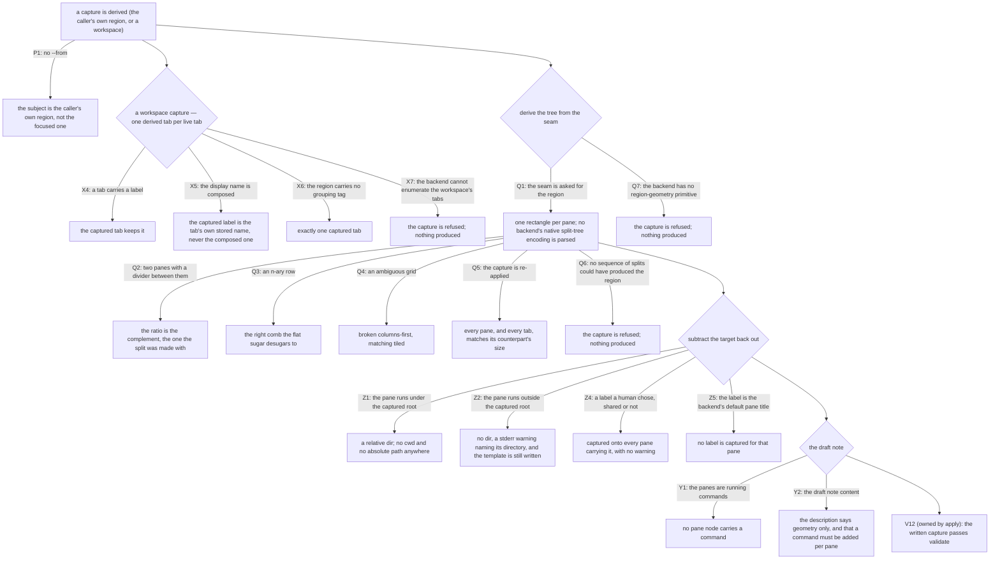

# template/capture — reading a live region back into a template

## What

This unit owns the **write direction** of the [`template`](../README.md) capability: reading the live
region around a pane — or every tab of the workspace it sits in — deriving the template that would
rebuild it, and subtracting the target directory back out.

This is the **engine** — the surface-independent write contract: the geometry-seam-to-tree
derivation, the target subtraction, the draft-note content, and the roundtrip. The `cyber-mux
template save` verb that drives it — which region `--from` names, `--workspace` and its bare-save
reveal, `--description`, where the file lands (`--to`, `--force`), the structured stdout payload, and
the exit code each refusal takes — is the **CLI surface**, specified in
[`cli/template/capture/`](../../cli/template/capture/README.md) (cyberuni/cyberplace#360).

It is the exact inverse of [apply](../apply/README.md). Apply injects a target directory and expands
sugar into a tree; capture derives a tree from the live screen and subtracts the target back out into
`dir`. That the same rules compose in both directions is the best evidence the schema is coherent
rather than arbitrary. It also closes the schema's one real authoring cost: a 4+ pane grid needs
nested `split` nodes nobody wants to type, so a pool built by hand once can be *named* rather than
transcribed.

The capability-level rule holds in this direction too: **nothing about the target directory is ever
written into the template.** A captured pane's location becomes a relative `dir`, or no `dir` at all —
never a `cwd`, never an absolute path.

Designed in
[`docs/design/layout-templates.md`](../../../../../../docs/design/layout-templates.md) — which keeps
its original name as a record of the design moment — against `.research/mux-workspace-layouts/`.

### Non-goals

**`template export` was here, and this CR reversed it.** It was recorded as *deferred, not rejected*,
and the deferral's own reasoning is what expired: it read the seam's inability to report split
structure as the backends' inability, and that premise was simply false — `listPanes` reports no
geometry, but both backends do. What the deferral got right is the part that survived: the capture
genuinely cannot recover `command`, and that is now a stated limit of a shipped verb rather than a
reason not to ship one. Two things changed on the way in: the verb is **`save`**, not `export`,
because it writes the file rather than printing it; and the honesty the original design bought by
printing to stdout is bought instead by the draft note the file carries in its own `description`.

**Commands are not recovered, and that is structural rather than a gap to close later** — on
PORTABILITY grounds, not availability. A backend often can say what is running (herdr's `pane
process-info` reports full argv for a pane's whole foreground tree), so the limit is not that the
information is missing. It is that what a backend reports is the RESOLVED command line rather than
the one a human typed, and resolution destroys the portable form: `$PATH` lookup, aliases and version
shims are applied on the way in and cannot be run backwards. No future backend closes that, because
no backend is holding the original. See the reasoning under the first use case below.

**Widening `save`'s default subject** is out. `save`'s subject is a **region** and stays one — a bare
`save` in a 3-tab workspace still captures the caller's own region, because widening the default
silently would rewrite what `save` has always meant for every caller who already relies on it.
`--workspace` opts in.

## Use Cases

**Subject** — reading a live region or workspace and writing the template that would rebuild it:

- **A region is captured back into a template, and the capture is a draft** — `template save <name>`
  reads the live region around a pane and writes the template that would rebuild it. This closes the
  schema's one real authoring cost: a 4+ pane grid needs nested `split` nodes nobody wants to type,
  so a pool built by hand once can be *named* rather than transcribed. It is the exact inverse of
  apply — apply injects a target and expands sugar into a tree; capture derives a tree and subtracts
  the target back out into `dir`. That the same rules compose in both directions is the best evidence
  the schema is coherent rather than arbitrary.

  **The capture recovers geometry, labels and dirs — never commands, and that limit is structural.**
  What a backend reports about a running pane is the resolved command line, not the one that was
  typed: `nr web dev` comes back as `node /run/user/1000/fnm_multishells/4223_1784479278417/bin/nr web
  dev`, a path carrying a uid, a pid and a timestamp that is dead on the next machine and often on the
  next login. An idle pane reports its shell, and a `claude` pane reports exactly `claude` with the
  flags that made it that session already gone. A template is meant to be checked in and run
  elsewhere, and apply SUBMITS whatever `command` says — so a wrong one fails by executing something,
  and absent beats wrong exactly as it does for a pane's `label`. (A capture is also never the pane's
  own launch record: the walk types commands with `submit` rather than passing them to the split, so
  tmux's `pane_start_command` is empty for every pane cyber-mux creates.) So a saved template carries the tree, its ratios,
  labels and dirs, with `command` left for the author. Geometry is the verbose part and a command is
  one word, so this is still the bulk of the value — but the result is a **draft**, and it says so in
  its own `description`, because `template list` shows it beside finished templates and a note that
  only ever reached the terminal that ran `save` would be gone by the time anyone read the file.

- **The geometry seam reports rectangles, and cyber-mux derives the tree** — the capability a
  multiplexer must supply is *"what does this region look like"*, answered as one rectangle per pane;
  the split tree is **derived** from those rectangles by recursive guillotine cuts, in a pure module.
  Reporting rects rather than a tree is the whole design of the seam. Both backends can describe a
  region and **both describe it in a structure the other cannot speak**: tmux encodes a nested tree in
  a bespoke string (`#{window_layout}` — `83ae,200x50,0,0{133x50,0,0[...],...}`), while herdr reports
  a **flat** `splits[]` array whose parent/child links exist only inside an undocumented id
  convention (`split_1_0`, meaning "split 1, child of split 0" — inferred from the shape, never
  specified). Neither survives being made portable: one needs a parser for a format tmux does not
  promise to keep, the other needs cyber-mux to bet on herdr's id spelling. Rectangles are the fact
  both report exactly and neither can spell differently, and deriving the tree from them is sound
  because a multiplexer region is *built by splitting* and is therefore always guillotine-cuttable.
  The payoff is that the hard part — n-ary rows, ratios, ambiguous grids — is a pure function of four
  numbers per pane, testable with no multiplexer at all, and a third backend owes the seam four
  numbers rather than a tree in its own dialect.

  Two derivations are load-bearing and easy to get wrong. **A ratio is the complement of what the
  second pane occupies** (`1 - second/total`), not `first/(first + second)`: tmux splitting a 50-row
  region reports 34 + 15, because the divider row belongs to the region and to neither pane, so the
  naive form reads 0.69 where the split was really 0.7. The complement puts that row where the
  backend's own sizing flag puts it. **An n-ary row lowers to a right-comb** — the desugarer's
  inverse, so a pool `arrange: even-horizontal` built captures back as the comb it was built from —
  and a 2x2's genuine ambiguity (a vertical or a horizontal cut first describe the same screen) is
  broken **columns-first**, to match what `tiled` emits rather than its transpose.

- **A whole workspace is captured back, and `--workspace` is what asks for it** — `save`'s subject is
  a **region** and stays one: a bare `save` in a 3-tab workspace still captures the caller's own
  region into a single-tree template, because widening the default silently would rewrite what `save`
  has always meant for every caller who already relies on it. `--workspace` opts in, and is the exact
  inverse of the tabs walk — one captured tab per live tab, each with its own derived tree. The bare
  form does not stay quiet about it: capturing one tab of three reports, in a `help[N]:` block **on
  stdout inside the payload**, what it left out and the `--workspace` invocation that captures it,
  rather than letting a caller believe a 3-tab workspace round-trips from a 1-tab template. That
  reveal is [`axi.md`](../../axi.md)'s #9 *reveal a truncated list* case verbatim, which puts the
  note on stdout, not stderr — so `save`'s stdout is a structured payload (a `path` field plus that
  optional `help[N]:` block), the note present only when there is a next move. The
  bare-path-for-`$(...)` ergonomic yields to it: a programmatic caller reads the path from
  `--format json` (`cyber-mux template save pool --format json | jq -r .path`).

  The seam this needs is a **workspace-wide** read beside the region one, and both backends can
  answer it — established empirically against herdr 0.7.4 and tmux 3.6b, the standing bar here. On
  **herdr** it is direct and race-free: a workspace's tabs enumerate by id, every pane comes stamped
  with its tab, and an **unfocused tab in another workspace reports live geometry**, so nothing has to
  be focused first. (herdr's own native per-tab layout export takes a `tab_id` and would be the
  obvious road — but `template` is **not a CLI verb** in 0.7.4; it is socket-API-only, and this adapter
  speaks the CLI by design, so the road is closed. `docs/design/layout-templates.md` asserts otherwise
  and is corrected.) On **tmux** the workspace is not a fact the backend holds at all, so the read is
  *"which windows carry this group id"* — the tag the walk wrote, never the label. A window carrying
  no tag is a **workspace of one**: the honest answer for a window nobody grouped.

  A backend that cannot enumerate a workspace's tabs **refuses** `--workspace` cleanly, naming itself
  and writing nothing — the same shape as a backend that cannot report a region's geometry. An absent
  optional seam member is a refusal, never a guess.

  What the capture recovers is unchanged and so is its limit: geometry, labels and dirs, and **never a
  command**, on any backend, for the same portability reason — adding a level does not make a
  machine-local command line portable. A
  captured workspace is a **draft** and says so in its own `description`.

- **A composed tab label is never parsed back** — where the backend has no workspace tier, the walk
  labels a tab `<workspace> - <tab>` and stores the tab's own name beside the group id
  ([`apply/`](../apply/README.md)). Capture reads the stored name, never the display name: taking the
  display name verbatim would re-prefix it on every round trip (`pool - pool - editor`), and splitting
  it would be an unsound parse — `acme - beta - main` reads as workspace `acme` with tab `beta - main`
  just as well as workspace `acme - beta` with tab `main`. Both roads break the property capture is
  *for*.

- **`save` writes a file, and refuses rather than guessing** — the destination is the primary
  checkout's `.cyber-mux/templates` by default and the user's directory with `--to user`; an existing
  template is never overwritten without `--force`, and the refusal is checked *before* the region is
  read so it costs nothing. The refusals split across two exit codes by kind: a malformed **name** and
  **no pane to capture around** are usage errors and exit **2** per [`axi.md`](../../axi.md)'s #6,
  while a backend that cannot report geometry and a region no sequence of splits could have produced
  are genuine operation failures and exit **1**. Every refusal writes nothing.

Every scenario in [`capture.feature`](./capture.feature) maps to one of the **engine** behaviors
below. The CLI-surface behaviors that used to sit here — the `save` verb, its `--from`/`--workspace`/
`--description`/`--to`/`--force` flags, where the file lands, the structured stdout payload, and the
usage-vs-operation exit codes — moved to
[`cli/template/capture/`](../../cli/template/capture/README.md); the rows below are trimmed to the
engine half.

| Behavior | What it covers |
|---|---|
| **the geometry seam reports rects, not a tree** | every pane of the region is reported with its rectangle; no backend's native split-tree encoding is parsed to obtain the tree — not tmux's `#{window_layout}` string, not herdr's flat `splits[]` |
| **a region is captured back into a template** | the subject is the caller's own region (not the focused one); the ratio is the one the split was made with, not the one the pane sizes imply; an n-ary row lowers to the desugarer's right-comb; a 2x2 breaks columns-first to match `tiled`; re-applying a capture reproduces the region it came from. (`--from`, which overrides the subject, is the CLI surface.) |
| **the capture is a draft** | no pane node carries a `command`, on any backend; the written template says so in its own `description`. (`--description`, which replaces that note, is the CLI surface.) |
| **the capture subtracts the target back out** | a pane under the captured root becomes a relative `dir`; no `cwd` and no absolute path ever reaches the template; a pane outside the root loses its dir and warns; a capture passes `validate` |
| **labels are the author's, or absent** | a label someone set is captured; a backend's default pane title is not (tmux titles every pane with the hostname); a label two panes share is captured onto both, because a human chose it and no label needs to be unique |
| **capturing a whole workspace** | one derived tab per live tab, each with its own tree; a captured tab's label is the tab's own name rather than the composed display name, so a round trip never compounds the prefix; captured tabs keep their labels; re-applying reproduces the tabs and every pane size; still a draft carrying no command; an untagged region derives as a single-tab workspace. (The `--workspace` flag, the bare-save reveal, and the declares-tabs shape are the CLI surface.) |
| **the adapter-capability refusals** | an absent optional seam member is a refusal, never a guess: a backend that cannot enumerate a workspace's tabs, and one that cannot report a region's geometry, both refuse and produce nothing; a region no sequence of splits could have produced is refused too. (The `save` verb's observable of each — exit 1 naming the backend, writing nothing — is the CLI surface.) |

## Control Flow

One sub-graph — the derivation. `template save` drives it directly (the verb surface is in
[`cli/template/capture/`](../../cli/template/capture/README.md)); capture never routes through
[apply](../apply/README.md)'s resolve-and-validate graph, because there is no template to resolve
yet; it is the artifact being produced. The one place the two meet is at the end: a written capture
must pass the same validator, which is edge `V12` of apply's resolve graph.

### Capture — the derivation

The engine derivation. `template save`'s verb entry, its flags (`--from`, `--workspace`,
`--description`, `--to`, `--force`), the structured stdout payload, where the file lands, and the
exit code each refusal takes are the CLI surface, in
[`cli/template/capture/`](../../cli/template/capture/README.md); this graph is what that verb drives.

## Scenario map

Grouped by use case, mirroring [`capture.feature`](./capture.feature)'s own sections. One row per
scenario; the `Edge` column names the edge in `## Logic`, the `Path (Given)` column the path class
reaching it.

The CLI surface — the `save` verb, its flags, the file destination, the structured stdout payload,
and the exit code each refusal takes — moved to
[`cli/template/capture/`](../../cli/template/capture/README.md); the rows below are the **engine**
half: the derivation, the label handling, the subtraction, the draft-note content, and the
adapter-capability refusals.

### Capturing a live region — which region, and what tree

| Edge | Path (Given) | Scenario |
|---|---|---|
| P1 no `--from` | the caller is not the focused pane | `save captures the region around the calling pane, not the one the user is looking at` |
| Q1 the seam is asked for the region | a region on any backend | `the geometry seam reports one rectangle per pane, not a backend's own tree` |
| Q2 two panes with a divider between them | a region split at 0.7 | `a captured ratio is the one the split was made with, not the one the pane sizes imply` |
| Q5 the capture is re-applied | one region of 4 panes | `re-applying a captured template reproduces the region it was captured from` |
| Q3 an n-ary row | 3 equal panes side by side | `an n-ary row captures as the right-comb the flat sugar desugars to` |
| Q4 an ambiguous grid | 4 panes in a 2x2 | `an ambiguous grid captures columns-first, matching tiled rather than its transpose` |

### The capture is a draft

| Edge | Path (Given) | Scenario |
|---|---|---|
| Y1 the panes are running commands | a region on tmux, and one on herdr | `no pane in a captured template carries a command, on either backend` |
| Y2 the draft note content | a bare `save` | `a captured template records in its own description that it is geometry only` |

### The capture subtracts the target back out

| Edge | Path (Given) | Scenario |
|---|---|---|
| Z1 the pane runs under the captured root | a pane in the target's `services/api` | `a pane under the captured root becomes a relative dir` |
| Z2 the pane runs outside the captured root | one pane outside the root | `a pane outside the captured root loses its dir and says so` |
| V12 valid *(edge owned by [`apply/`](../apply/README.md))* | a template captured from a live region | `a captured template passes validate` |
| Z4 a label a human chose, shared or not | two panes both labeled `worker` | `a label two panes share is captured onto both, because a human chose it` |
| Z5 the label is the backend's default pane title | one renamed pane among tmux defaults | `a label the author set is captured, and a backend's default pane title is not` |

### Capturing a whole workspace

The `--workspace` flag, its declares-tabs shape, and the bare-save reveal are the CLI surface. What
stays here is the per-tab derivation and the label handling it does.

| Edge | Path (Given) | Scenario |
|---|---|---|
| X4 the tab carries a label | tabs labeled `editor` and `logs` | `a captured tab keeps the label its tab carries` |
| X5 the display name is composed | a tmux tab displaying as `pool - editor` | `a captured tab's label is the tab's own name, never the composed one` |
| Q5 the capture is re-applied | a workspace of 2 tabs of 2 panes | `re-applying a captured workspace reproduces the tabs it was captured from` |
| Y1 the panes are running commands | a workspace of 2 tabs | `a captured workspace is still a draft carrying no command` |
| X6 the region carries no grouping tag | a tmux window nobody grouped | `on a backend with no workspace tier, an untagged region captures as a single-tab workspace` |
| X7 the backend cannot enumerate the workspace's tabs | a backend lacking the workspace-tab enumeration seam | `a workspace whose tabs the backend cannot enumerate is refused, not guessed at` |

### The adapter-capability refusals

The `save` verb's observable of these refusals (exit 1, naming the backend, writing nothing) is the
CLI surface. What stays here is the capability contract — an absent optional seam member is a
refusal, never a guess — and the geometry-impossibility refusal.

| Edge | Path (Given) | Scenario |
|---|---|---|
| Q7 the backend has no region-geometry primitive | a backend lacking the region-geometry seam | `a region whose geometry the backend cannot report is refused, not guessed at` |
| Q6 no sequence of splits could have produced the region | a region no straight cut separates | `a region no sequence of splits could have produced is refused` |
